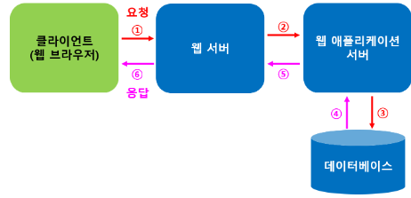
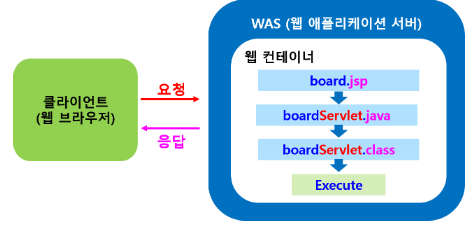
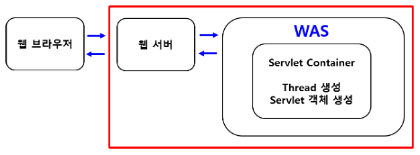
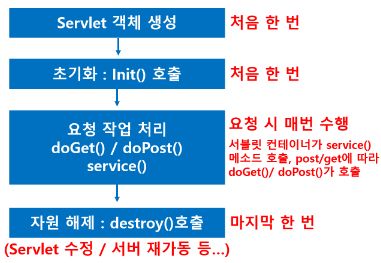
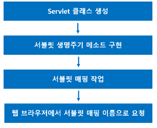
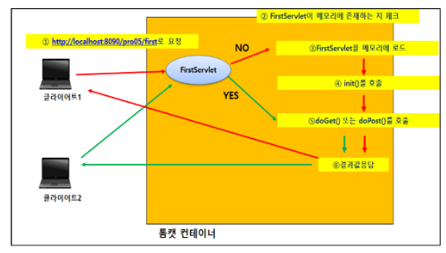
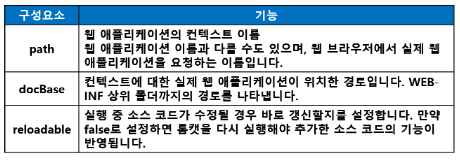
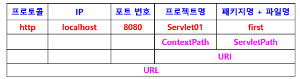
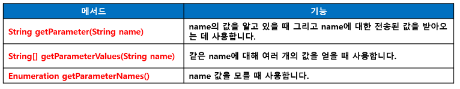
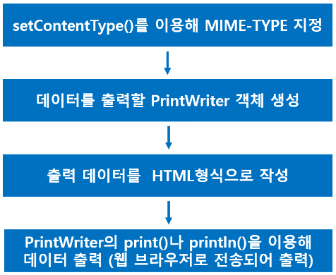

### 프레임워크 기반의 서비스 프로그래밍(백엔드 프로그래밍)

> 웹 개념 - 웹 프로그래밍의 이해
>
> 서블릿
>
> JSP
>
> 스프링 프레임워크

- **웹 서비스**

  - 인터넷을 기반으로 제공되는 서비스

- **웹 어플리케이션**

  - ㅇ웹을 기반으로 작동되는 프로그램
  - 웹 프로그래밍을 통해 구현

- **웹 프로그래밍의 개요**

  - 웹 프로그래밍은 기본적으로 클라이언트(client) / 서버(server) 방식
  - 정적인 HTML만으로는 데이터가 실시간으로 변화하는 것을 처리하거나 저장하기에 불가능하기 떄문에 동적으로 변화하는 데이터를 처리하고 표시하기 위해 개발된 언어(CGI. ASP, PHP, JSP, Servelet)

- **정적 웹프로그래밍**

  - 웹 서버에 미리 보여줄 HTML페이지, CSS, 이미지, 자바스크립트 파일등을 저장해 놓고 브라우저에서 요청할 경우 그대로 전달하는 방식
  - 사용자는 페이지가 변경되지 않는 한 고정된 웹 페이지를 보게됨 (물론 페이지 레이아웃 등이 동적으로 변경 가능)
  - 주로 화면의 디자인을 구성하거나 클라이언트의 이벤트를 처리함

  - 실시간 데이터 처리 또는 데이터 저장 등을 표현하거나 다루는데 적합하지 않은 방식

- **정적 웹 프로그래밍의 구성 요소**

  - **클라이언트 (웹 브라우저)**
    - 인터넷으로 서버에 접속한 후 서버로부터 서비스를 제공받는 컴퓨터와 소프트웨어(웹 브라우저) 
  - **웹 서버**
    - 각 클라이언트로부터 요청을 받고 서비스를 제공하는 컴퓨터와 소프트웨어
  - **HTTP 프로토콜(통신 규약)**
    - Hyper Text Transfer Protocol
    - WWW 서비스를 제공하는 프로토콜을 이용해서 정보를 주고 받음 (World Wide Web)
    - 통신 규약 : 통신을 위해 미리 정해놓은 규칙

- **동적 웹 프로그래밍**

  - 정적 웹 프로그래밍에서 관리자의 역할을 웹 애플리케이션 서버가 수행
  - 웹 애플리케이션 : Web Application Sercer : **WAS**
  - 클라이언트의 요청이 있을 때마다 데이터베이스에 접근하여 실시간 정보를 얻어와서 클라이언트에게 전송
  - 초기 동적 웹 프로그램에서 사용하는 방식
    - **CGI(Common Gate Interface)** : 공용 게이트웨이 인터페이스 => 대표적 언어 : 펄(Perl)
  - 프로세스(Process) 방식으로 실행됨
  - 프로세스마다 메로리에 로드하는 방식으로 메모리에 과부하 발생(문제점)
  - **JSP, ASP, PHP**(CGI의 문제접 보완한 언어)
    - 브라우저 요청 시 스레드 방식으로 실행하므로 CGI 보다 효율적으로 기능을 수행함
    - 클라이언트 요구를 처리하는 기능은 최초 한 번만 메모리에 로드
    - 동일한 기능 요구 시 기존에 사용한 기능을 재사용
    - 따라서 프로세스 방식으로 동작하는 것보다 훨씬 빠르게 수행

- **웹 서비스의 구성 요소**

  - 웹 브라우저 : 클라이언트, 사용자의 작업 창
  - 웹 서버 : 웹 브라우저의 요청을 받아들이는 곳
  - 웹 애플리케이션 서버 (WAS)
    - 요청된 페이지의 로직 및 데이터베이스와의 연동을 처리하는 부분
    - Apache Tomcat 
  - 데이터베이스 : 데이터의 저장소

- **웹 서비스 구조 및 처리 순서**

  

- **웹 서버**
  - 웹에서 서버 기능을 수행하는 프로그램 
  - HTTP 프로토콜 기반
  - 웹 클라이언트(웹 브라우저)로부터 요청을 서비스(제공)하는 기능 담당
  - 정적인 콘텐츠 (HTML, JPG, CSS 등) 제공
  - 동적인 콘텐츠(데이터 처리) 요청은 웹 컨테이너에게 보내고 **웹 컨테이너(WAS에 포함)**가 처리한 결과를 클라이언트에게 응답 

- **웹 서버 종류**
  - Apache(리눅스/유닉스/윈도우)
  - IIS(Internet Information Server) : MS

- **웹 컨테이너(Web Container)**
  - 웹 애플리케이션을 실행할 수 있는 컨테이너
  - JSP와 Servlet(서블릿)을 실행시킬 숭 있는 소프트웨어
  - 웹 서버가 서블릿자체를 실행하지 못하므로 JVM을 내장한 컨테이너라는 서블릿 실행환경이 필요
  - Servlet과 JSP에 대한 실행환경 제공
  - Static Page(정적페이지)에 대한 요청도 처리 가능
  - 웹 서버에서 JSP를 요청하면 톰켓(웹서버 + 컨테이너)에서 JSP 파일을 서블릿으로 변환하여 컴파일을 수행하고 서블릿 수행결과를 웹 서버에게 전달 -> 클라이언트에게 전달
  - 웹 애플리케이션 당 한 개의 SevletContext 객체 생성

- **웹 컨테이너가 사용자의 요청에 응답하는 순서**

  - 클라이언트가 HTTP request를 HTTP service(웹서버)에게 전송
  - 웹 서버가 요청 데이터를 웹 컨테이너에게 전송
  - 웹 컨테이너는 HttpServletRequest 객체와 HttpServletResponse 객체 생성
  - 웹 컨테이너는 요청된 Servlet의 service() 메소드를 호출하여 Servlet을 활성화 시킴
  - **웹 컨테이너는 Servlet에 의해 생성된 응답 데이터를 웹 서버(HTTP service)에게 전송**
  - **웹 서버는 Http response를 클라이언트에게 전송**

- **웹 애플리케이션 서버 (WAS)**

  - 웹 서버로부터 오는 동적인 요청을 처리하는 서버
  - 웹 서버 기능 + 웹 컨테이너 기능
  - 기타기능
    - 트랜잭션, 보안, 트래픽 관리, DB 커넥션 풀, 사용자 관리 등 다양한 기능 제공
  - **Apache Tomcat은 WAS**

- **JSP와 Servlet**

  - **JSP (Java Server Page)**
    - 서버측 스크립트 언어
    - 형식 : HTML 내에 Java 언어를 삽입한 문서 형태
    - .jsp
  - **Servlet(Server + Applet)**
    - Java 언어로 이루어진 웹 프로그래밍 문서
    - 자바 코드에 의존적
    - .java

- **JSP 페이지의 실행 과정**

  

- **서블릿(Servlet)**

  - 서버 측에서 실행되면서 클라이언트의 요청에 따라 동적으로 서비스를 제공하는 자바 클래스 (응답 : HTML 형식)
  - 자바 플랫폼에서 컴포넌트 기반의 웹 애플리케이션을 개발하는 핵심 기술 (동적 웹 애플리케이션 컴포넌트)
  - 컨테이너 종류에 상관없이 실행됨 (플랫폼 독립적)
  - 독자적으로 실행되지 못하고 톰캣과 같은 JSP/Servlet 컨테이너에서 실행
  - 자바로 만들어져 자바의 특징(객체 지향)을 가짐
  - 스레드 기반
  - JSP 페이지처럼 화면에 내용을 표시할 목적으로 사용하는 것이 아니라MVC 패턴에서 로직인 모델(Model)과 화면에 결과를 표시하는 View 사이에서 제어를 하는 컨트롤러로 사용됨
  - java 파일이기 때문에 src/main/java 폴더에 위치
    - webapp 폴더 - HTML 문서

- **서블릿 처리 순서**

  - 클라이언트에서 서블릿 요청이 들어오면 서버에서 서블릿 컨테이너를 만들고 스레드 생성(요청 시 마다 스레드 생성)

  - 서블릿 컨테이너는 스레드를 가동하여 서블릿 객체 생성

  - 서블릿 객체의 실행이 종료되면 스레드 종료되고 반환

  - 서블릿 실행 결과가 웹 서버에 전송

  - 이 결과를 웹 서버가 웹 브라우저에게 전송

    

  - 같은 Servlet class에 대한 요청을 처리하는 모든 thread는 같은 Servlet 객체 공유
  - 로컬 변수가 각 요청 스레드마다 각 스택영역에 저장되어 동시성 문제를 발생시키지 않음

- **서블릿 라이프 사이클 (생명주기)**

  

- **서블릿 패키지와 클래스**

  - **서블릿 패키지**
    - javax.servlet.\*
    - 서블릿 작성을 위한 인터페이스와 클래스 제공
    - javax.servlet.http.\*
    - HTTP 프로토콜을 이용한 서블릿 작성에 필요한 인터페이스 제공 (GET/POST)

  - **서블릿 클래스**
    - Servlet 인터페이스
    - GenericServlet 추상 클래스
    - HttpServlet 클래스를 상속 받음

- **Servlet 많이 사용하는 이유 : 빠른 응답 속도 때문**

  - 서블릿은 최초 요청 시 객체가 만들어져 메모리에 로드되고이후 요청 시에는 기존의 객체 재활용(동작속도 빠름)
  - 서블릿 장점
    - 신뢰성
    - 확장성 - 기능 확장 용이
    - 플랫폼과 서버에 독립적 (자바 기반)
    - 한 번 개발된 애플리케이션은 다양한 서버 환경에서 실행 가능
    - Java에서 제공되는 다른 기술을 같이 사용 가능
    - 예 : Servlet과 JDBC 연동

- **서블릿 생성 과정**

  

- **서블릿 맵핑 (Mapping)**

  - 서블릿 경로 연결
  - 서블릿 파일 경로 노출로 인한 보안 문제를 없애고url을 간단하게 줄일 수 있음
  - 웹 브라우저에서 서블릿을 요청하기 위해서는 서블릿 맵핑 필요

- **서블릿 동작 과정**

  

- **컨텍스트 (Context)**

  - 톰캣의 server.xml에 등록하는 웹 애플리케이션을 컨텍스트라고 함

  - 톰캣 입장에서 인식하는 한 개의 웹 애플리케이션임

  - 웹 애플리케이션 당 하나의 컨텍스트가 등록됨

  - 웹 애플리케이션 이름과 같을 수도 다를 수도 있음

  - 컨텍스트 이름은 중복되면 안 됨

  - 웹 애플리케이션의 의미를 가장 잘 나타낼 수 있는 명사형으로 지정

  - 대소문자 구분

  - server.xml에 등록

  - 모든 설정 정보를 xml 로 저장한 후 실행 시 정보를 읽어와 설정대로 실행함

  - 이클립스에서 프로젝트를 생성하면 자동으로 server.xml에 추가

  - Servers / server.xml 열고 확인 : < Context> 태그

    

- **URL / URI / ContextPath / ServletPath**

  - **URL : 전체 주소** 

    - ##### http:// localhost:8080/ Servlet01/ first

    - 프로토콜 + IP + 포트번호 + URI

  - **URI : ContextPath + ServletPath**

    - /Servlet01/first
    - 프로젝트명 + 서블릿 맵핑 이름

  - **ContextPath : 프로젝트명**

    - /Servlet01

  - **서블릿 매핑 이름**

    - /first

    

- **URI (Uniform Resource Identifier : 통합 자원 식별자)**

  - 특정 리소스를 구분하는 식별자
  - 논리적 또는 물리적 리소스 (접근할 리소스 위치를 알 수 있음)
  - 인터넷, 모바일 기기 등 다양한 곳에서 사용

- **URL (Uniform Resource Locator) : 웹 주소**

  - 리소스 위치
  - URI가 서브넷

- **어노테이션을 이용한 서블릿 맵핑**
  - web.xml에서 여러 서블릿 맵핑 설정 시 복잡
  - 서블릿 클래스에서 직접 어노테이션으로 서블릿명을 설정하면 가독성도 좋고 편리
  - @WebServlet을 이용해서 서블릿 맵핑 구현
  - 어노테이션이 적용되는 클래스는 반드시 HttpServlet 클래스를 상속 받아야 함

- **서블릿 요청 API**

  - **(1) 클라이언트로부터 요청을 받음**

    - 서블릿 요청과 응답 수행 API 

    - javax.servlet.http 패키지에 포함

    - 요청과 관련된 API(javax.servlet.http.HttpServletRequest 클래스)

    - 응답과 관련된 API(javax.servlet.http.HttpServletResponse 클래스)

    - **< form> 태그로 서블릿 요청**

      - **서블릿 데이터를 웹 브라우저를 통해서 전송하는 방법**
      - **< form> 태그를 사용해서 브라우저에서 서블릿으로 사용자의 요청이나 데이터를 전송**

    - **< form> 태그**

      - action 속성 : 서블릿 또는 JSP 이름 지정
      - method : GET 또는 POST (디폴트 : GET)

    - **< input> 태그**

      - 데이터 입력 받아서 전송
      - name 속성 사용
      - name 속성명과 속성값 쌍으로 전송

    - **서블릿에서 클라이언트의 요청 받기**

      - HttpServletRequest 클래스의 여러 가지 메소드를 이용해서 전송된 데이터를 받음 

      - < form> 태그로 전송된 데이터를 받아오는 메소드

        

- **Get 방식**
  - 데이터를 전송할 때 데이터가 URL 뒤에 name=value 형태로 전송
  - 여러 개의 데이터를 전송할 때는 &로 구분해서 전송
  - 전송 데이터 노출 : 보안 취약
  - 전송 데이터 길이 제한 : 최대 255자
  - 기본 전송 방식
  - 서블릿에서는 doGet() 이용해서 데이터 처리
  - 웹 브라우저에서 직접 url에 입력해서 doGet() 메소드 호출 가능
- **Post 방식**
  - 데이터를 전송할 때 TCP/IP 프로토콜 데이터의 HEAD 영역에 숨겨서 전송됨
  - 보안에 유리
  - 전송 데이터 길이 : 용량이 무제한
  - 서블릿에서는 doPost() 메소드 이용해서 데이터 처리
  - GET 방식보다 느림
- **주의!**
  - 폼에 입력되어 서버로 전송되는 값들은 모두 문자열로 전송 (연산이 필요한 경우 숫자로 형변환 필요)
  - 1개의 값을 받을 경우 : getParameter() 메소드 사용
  - 여러 개의 값을 받을 경우 (동일한 name 값이 여러 개인 경우 : checkbox name이 다 동일한 경우)
    - getParameterValues() 메소드 사용
    - 반환되는 값이 배열이므로 배열 처리해서 사용
  - 참고 : 라디오버튼인 경우 한 그룹의 라이오 버튼 이름이 다 동일해도 1개의 값만 전송되므로 getParameter() 메소드 사용

- **서블릿의 응답 처리 방법**
  - doGet()이나 doPost() 메소드 안에서 처리함
  - javax.servlet.http.HttpServletResponse 객체를 이용함
  - **클라이언트에게 전송할 데이터 타입 인코딩**
    - response.setContentType(“text/html;charset=utf-8”);
    - **MIME-TYPE**
      - 미리 지정해놓은 데이터 종류로 서블릿에서 브라우저로 전송 시 설정해서 사용함
      - HTML로 전송 시 : text/html
      - 일반 텍스트로 전송 : text/plain
      - XML 데이터로 전송 : application/xml
  - **클라이언트(웹 브라우저)와 서블릿의 통신은 자바 I/O의 스트림 이용**
    - **PrintWriter 클래스 사용**
      - PrintWriter out = response.getWriter();
      - out.print(data);
      - // data : 웹 브라우저로 보내는 데이터

- **서블릿의 응답 처리 순서**

  

- **doGet() / doPost() 방식 둘 다 처리**
  - 일반적으로 doHandle() 또는 doProcess() 메소드를 새로 추가해서 doGet() / doPost() 방식 둘 다 처리
  - doGet() 또는 doPost() 방식으로 요청이 들어오면doGet() 또는 doPost() 메소드에서 doHandle() 호출하고 request와 response 객체 전달
  - doHandle() 메소드에서 처리