### 프레임워크 기반의 서비스 프로그래밍2(백엔드 프로그래밍)

> 웹 개념 - 웹 프로그래밍의 이해
>
> **서블릿**
>
> JSP
>
> 스프링 프레임워크

- **자바스크립트로 서블릿에 요청**

  - DOM 사용

    - id 속성 추가를 해주어야 한다.

    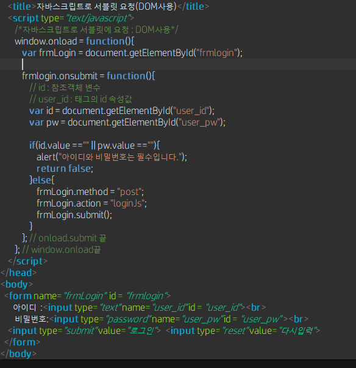

  - name 속성 사용

    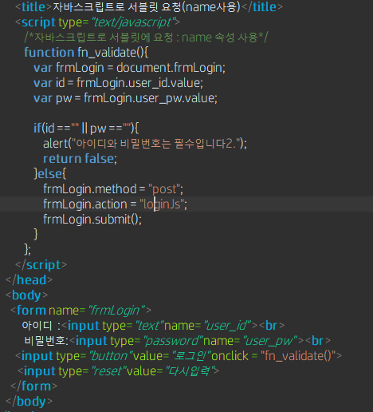

- jQuery 사용해서 서블릿에 요청

  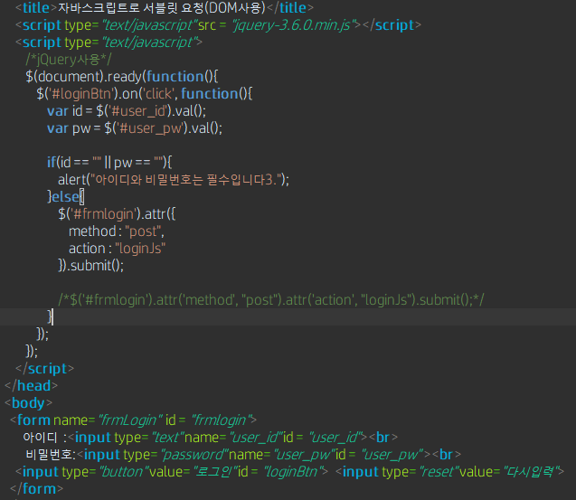

- **서블릿 포워딩**

  - **서블릿에서 다른 서블릿이나 JSP 페이지로 요청을 전달하는 기능**
  - **포워딩 용도**
    - 요청에 대한 추가 작업을 다른 서블릿에서 수행
    - 요청에 포함된 정보를 다를 서블릿이나 JSP 페이지와 공유
    - 요청에 정보를 포함시켜 다른 서블릿으로 전달
    - 컨트롤러에서 뷰로 데이터 전달

- **서블릿에서 포워딩 방법 4가지**

  - **Redirect 방법**

    - 웹 브라우저에 재요청하는 방식

    - HttpServletResponse 객체의 sendRedirect() 메소드 이용

    - 형식 : sendRedirect(“포워드할 서블릿 또는 JSP”);

      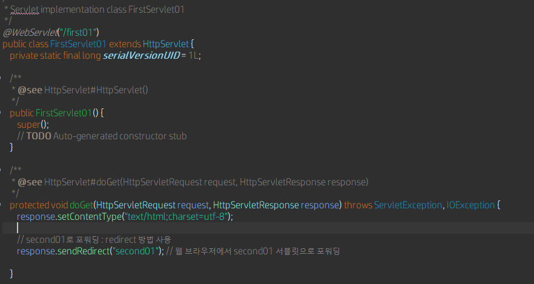

      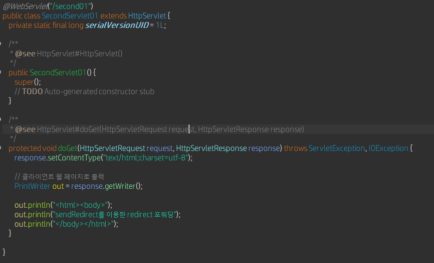

  - **Refresh 방법**

    - 웹 브라우저에게 재요청하는 방식

    - HttpServletResponse 객체의 addHeader() 메소드 이용

    - 형식 : addHeader(“Refresh”, “경과시간(초);url=요청할 서블릿 또는 JSP”);

      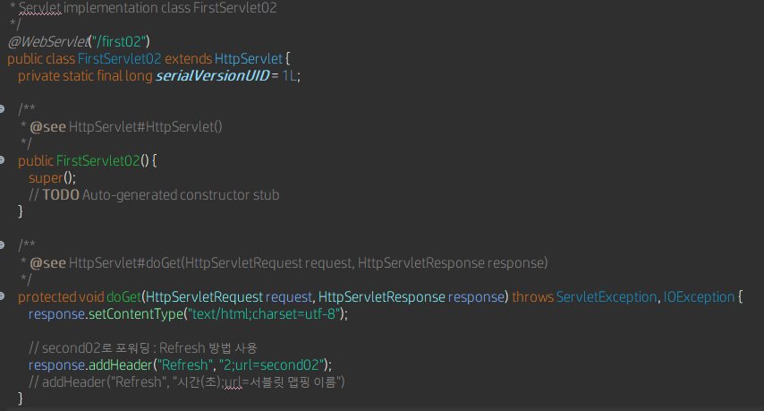

      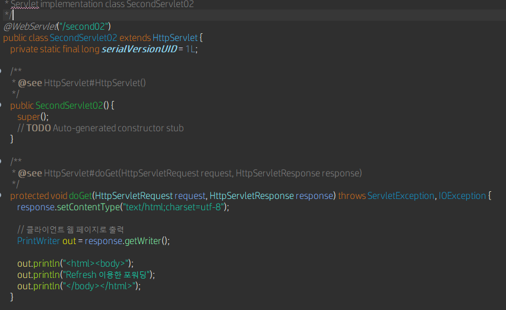

  - **location 방법**

    - 자바스크립트에서 재요청하는 방식

    - 자바스크립트에서 재요청하는 방식

    - 형식 : location.href = “요청할 서블릿 또는 JSP”;

      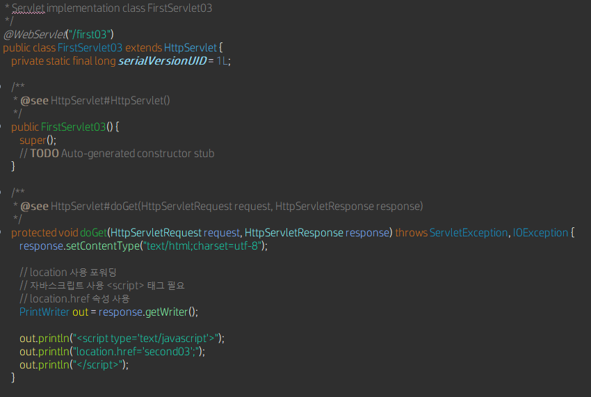

      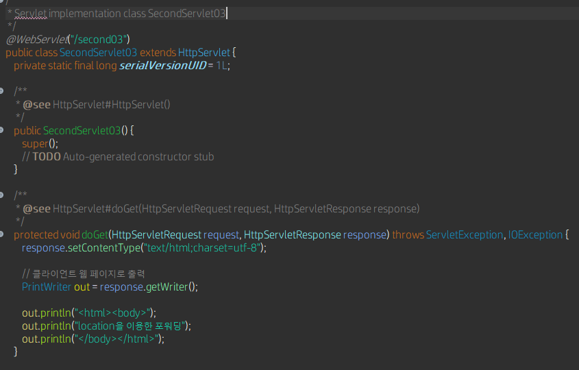

  - **dispatch 방법**

    - 서블릿이 직접 요청하는 방식 (일반적으로 포워딩 기능 지칭)

    - RequestDispatcher dis = request.getRequestDispatcher(“포워드할 서블릿 또는 JSP);

    - dis.forward(request, response);

      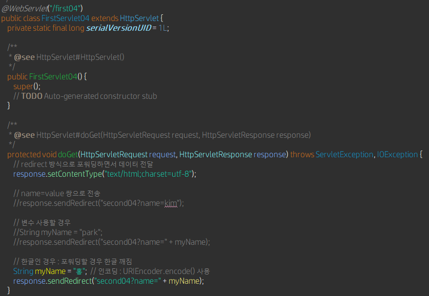

      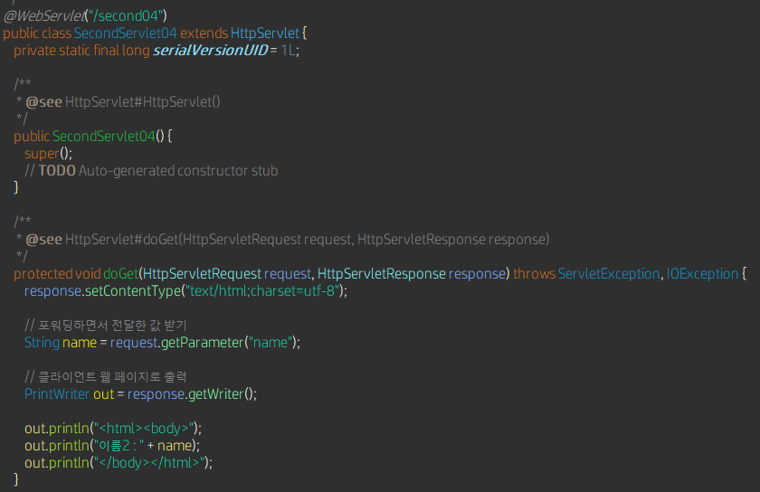

  - 포워딩 방법들의 차이점

    - **redirect, Refresh, location 방법**
      - 서블릿이 웹 브라우저를 거쳐서 다른 서블릿이나 JSP에게 요청하는 방법
    - **dispatch 방법**
      - 클라이언트를 거치지 않고 서블릿에서 바로 다른 서블릿에게 요청하는 방법
      - url이 바뀌지 않음(즉, 클라이언트 측에서는 포워드가 진행되었는지 알 수 없음)

- **포워딩 하면서 데이터 전달**

  - response.sendRedirect(“second04?name=kim”);
  - String name = request.getParameter(“name”);
    - FirstServlet04.java : /first04
    - SecondServlet04 : /second04

  - **(1) 값 지정해서 전달**
  - **(2) 변수 사용 : 변수값이 전달되도록**
  - **(3) 한글 인코딩 : URLEncoder.encode() 사용**

- **dispatch 사용 포워딩 방법**

  - 클라이언트를 거치지 않고 서블릿에서 바로 다른 서블릿에게 요청

  - 주소창의 URL 변경되지 않음

  - 클라이언트 측에서는 포워딩 진행되었는지 알 수 없음

    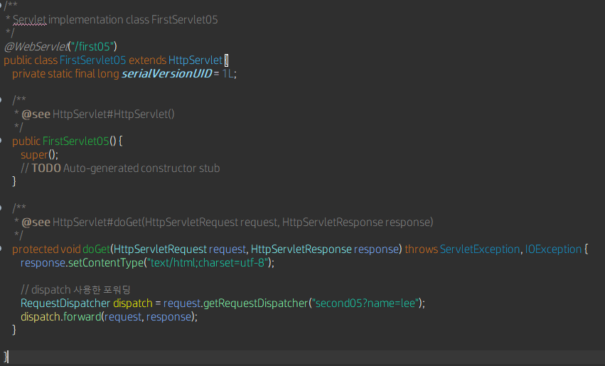

    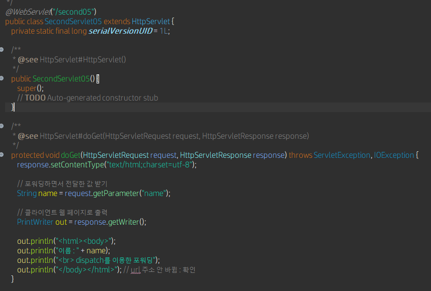

    - **실행은 FirstServlet05.java**

- **바인딩**

  - **수십 개 또는 많은 양의 회원 정보나 상품 정보를 전달해야 할 경우 포워딩 방식만 사용할 경우 문제**
  - **서블릿에서 다른 서블릿 또는 JSP로 대량의 데이터를 공유하거나 전달할 때 바인딩(binding) 기능 사용**
  - **바인딩 방법**
    - 포워딩할 때 setAttribute(“바인딩이름”, 데이터) 메소드를 사용해서 바인딩 이름과 데이터를 묶어서 설정한 후 포워딩된 문서에서 getAtrribute(“바인딩이름”) 메소들 사용해서 바인딩된 데이터를 추출해서 사용
    - redirect 방식으로는 전송 안 되고 dispatch 포워딩 방식 사용

- **DTO vs VO**

  - **DTO (Data Transfer Object)**
    - 데이터 저장 담당 클래스 (Model)
    - Controller, Service, View 등 계층간 데이터 교환을 위해 사용되는 객체
    - 비즈니스 로직을 갖지 않는 순수한 데이터 객체
    - Getter / Setter 메소드만 포함
    - 가변의 성격 (Setter : 값을 설정 (값이 바뀜)
  - **VO (Value Object)**
    - 데이터 저장 담당 클래스 (Model)
    - DTO와 혼용해서 사용되지만 VO는 값(value)을 위해 사용되는 객체로 불변(read only)의 속성
    - 보통 Getter의 기능만 포함ㄴ
    - 일반적으로 스프링에서 VO로 사용되지만 Getter/Setter 기능 다 사용하는 경우도 있음