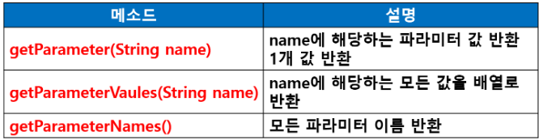
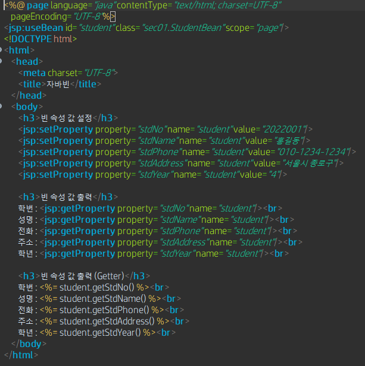
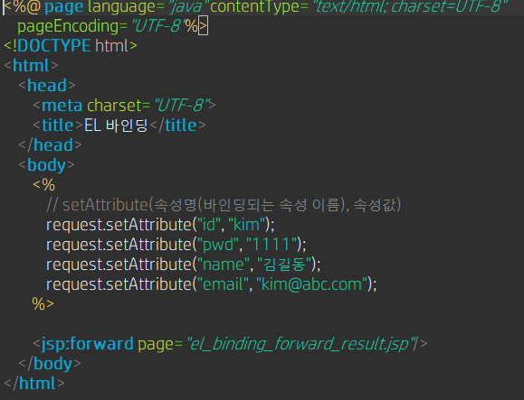

### 프레임워크 기반의 서비스 프로그래밍3(백엔드 프로그래밍)

> 웹 개념 - 웹 프로그래밍의 이해
>
> 서블릿
>
> JSP
>
> 스프링 프레임워크

- **JSP(Java Server Page)**

  - 서버 사이드 스크립트 언어
  - Java기반으로 HTML 문서 내에 자바코드를 삽입해서 웹 서버에서 동적으로 웹 페이지를 생성하여 클라이언트에게 반환
  - JSP를 통해 HTML과 동적으로 생성된 컨텐츠를 혼합해서 사용
  - Servlet을 보완한 스크립트 방식 표준
    - Servlet + 추가 기능
  - JSP는 실행되면 Servlet(.java)으로 변환되어 컴파일되서 클래스(.class)파일로 만들어져 실행
  - View를 담당하는 페이지로 사용

- **JSP와 서블릿과 차이점**

  - **JSP**
    - HTML 내부에 Java 소스코드가 들어있는 형식
    - 사용하기 편리 : 쉬움
  - **Servlet**
    - Java코드 내에 HTML 코드 포함
    - 읽고 쓰기 불편

- **JSP 페이지의 구조**

  - 정적페이지 + 동적페이지
  - 정적 페이지 구현 : HTML 태그
  - 동적페이지 구현 : 스크립트 사용
    - < %@ %>
    - < % %>
    - < %! %>
    - < %= %>

- **JSP 페이지의 기본 구성 요소**

  - **JSP 페이지 내용**
    - HTML 문서 내용 / JSP 태그 / 자바 코드
  - JSP 페이지 구성
    - 지시어 : **page, include, taglib**
    - 스크립트 요소
    - 액션 태그

- JSP 태그

  - **< %**로 시작하고 **%>**로 종료

  - **@ , !, =, --**문자를 추가하여 태그의 의미 부여

    

- **지시어**

  - JSP 페이지의 전체적인 속성을 지정할 때 사용
  - JSP 컨테이너에게 전달하는 JSP 페이지 관련 메세지
  - < %@ 지시어 속성1=값, 속성2=값, …. %>
  - **page 지시어** :  **< %@ page** … %>
    - JSP 페이지에 대한 속성 설정
  - **include 지시어**
    - **< %@ include** file=”포함될 파일의 url” %>
    - 공통적으로 포함될 내용을 가진 파일을 해당 JSP 페이지 내에 삽입하는 기능을 제공
    - 복사 & 붙여넣기 방식으로 두 개의 파일이 하나의 파일로 합쳐진 후 하나의 파일로서 변환되고 컴파일
  - **taglib 지시어**
    - **< %@ taglib** prefix ="c" uri="http:......"%>
    - 표현언어(EL : Expression Language), JSTL(JSP Standard Tag Library)를 JSP 페이지 내에 사용할 때 씀

- **JSP 페이지의 스크립트 요소**

  - **선언문(Declaration)**

    - JSP 페이지의 멤버 필드 또는 메소드를 정의할 때 사용

    - 선언문에서 선언된 변수는 페이지 전체에서 사용 가능(전역변수 의미)

    - 형식 : < %! 선언 %>

    - 예 : **< %! int a = 20; %>** 

    - **< %**

      **int a = 10;**

      **String str = "문자열";**

      **%>**

  - **표현식**

    - 변수 값, 계산 결과, 함수 호출 결과를 직접 출력하기 위해 사용

    - 형태 : < %= 식 %>

    - < %= 변수명 %>

    - 예 : < %= 3*5 %>

    - 활용

      - < %! String name = "홍길동"; %>

        < %= name %>

  - **스크립트릿**

    - 자유롭게 자바코드를 기술할 수 있는 영역
    - **< % 자바코드 %>**
    - 스크립트릿에서 선언된 변수는 지역 변수의 개념(**선언된 이후부터 사용 가능**)
    - **주의사항!!!** : **메소드 반드시 선언부에서 정의 해야 함**

  - **주석**

    - HTML 주석 : < !-- -->
    - JSP 주석 : < %-- --%>
    - **자바 주석 : //, / * */

- **JSP 내장 객체**

  - 클라이언트에서 웹 서버에게 JSP 페이지를 요청하면 자동으로 생성

  - 객체 생성하지 않고 바로 사용 가능

  - **내장 객체 종류** 

    - 입출력 : request / response / out 

    - 서블릿 : page / config

    - 컨텍스트 : session / application / pageContext

    - 예외 처리 : exception

      

      

  - **request 객체의 파라미터 관련 메소드** 

    

    - **HTML 태그의 name 속성 값을 받음**
      - **< input type="text" name="name">**

  - **response 객체**

    - JSP 페이지에서 처리한 결과를 웹 브라우저에 응답할 때 사용

    - 헤더 설정, 코드 상태, 쿠키 등 정보 포함되어 있음

    - 응답 콘텐츠 설정, 응답 헤더 설정, 상태 코드 설정과 관련된 메소드 제공

      

  - **out 객체**
    - 웹 서버에서 웹 브라우저에게 출력 스트림으로 응답하기 위해 사용
    - out.println(“출력 문자열”);
    - 표현식 < %= 출력문자열 %>과 동일
    - println() : 줄바꿈 적용되지 않음 
      - print()와 동일한 결과 (스페이스 한 칸 정도 차이)
      - 줄바꿈 하기 위해서는 < br> 태그 사용

- **액션 태그**

  - JSP 페이지 내에서 어떤 동작을 지시하는 태그

  - 어떤 동작 또는 액션이 일어나는 시점에 페이지와 페이지 사이에서의 제어 이동 또는 다른 페이지의 실행 결과를 현재 페이지에 포함하는 기능 제공

  - **액션 태그 종류**

    - **include 액션 태그 : < jsp:include>**

      - 다른 페이지의 실행 결과를 현재 페이지에 포함시킬 때 사용

      - 페이지를 모듈화 할 때 사용

      - < jsp:include page = "포함될 페이지" flush = "true"/>

      - page속성 : 결과가 포함될 페이지

      - flush속성

        - 포함될 페이지로 제어가 이동될 때 현재 포함하는 페이지가 지금까지 출력 버퍼에 저장한 겨로가를 처리하는 방법을 결정
        - true(현재 페이지가 지금까지 버퍼에 저장한 내용을 웹 브라우저에 출력하고 버퍼를 비움)

        

      

    - **forward 액션 태그 : < jsp:forward>**

      - < jsp:forward page = "포워딩 할 jsp 페이지"/>
      - 현재 페이지에서 다른 특정 페이지로 전환
      - 웹 페이지 간의 제어를 이동시킬 때 사용

    - **param 액션 태그 : < jsp:param>**

      - 자바빈을 JSP 페이지에서 이용할 때 사용
      - DTO / VO에 해당

    - **setProperty 액션 태그 : < jsp:setProperty>**

      - 프로퍼티의 값을 세팅할 때 사용
      - setter

    - **getProperty 액션 태그 < jsp:getProperty>**

      - getter

- **자바빈 (JavaBeans)**

  - DTO/ VO와 같은 개념
  - 데이터를 다루기 위해 자바로 작성되는 소프트웨어 컴포넌트로 재사용 가능
  - 입력 폼의 데이터와 데이터베이스의 데이터 처리 부분에서 활용
  - **클래스로 작성**
    - 멤버 필드로 속성 (property)이 있고멤버 메소드로 Getter/Setter 메소드 포함
    - setXXX() : 프로퍼티에 값 저장
    - getXXX() : 프로퍼티 값 반환
  - 액션 태그를 이용해서 빈 사용
  - 속성 접근 제어자는 private
  - Getter/Setter 메소드와 클래스는 public 

- 자바 빈 관련 액션 태그

  - **useBean 액션태그 : < jsp:useBean>**

    - **< jsp:useBean id=”” class=”” scope=”” />**

      

    - 자바빈을 JSP페이지에서 사용할 때 사용

  - **setProperty 액션태그 : < jsp:setProperty>**

    - 프로퍼티(속성) 값을 설정할 때 사용
    - 데이터 설정(저장)

  - **getProperty 액션태그 : < jsp:getProperty>**

    - 프로퍼티의 값을 얻어낼 때 사용

    

- **모든 속성을 한꺼번에 설정**

  - form의 < input> 태그 속성명을** 클래스 필드명과 동일하게 지정하고 **<jsp:setProperty property="\*".. />로 설정**

    

- **표현 언어 : EL (Expression Language)**

  - **자바 코드가 들어가는 표현식을 좀 더 편리하게 사용하기 위해 JSP 2.0부터 도입된 데이터 출력 기능**

  - **표현식 또는 액션 태그 대신 값을 표현**

  - **< %= 값%>** => **${값}**의 형태로 표현이 바뀜

  - < jsp:getProperty> 대신 사용 

    - **<jsp:getProperty name=”member” property=”id” />**=>  **${member.id}**

  - parameter : ${param.이름}

  - **EL 연산자**

    - 산술 연산자 : +, -, *, /, %, (div, mod)
    - 관계 연산자 : >, >=, <, <=, ==, !=
    - 논리 연산자 : &&, ||, !, (and, or, not)
    - empty 연산자
      - 값이 null이거나 길이가 0이면 참(true)
      - ${empty 변수} : 변수가 null이 거나 0이면 참
      - ${not empty 변수} : 변수가 null이 아니거나 0이 아니면 참 

    

  - **param 내장 객체 사용**

    - memberForm_param.jsp
    - memberForm_param_result.jsp

  - **pageContext 내장 객체**

    - **컨텍스 이름 (프로젝트명) 출력**

    - **getContextPath() 메소드 이용해서 컨텍스트 이름 가져오기**

    - < a href="/JSP01/el/login.jsp">로그인< /a>

    - < a href=”<%=request.getContextPath() %>”>로그인< /a>

      

- **표현 언어로 바인딩 속성 출력**

  - **request, session, application 내장 객체**에 속성을 바인딩한 다른 서블릿이나 JSP에 전달 가능

  - 자바 코드 사용하지 않고 바인딩된 속성 이름으로 바로 값 출력

  - **request.setAttribute(“바인딩이름”, 값); => ${바인딩이름}**

    

    

  - **MemberBean2객체 바인딩 연습문제**

    - 생성자 + getter/setter 생성

      

    - MemberBean2 객체 생성하면서 초기화 : 생성자에게 값 전달 /  MemberBean2 클래스에 매개변수가 있는 생성자 필요

      

    - 바인딩된 MemberBean 객체로 속성에 접근하여 데이터 출력 

      

  - **MemberBean 객체를 ArrayList에 담아서 바인딩** 

- **스코프 (scope) 우선순위**

  - request, session, application 내장 객체에는 데이터를 바인딩해서 다른 JSP로 전달
  - 각 내장 객체에 바인딩하는 속성 이름이 같은 경우
  - 각 내장 객체에 지정된 출력 우선순위에 따라 순서대로 속성에 접근
  - **높 page < request < session < application 낮**
  - pageScope : 현재 페이지 영역의 변수
  - requestScope : 이전 페이지에서 받아온 영역의 변수 
  - sessionScope : session 영역의 변수
  - applicationScope : application 영역의 변수

- **JSTL (JSP Standard Tag Library)**

  - JSP 표준 태그 라이브러리

  - JSP와 HTML을 같이 사용함으로써 가독성이 떨어지는 것을 보완하고자 만들어진 태그 라이브러리

  - JSP 페이지 내에서 자바 코드를 사용하지 않고 태그를 사용하도록 함

  - JSP 페이지의 로직을 담당하는 부분인 제어문 및 데이터베이스 처리 등을 표준 커스텀 태그 제공

  - 사용하기 위해서는 라이브러리 별도 필요

  - < %@ taglib uri=”..” prefix=”” />

  - **JSTL 라이브러리 : 5개의 라이브러리로 구성**

    

  - **Core (코어)**

    - URI : http://java.sun.com/jsp/jstl/core
    - prefix : c
    - **제공 기능**
      - 변수의 선언 및 삭제 등의 변수와 관련된 작업
      - if, for 문 등과 같은 제어문
      - url 처리 및 그밖에 예외처리 및 화면 출력

  - **Core** **태그** 

    - **< c:set>**

      -  JSP의 setAttribute()와 같은 역할. (page|request|session|application) 범위의 변수(속성)를 설정

      - **< c:set var=”변수명” value=”변수값” [scope] />**

        

    - **< c:remove>**

      - JSP의 removeAttribute()와 같은 역할. (page|request|session|application) 범위의 변수(속성)를 제거

    - **< c:out>**

      - 화면출력. JSP의 표현식 대체

    - **< c:redirect>**

      - response.sendRedirect()를 대체하는 태그로 지정한 다른 페이지로 이동

    - **< c:if>**

      - 조건문을 사용할 때 씀 : else문 없을 때

      - **< c:if test=”${조건식}” [scope] /**>

        

    - **< c:choose>**

      - 자바의 switch 문과 같지만, 조건에 문자열 비교도 가능하고 쓰임의 범위가 넓음. 서브 태그로 < when>과 < otherwise>를 가짐 

      - else 가 필요할 때

      - \-   **< c:choose>**

        ​	< c:when test=”조건식1”>내용1< /c:when>

        ​	< c:when test=”조건식2”>내용2< /c:when>

        ​	< c:otherwise>내용n< /c:when>

      

    - **< c:when>**

      - choose의 서브 태그로 조건의 비교 시에 조건을 만족한 경우에 사용

    - **< c:otherwise>**

      - 조건을 만족하지 못한 경우에 사용

    - **< c:forEach>**

      - 객체 전체에 걸쳐 반복 실행을 할 때 사용

    - **< c:forToken>** 

      - 자바의 StringTokenizer 클래스를 사용하는 것과 같음

    - **< c:catch>**

      - body 위치에서 실행되는 코드의 예외를 잡아내는 역할을 담당

    - **< c:import>**

      - 웹 애플리케이션 내부의 자원 접근은 물론이고, http, ftp 같은 외부에 있는 자원(html, jsp등)을 가져옴

    - **< c:param>** 

      - 파라미터사용시 필요. < import>태그의 URL뒤에 파라미터로 붙여서 사용되기도 함 

    - **< c:url>**

      - 쿼리 파라미터로 부터 URL을 생성

