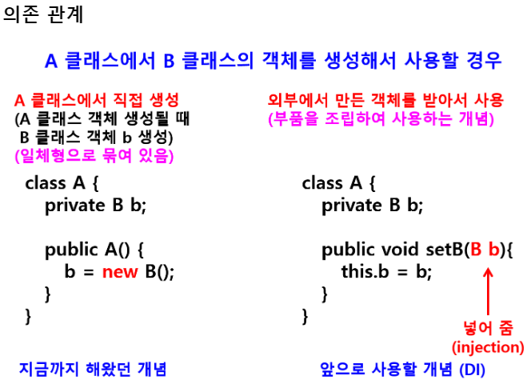
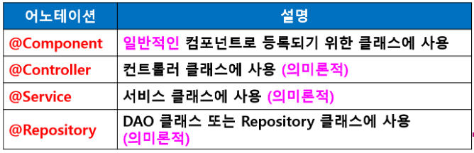

### 프레임워크 기반의 서비스 프로그래밍4(백엔드 프로그래밍)

> 웹 개념 - 웹 프로그래밍의 이해
>
> 서블릿
>
> JSP
>
> **스프링 프레임워크 : 자바 기반 웹 프레임워크**

- **스프링 프레임워크 (Spring Framework)**

  - 엔터프라이즈 애플리케이션 구축을 위한 솔루션

  - 자바 애플리케이션 개발을 위한 포괄적인 인프라 지원을 제공하는 자바 플랫폼

  - 스프링에서 인프라를 처리하므로 개발자는 애플리케이션 개발에만 집중

  - 모듈화되어 있어 필요한 부분만 사용 가능

  - 국내에서는 자바 개발자들에게 표준 프레임워크

  - **장점**

    - **생산성 우수**
      - 엔터프라이즈 애플리케이션 구축을 위한 솔루션이지만 가볍고 모듈화되어 있어서 필요한 부분만 사용 가능
      - **POJO** 클래스와 약간의 설정만으로도 개발이 가능하므로 개발 생산성을 높일 수 있음.
      - 스프링을 적용하면 적용하지 않은 코드의 1/3정도의 코드만으로도 개발 가능
    - **품질 보증**
      - 스프링 프레임워크는 이미 검증된 많은 아키텍처 또는 디자인 패턴을 적용하여 만들어졌기 때문에 코드에 아키텍처를 구현하기위한 코드나 디자인 패턴을 사용하기위한 코드를 개발자가 만들 필요가 없음
      - 이는 개발에 일관성을 제공해주고 소프트웨어의 품질을 보증
    - **유지보수 용이**
      - 스프링 프레임워크를 사용하여 작성된 애플리케이션들을 유지보수하는데 소요되는 인력과 시간을 줄일 수 있기 때문에 여러 프레임 워크중에서 스프링 프레임워크가 업계 표준으로 자리잡음

  - **특징**

    - **POJO 기반 프레임워크**

      - 자바 객체의 라이프사이클을 스프링 컨테이너가 직접 관리
      - 스프링 컨테이너로부터 필요한 객체를 얻어옴

    - **DI(Defendency Injection) 지원**

      - 의존성 주입

      - 각 계층이나 서비스들 사이 또는 객체들 사이의 의존성이 존재할 경우 스프링 프레임워크가 서로 연결시켜 줌(클래스간의 약한 결합 가능)

      - 객체간의 의존성을 개발자가 설정하는 것이 아니라 스프링 컨테이너가 주입시켜주는 기능

      - 장점 : 객체를 쉽게 확장하고 재사용 할 수 있음

        

    - **AOP(Aspect Oriented Programming) 지원**

      - 관점 지향 프로그래밍
      - 트랜잭션 로깅, 보안 등 여러 모듈에서 공통적으로 지원하는 기능을 분리하여 사용가능
      - 반복적인 코드를 줄이고 개발자가 비즈니스 로직에만 집중할 수 있도록 지원

    - **뛰어난 확장성**

      - 스프링 프레임워크의 소스는 모두 라이브러리로 분리되어 있어서 필요한 라이브러리만 가져다 사용하면 됨

    - **Model2 방식의 MVC Framework 지원**

      - Model / View / Controller
      - JSP MVC때보다 코드가 간결

  - **핵심기능**

    - 의존관계에 있는 객체를 생성 조립해 주는 기능
    - DI : 의존성 주입
    - IoC(Inversion of Control) : 제어의 역전

- **EJB(Enterprise JavaBean)**

  - 규모가 커지고 복잡한 애플리케이션 제작을 위해 만들어진 기술
  - 컴포넌트 기반
  - extends, implements를 많이 사용해서 클래스 의존도가 높고, 복잡하고 제한이 많은 문제 발생
  - 별도로 종속되지 않고 간단한 자바 객체를 사용하자는 의도에서 나온 것이 **POJO**
  - JavaEE 등의 중량 프레임워크들을 사용하게 되면서 해당 프레임워크에 종속된 "무거운" 객체를 만들게 되는 것에 반발해서 사용하게 된 용어

- **POJO(Plain Old Java Object)**

  - 자바 언어 사양외에 어떠한 제한에도 묶이지 않은 자바객체
  - 특정 환경과 규약에 종속되지 않아 필요에 따라 재사용 될 수 있는 방식으로 설계된 객체
  - 즉, 다른 클래스를 상속받거나 인터페이스를 구현해야 하는 규칙이 없는 자바 클래스
  - 미리 정의된 클래스 확장 예 :
    - public class Test extends javax.ser.....{}
  - **POJO의 예:**
    - JavaBean
      - 생성자와 Getters / Setters만 지닌 단순 자바 객체
      - DTO / VO
  - **대표적 POJO기반 프레임워크 : 스프링**
    - POJO를 사용하는 장접과 EJB에서 제공하는 엔터프라이즈 서비스와 기술을 그대로 사용할 수 있도록 지원하는 프레임워크

- **IoC(Inversion of Control) : 제어의 역전**

  - 객체에 대한 제어권 문제
  - 기존에는 개발자에게 제어권이 있었음
  - new 연산자를 사용해서 객체 생성
  - 스프링 프레임워크에서는 객체의 제어권이 스프링에 있고인스턴스의 라이프 사이클(생성에서 소멸까지)을 개발자가 아닌 스프링 프레임워크에서 담당

- **스프링 웹 프로젝트**

  - **Spring Legacy Project**
    - 스프링 템플릿 프로젝트를 이용하는 프로젝트
    - 모델2 방식 (MVC)의 프로젝트 생성시 사용
    - Spring MVC Project
    - 서버 및 여러 설정 필요(개발자가 직접 설정 해야함)
    - 실제 개발 업무에서 많이 사용
  - **Spring Starter Project**
    - Spring Boot을 이용하는 프로젝트
    - 최대한 간단하게 실행하고, 배포가 가능한 수준의 웹 애플리케이션을 제작하기 위한 목적
    - 개발에 필요한 모든 환경 설정을 갖추면서 최소한의 개발을 해야하는 경우 사용
    - 개발자가 복잡한 설정 없이 모든 개발 환경이 준비되기 때문에 초보 개발자도 쉽게 웹 프로젝트 생성 가능
    - 최근에는 **Spring Boot** 프로젝트 많이 사용
  - **Simple Spring Maven(Maven Project)** : 웹 기반이 아님
    - Spring 라이브러리의 기본 세트를 포함하는 Maven을 사용해서 간단한 Spring 프로젝트를 생성
    - **Maven(메이븐)**
      - Java용 프로젝트 관리도구
      - XML 기반의 정적인 빌드 제공
    - Gradle(그레이들)
      - 그루비(groovy) 스크립트 기반의 동적인 빌드 기능 제공
      - 안드로이드 앱을 만들 때 필요한 공식 빌드 시스템
      - 메이븐보다 빌드 작업이 간단하며 프로그래밍만으로 기능 추가 가능
      - 별도의 빌드 스크립트를 통하여 사용할 애플리케이션 버전, 라이브러리 등 설정

- **의존성(Dependency)** => 스프링에서는 사용하지 않음

  - 객체간 의존성
  - 한 클래스가 다른 클래스의 객체를 통해 그 클래스의 메소드를 실행할 때 이를 '의존한다' 라고 표현
  - new 연산자를 통해 다른 클래스의 객체 생성 사용
  - 예1>
    - MemInsertController클래스에서
    - MemberDAO 클래스의 개게 dao를 생성해서
    - MemberDAO 클래스의 insert() 메소드 사용
    - MemberDAO  dao = new MemberDAO();
    - dao.insert(dto);
  - 예2>
    - BoardDTO dto = new BoardDTO();

- **DI(Defendency Injection : 의존성 주입)**

  - 외부에서 빈(객체)을 만들어 필요로 하는 곳에 전달해 주도록 하는 것

  - 즉, 개발자가 new 연산자를 사용하여 직접 객체를 생성하지 않고 외부에서 생성된 bean(객체)을 IoC 컨테이너가 넣어주는 방식(주입 : Injection)

  - 일반적으로 부품(빈)을 조립(의존성 주입)해서 사용한다고 함

  - **사용하는 이유 :**

    - 의존하는 객체의 클래스가 변경되거나 다른 클래스의 객체를 사용하게 될 경우 의존관계(결합관계)에 있는 다른 모든 클래스들의 소스코드도 변경해야 하는데 의존성 주입 방법을 사용하면 클래스 결합 상태를 변경하거나 객체를 **주입하는 부분만 수정**하면 됨

    - 수정할 코드의 양을 줄일 수 있다는 장점이 있음

    - 예1>

      - A1 클래스를 사용하다가 A2 클래스로 변경할 경우 설정 파일에서 클래스 이름만 변경하면 됨

        **< bean id = "a" class="sec01.A1"> => < bean id = "a" class="sec01.A2">**

  - **스프링에서 의존성 주입 방법**
    - XML을 이용한 방법
      - XML 설정 파일에 < bean> 설정
    - Annotation을 이용한 방법
      - 자바 코드에서 **'@어노테이션이름'** 으로 설정

  - **예제**

    - 스프링을 사용하지 않는 DI
      - DI를 사용하지 않는 코드

        ```java
        // NameService 클래스 생성
        
        package com.di.no_spring_no_di;
        
        public class NameService {
        	public String showName(String name) {
        		System.out.println("NameService의 showName() 메소드");
        		String myName = "내 이름은 " + name + " 입니다";
        		return myName;
        	}
        }
        ```

        ```java
        // NameController 클래스 생성
        
        package com.di.no_spring_no_di;
        
        // NameService 클래스의 showName() 메소드 사용
        public class NameController {
        	// 필요한 곳에서 new 연산자를 사용해서 객체 직접 생성
        	NameService nameService = new NameService(); 
        	
        	public void show(String name) {
        		System.out.println("NameController : " + nameService.showName(name) );
        	}
        }
        
        /*
        	show() 메소드 
        	- 이름을 인자로 입력 받아
        	- NameService 클래스의 showName() 메소드를 호출하고
        	- 결과를 받아서 출력
        	- Controlle 클래스에서 Service 클래스 객체 생성 
        	-- DI 하지 않고 new 사용해서 직접 객체 생성
        	
        	
        	여기서 NameController 클래스와 NameService가 강한 의존관계에 있음
        
        */
        ```

        ```java
        // Main 클래스 생성 후 출력
        
        package com.di.no_spring_no_di;
        
        public class NameMain {
        
        	public static void main(String[] args) {
        		// NameController 객체 생성하고 show() 메소드 호출하면서 이름 전달
        		NameController controller = new NameController();
        		controller.show("홍길동");
        	}
        
        }
        ```

        

      - DI를 사용하는 코드
        - 의존성 관계에 있는 객체를 new를 통해 직접 생성하지 않고 생성자를 통해 외부에서 전달(주입 : injection)
        
          ```java
          package com.di.no_spring_di_contructor;
          
          public class NameService {
          	public String showName(String name) {
          		System.out.println("NameService의 showName() 메소드");
          		String myName = "내 이름은 " + name + " 입니다";
          		return myName;
          	}
          }
          ```
        
          ```java
          package com.di.no_spring_di_contructor;
          
          // NameService 클래스이 showName() 메소드 사용
          // new로 객체 직접 생성하지 않고
          // 생성자를 통해서 외부에서 주입 받아서 사용
          public class NameController {
          	// new 직접 객체 생성하지 않음
          	NameService nameService; 
          	
          	// 생성자를 통해서 NameService 객체 전달 받음
          	// 의미 : 생성자를 통해 외부에서 주입 받음 (injection)
          	// 의존성 주입
          	public NameController(NameService nameService) {
          		this.nameService = nameService;
          	}
          
          	public void show(String name) {
          		System.out.println("NameController : " + nameService.showName(name) );
          	}
          }
          ```
        
          ```java
          package com.di.no_spring_di_contructor;
          
          public class NameMain {
          
          	public static void main(String[] args) {
          		// 외부에서 객체 생성
          		NameService nameService = new NameService();
          		
          		// 외부에서 생성된 객체를 생성자를 통해 주입 (injection)
          		// 생성자를 이용한 의존성 주입
          		NameController controller = new NameController(nameService);
          		controller.show("이몽룡");
          
          	}
          
          }
          ```
        
        - setter 메소드를 이용하여 의존성 주입 수행
        
          ```java
          package com.di.no_spring_di_setter;
          
          public class NameService {
          	public String showName(String name) {
          		System.out.println("NameService의 showName() 메소드");
          		String myName = "내 이름은 " + name + " 입니다";
          		return myName;
          	}
          }
          ```
        
          ```java
          package com.di.no_spring_di_setter;
          
          // NameService 클래스이 showName() 메소드 사용
          // new로 객체 직접 생성하지 않고
          // 생성자를 통해서 외부에서 주입 받아서 사용
          public class NameController {
          	// new 직접 객체 생성하지 않음
          	NameService nameService; 
          	
          	// 생성자 없음
          	// Setter 메소드를 통해 외부에서 주입 받음 (injection)
          	// 의존성 주입
          	public void setNameService(NameService nameService) {
          		this.nameService = nameService;
          	}	
          
          	public void show(String name) {
          		System.out.println("NameController : " + nameService.showName(name) );
          	}
          
          }
          ```
        
          ```java
          package com.di.no_spring_di_setter;
          
          public class NameMain {
          
          	public static void main(String[] args) {
          		// 외부에서 객체 생성
          		NameService nameService = new NameService();
          		NameController controller = new NameController();
          		
          		// 외부에서 만든 객체를 Setter 메소드를 통해서 주입
          		// 의존성 주입
          		controller.setNameService(nameService);
          		controller.show("성춘향");
          	}
          
          }
          ```
        
          

    - **스프링 DI**

      - XML을 이용한 DI => XML파일에 bean을 정의(**< bean id="이름" class="패키지명.클래스명">**)하고 의존성 설정(**< ref bean="의존하는빈">**)
        - **생성자 기반 DI**
          
          - 클래스에 생성자가 있어야 하고 스프링 설정 파일 (xml)에서 빈을 정의할 때 **< constructor-arg ref="의존하는 빈">** 태그를 이용하여 의존성 주입
          
          - Main에서 객체 생성하지 않고 XML 설정 파일에서 빈 생성
          
          - main()의 역할 : 컨테이너 객체 생성 / 컨테이너에서 컴포넌트(빈) 가져옴
          
            ```java
            // NameServer 클래스 생성
            
            package com.di.spring_di_xml_constructor;
            
            public class NameService {
            	public String ShowName(String name) {
            		System.out.println("NameService의 showName() 메소드");
            		String myName = "내 이름은 " + name + " 입니다";
            		return myName;
            	}
            }
            ```
          
            ```java
            // 생성자가 있는 NameController 클래스 생성
            
            package com.di.spring_di_xml_constructor;
            
            // 스프링에서의 XML 이용한 DI-생성자 기반DI
            // NameService 클래스의 showName() 메소드 사용
            // new로 객체 직접 생성하지 않고
            // 생성자를 통해서 외부에서 주입 받아서 사용
            public class NameController {
            	// new 직접 객체 생성하지 않음
            	NameService nameService;
            	
            	// 생성자를 통해서 NameService 객체 전달받음
            	// 의미 : 생성자를 통해 외부에서 주입받음(injection)
            	// 의존성 주입
            	// main()에서 객체를 생성해서 전달하는 것이 아니라
            	// 컨테이너에서 가져온 빈을 전달해 줌
            	public NameController(NameService nameService) {
            		this.nameService = nameService;
            	}
            
            
            	public void show(String name) {
            		System.out.println("NameController : "+ nameService.ShowName(name));
            	}
            	
            }
            ```
          
            ```xml
            <!--bean 생성 -->
            
            <?xml version="1.0" encoding="UTF-8"?>
            <beans xmlns="http://www.springframework.org/schema/beans"
            	xmlns:xsi="http://www.w3.org/2001/XMLSchema-instance"
            	xsi:schemaLocation="http://www.springframework.org/schema/beans http://www.springframework.org/schema/beans/spring-beans.xsd">
            
            	<bean id = "nameService" class = "com.di.spring_di_xml_constructor.NameService"/>
            	<bean id = "nameController" class = "com.di.spring_di_xml_constructor.NameController">
            	
            	<constructor-arg ref="nameService"/>	<!--의존성 주입-->
            	</bean>
            </beans>
            ```
          
            ```java
            // Main 클래스 생성하고 출력
            
            package com.di.spring_di_xml_constructor;
            
            import org.springframework.context.support.AbstractApplicationContext;
            import org.springframework.context.support.GenericXmlApplicationContext;
            
            public class NameMain {
            
            	public static void main(String[] args) {
            		// 스프링 컨테이너 객체 생성
            		AbstractApplicationContext context = new GenericXmlApplicationContext("application-context.xml");
            		// 오류 : pom.xml에 spring 라이브러리가 없어서 나는 오류
            		// => pom.xml(설정파일)에 spring 라이브러리 추가
            		
            		NameController controller = context.getBean("nameController", NameController.class);
            		controller.show("김길동");
            		context.close();
            	}
            
            }
            ```
          
            
          
        - **Setter 기반 DI**
          
          - 클래스에 반드시 setter 메소드가 있어야 하고 스프링 설정 파일(xml)에서 < property> 태그 이용하여 의존객체 주입
          
          - **< property name="nameService" ref="nameService"/>**
          
          - name : Setter 메소드 이름(setNameService)
          
          - ref : 참조 객체 이름
          
          - 주의사항 : Setter 메소드를 사용할 경우에는 기본 생성자에 외에 다른 생성자를 정의해서는 안됨
          
            ```java
            // NameServer 클래스 생성
            
            package com.di.spring_di_xml_setter;
            
            public class NameService {
            	public void showName() {
            		System.out.println("내 이름은 이몽룡 입니다");
            	}
            }
            ```
          
            ```java
            // setter 포함한 NameController 클래스 생성
            
            package com.di.spring_di_xml_setter;
            
            // Spring DI : XML을 이용한 DI - Setter 기반
            // NameService 클래스의 showName() 메소드 사용
            // new로 객체 직접 생성하지 않고
            // 생성자를 통해서 외부에서 주입 받아서 사용
            public class NameController {
            	// new 직접 객체 생성하지 않음
            	NameService nameService;
            	
            	// 생성자를 없음
            	// Setter 메소드를 통해 외부에서 주입받음(injection)
            	// 의존성 주입
            	public void setNameService(NameService nameService) {
            		this.nameService = nameService;
            	}
            	
            	public void show() {
            		nameService.showName();
            	}
            
            }
            ```
          
            ```xml
            <!--xml에서 < property> 태그 이용하여 의존객체 주입-->
            
            <?xml version="1.0" encoding="UTF-8"?>
            <beans xmlns="http://www.springframework.org/schema/beans"
            	xmlns:xsi="http://www.w3.org/2001/XMLSchema-instance"
            	xsi:schemaLocation="http://www.springframework.org/schema/beans http://www.springframework.org/schema/beans/spring-beans.xsd">
            
            	<bean id = "nameService" class = "com.di.spring_di_xml_setter.NameService"/>
            	<bean id = "nameController" class = "com.di.spring_di_xml_setter.NameController">
            	
            	<!-- Setter 기반 : nameService 참조 (nameService 빈을 의존성 주입하도록 설정 : DI 설정) -->
            	<property name="nameService" ref="nameService"/>
            	</bean>
            </beans>
            ```
          
            ```java
            // Main 클래스 생성하고 출력
            
            package com.di.spring_di_xml_setter;
            
            import org.springframework.context.support.AbstractApplicationContext;
            import org.springframework.context.support.GenericXmlApplicationContext;
            
            public class NameMain {
            
            	public static void main(String[] args) {
            		// 스프링 컨테이너 객체 생성
            		AbstractApplicationContext context3 = new GenericXmlApplicationContext("application-context3.xml");
            		// 오류 : pom.xml에 spring 라이브러리가 없어서 나는 오류
            		// => pom.xml(설정파일)에 spring 라이브러리 추가
            		
            		NameController controller = context3.getBean("nameController", NameController.class);
            		controller.show();
            		context3.close();
            	}
            }
            ```
          
            

      - **<u>Annotation을 이용한 DI</u>**

        - xml 설정파일에서 < bean> 태그를 이용하여 설정하였던 빈 설정을 Annotation(메타데이터)을 이용해서 자바 코드에서 설정

        - 예> 

          - xml설정 파일에서 빈을 설정하지 않고 스프링 자바 소스코드를 읽어서

            클래스에 **@Component 어노테이션**이 붙은 클래스를 객체화(bean설정)

          - A1 클래스의 객체를 A2 클래스의 객체로 변경하려면 A1클래스에서 @Component를 제거하고

             A2클래스에 @Component를 붙이면 됨

          - **@Autowired** 어노테이션을 사용하여 bean을 자동 삽입

- **스프링에서 사용하는 Annotation**

  - **DI(의존성주입) 관련 Annotation** => xml 설정 파일에 있는 < bean>에 대해 DI 하거나, 자바 코드에서 생성된 bean에 대해 DI 할 수 있음

    - **@Autowired(스프링 지원) / @Inject(자바 지원)**
      - 타입을 기준으로 의존성 주입
      - 스프링 빈에 의존하는 다른 빈을 자동으로 주입할 때 사용
    - **@Qualifier**
      - 특정 빈의 이름을 지정
      - 동일한 interface 구현한 클래스가 여러개 있는 경우 사용하고자 하는 빈의 이름을 지정할 때 사용
    - @Resource
      - @Autowired와 @Qualifier 를 같이 사용하는 것과 동일
      - 자바에서 지원

  - **Annotation 예제**

    - INamesService 인터페이스 생성

      ```java
      package com.di.spring_di_annotation;
      
      public interface INameService {
      	public String showName(String name);
      }
      ```

    - BNameService 클래스 생성(인터페이스를 오버라이딩)

      ```java
      package com.di.spring_di_annotation;
      
      public class BNameService implements INameService {
      	@Override
      	public String showName(String name) {
      		System.out.println("BNameService의 showName() 메소드");
      		String myName = "내 이름은 " + name + " 입니다";
      		return myName;
      	}
      }
      ```
  
    - AnotherName 클래스
  
      ```java
      package com.di.spring_di_annotation;
      
      public class AnotherNameService implements INameService {
      
      	@Override
      	public String showName(String name) {
      		System.out.println("AnotherNameService의 showName() 메소드");
      		String myName = "나의 다른 이름은 " + name + " 입니다";
      		return myName;
      	}
      }
      ```
  
      
  
    - 어노테이션을 위한 xml 설정
  
      ```xml
      <?xml version="1.0" encoding="UTF-8"?>
      <beans xmlns="http://www.springframework.org/schema/beans"
      	xmlns:xsi="http://www.w3.org/2001/XMLSchema-instance"
      	xmlns:context="http://www.springframework.org/schema/context"
      	xsi:schemaLocation="http://www.springframework.org/schema/beans http://www.springframework.org/schema/beans/spring-beans.xsd
      		http://www.springframework.org/schema/context http://www.springframework.org/schema/context/spring-context-4.3.xsd">
      	
      	<!--Annotation을 사용하기 위한 태그 추가  -->
      	<context:annotation-config/>
      	
      	<bean id="bnameService" class="com.di.spring_di_annotation.BNameService"/>
      	<bean id="anotherNameService" class="com.di.spring_di_annotation.AnotherNameService"/>
      	<bean id="nameController" class="com.di.spring_di_annotation.NameController"/>
      </beans>
      ```
  
    - NameController 클래스 생성
  
      ```java
      package com.di.spring_di_annotation;
      
      import javax.annotation.Resource;
      
      public class NameController {
      	// nameService 빈을 자동으로 주입(DI 설정)
      	// INamseService 인터페이스를 구현한 클래스가 2개 이므로 
      	// @Qualifier("빈이름") 사용해야 함
      	//@Autowired	=> 자동 입력
      	//@Qualifier("anotherNameService")	=> 여러개의 구현클래스가 있을때 빈을 설정
      	//@Qualifier("bnameService")
      	@Resource(name="anotherNameService")	=> @Autowired, @Qualifier 두개의 성질을 모두 가지고 있는 어노테이션
      	INameService nameService;
      	
      	// setter 메소드를 통해 외부에서 주입 받음
      	public void setNameService(INameService nameService) {
      		this.nameService = nameService;
      	}
      
      
      	public void show(String name) {
      		System.out.println("NameController : "+ nameService.showName(name));
      	}
      	
      }
      ```
  
    - NameMain 클래스 생성
  
      ```java
      package com.di.spring_di_annotation;
      
      import org.springframework.context.support.AbstractApplicationContext;
      import org.springframework.context.support.GenericXmlApplicationContext;
      
      
      public class NameMain {
      
      	public static void main(String[] args) {
      		AbstractApplicationContext context = new GenericXmlApplicationContext("application-context.xml");
      		// 오류 : pom.xml에 spring 라이브러리가 없어서 나는 오류
      		// => pom.xml(설정파일)에 spring 라이브러리 추가
      		
      		NameController controller = context.getBean("nameController", NameController.class);
      		controller.show("홍길동");
      		context.close();
      	}
      }
      ```
  
      
  
  - **빈 생성 관련 Annotation** => 빈 생성(설정)을 위해 클래스 위에 추가되는 어노테이션으로 클래스 이름위에 붙이면 클래스 파일에 대한 bean이 자동생성
  
    - 빈의 이름은 **클래스 이름에서 첫 문자만 소문자로 지정됨**
  
    - xml파일에서 bean 생성하지 않음
  
    - 어노테이션을 이용하기 위한 xml 설정 파일에서 필요한 작업
  
      - **xml 설정파일에 context 네임스페이스 추가 필요**
      - **< context-component-scan base-pakage="패키지명"/>** 추가
        - @Component 어노테이션이 적용된 클래스를 빈으로 등록
        - 빈으로 등록될 클래스가 들어있는 패키지 지정
        - 상위 패키지를 지정하면 하위 패키지까지 빈으로 등록될 클래스 찾음
  
    - **빈 생성 어노테이션 예제**
  
      - INamesService 인터페이스 생성
  
        ```java
        package com.di.spring_di_annotation;
        
        public interface INameService {
        	public String showName(String name);
        }
        ```
  
      - NameService 클래스 생성 : @Component 어노테이션 추가
  
        ```java
        package com.spirng_di_annotation_component;
        
        import org.springframework.stereotype.Component;
        
        
        
        // NameService 클래스를 빈으로 등록
        // 생성된 빈 이름은 nameService
        @Component
        public class NameService implements INameService {
        
        	@Override
        	public String showName(String name) {
        		System.out.println("NameService의 showName() 메소드");
        		String myName = "내 이름은 " + name + " 입니다";
        		return myName;
        	}
        }
        ```
  
      - NameController 클래스 생성 : 빈 생성
  
        ```java
        package com.spirng_di_annotation_component;
        
        import org.springframework.beans.factory.annotation.Autowired;
        import org.springframework.stereotype.Component;
        
        // NameController 클래스를 빈으로 등록
        // 생성된 빈 이름은 nameController
        @Component
        public class NameController {
        	// 어노테이션을 사용해서 DI 설정
        	@Autowired
        	INameService nameService;
        	
        	public void show(String name) {
        		System.out.println("NameController : "+ nameService.showName(name));
        	}
        }
        ```
  
      - xml 설정파일
  
        ```xml
        <?xml version="1.0" encoding="UTF-8"?>
        <beans xmlns="http://www.springframework.org/schema/beans"
        	xmlns:xsi="http://www.w3.org/2001/XMLSchema-instance"
        	xmlns:context="http://www.springframework.org/schema/context"
        	xsi:schemaLocation="http://www.springframework.org/schema/beans http://www.springframework.org/schema/beans/spring-beans.xsd
        		http://www.springframework.org/schema/context http://www.springframework.org/schema/context/spring-context-4.3.xsd">
        		
        	<context:component-scan base-package="com.spirng_di_annotation_component"/>
        		
        </beans>
        ```
  
      - Main 클래스 생성 후 출력
  
        ```java
        package com.spirng_di_annotation_component;
        
        import org.springframework.context.support.AbstractApplicationContext;
        import org.springframework.context.support.GenericXmlApplicationContext;
        
        
        public class NameMain {
        
        	public static void main(String[] args) {
        		AbstractApplicationContext context = new GenericXmlApplicationContext("application-context2.xml");
        		// 오류 : pom.xml에 spring 라이브러리가 없어서 나는 오류
        		// => pom.xml(설정파일)에 spring 라이브러리 추가
        		
        		NameController controller = context.getBean("nameController", NameController.class);
        		// @Component 어노테이션을 사용하여 클래스의 빈을 등록했으므로 
        		// getBean 메소드를 가져다 사용
        		
        		controller.show("이몽룡");
        		context.close();
        	}
        }
        ```
  
        
  
    - **@Component(@Controller, @Service, @Repository)**
  
      - 클래스를 빈으로 등록(부품등록)
      - 빈 id 지정할 수 있음
      - **@Component("빈이름") => < bean id="빈이름"/>에 해당**
  
    - @Configuration(@Bean)
  
      
  
    