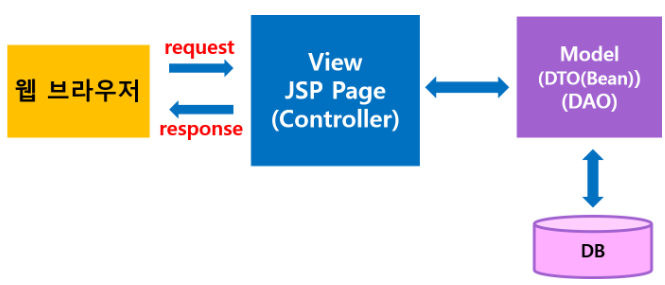
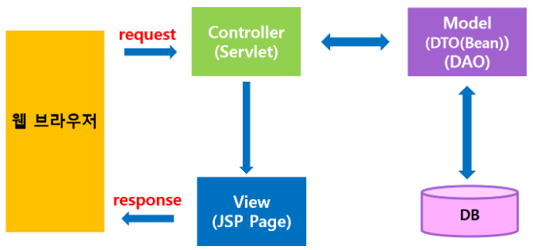
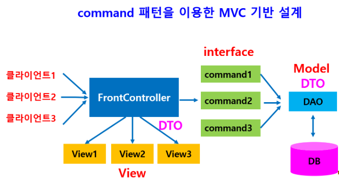
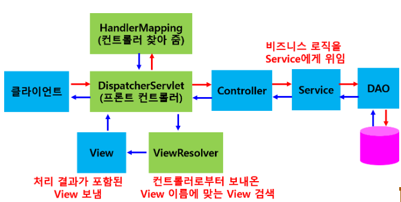
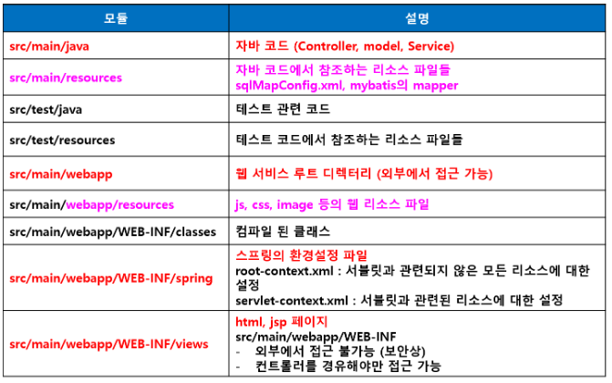

### 프레임워크 기반의 서비스 프로그래밍5(백엔드 프로그래밍)

> 웹 개념 - 웹 프로그래밍의 이해
>
> 서블릿
>
> JSP
>
> **스프링 프레임워크 : 자바 기반 웹 프레임워크**

- **Spring MVC 패턴**

  - **M : Model(DTO / DAO) / V : View(JSP) / C : Controller**

  - 웹 애플리케이션 개발

    - 화면 : 프론트엔드 개발자(디자이너)
    - 비즈니스 로직 : 백엔드 개발자
    - 처음부터 새로 개발하는 것이 아니라 기존의 웹 애플리케이션 개발 방법에 따라 개발
    - 많이 사용하는 표준화 소스 구조를 만들어 개발 진행

  - 웹 애플리케이션 모델

    - 표준화된 소스 구조

      - **모델1 방식**

        - 모든 클라이언트의 요청과 비즈니스 로직을 JSP가 담당

        - 클라이언트 요청 > JSP(화면 기능 / 로직처리) > DAO > 데이터베이스

        - 기능 구현이 쉽고 편리

        - 웹 사이트 화면 기능이 복잡해지고 화면 기능과 비즈니스 로직 기능이 섞이면서 유지보수 문제 발생

        - 코드 재사용성도 떨어짐

        - 비효율적

          

      - **모델2 방식**

        - 모델1 방식의 단점을 보완

        - 웹 애플리케이션의 각 기능을 분리해서 구현

          - 클라이언트 요청처리
          - 응답처리
          - 비즈니스 로직처리

        - 각 기능이 분리되어 모듈화 되어 있으므로 모듈별 개발이 가능

        - 모듈을 비슷한 프로그램 개발에 사용할 수 있어 코드 재사용성도 높음

        - 응용프로그램 확장성 및 이식성이 좋아짐

        - 개발 후 서비스 제공시 유지보수 편리

        - 현재 모든 웹 프로그램은 모델2 방식으로 개발

          

- **FrontController 패턴**
  - 모든 클라이언트 요청을 한 곳에서 처리하도록 하나의 대표 컨트롤러 사용
  - 단점 : 별도의 클래스를 추가하지 않고 FrontController가 다 처리(FrontController 내용이 길고 복잡해짐)
  - 장점 : 클라이언트의 요청을 한 곳으로 집중시켜서 효율적으로 개발 및 유지보수 가능


- **Command 패턴**

  - FrontController가 모든 클라이언트 요청을 직접 다 처리하지 않고 각 작업에 해당되는 클래스가 처리(분산)

  - FrontController가 수행하던 작업을 각 클래스로 분산처리

  - 각 클래스는 통일된 형식(규격)으로 처리하도록 interface로 구현

    

- **Spring MVC 구조**

  - DIspatcherServlet

    - 컨트롤러 선택(HandlerMapping을 통해)해서 요청을 컨트롤러에게 전달

    - View 검색(ViewResolver)해서 해당되는 View로 서비스 응답

      

- **Spring Project 생성**

  - 프로젝트 생성
    - 기본 컨트롤러와 뷰 페이지 자동으로 생성되어 있음
    - 컨트롤러 : HomeController.java
    - 뷰 페이지 : Home.jsp
    - 원하는 컨트롤러, 뷰페이지 생성하여 사용가능
  - **기본설정**
    - **pom.xml 설정**
      - **Java version을 11로 변경**
      - **Spring Framework를 5.2.22. RELEASE로 변경**
      - **Maven compiler : 1.8로 변경**
    - **프로젝트 설정(properties)**
      - **Java compiler : 11로 변경**
      - **Java Build Path : Workspace default JRE(jdk-11.0.15)로 변경**
      - **Project Facets : Java version 11로 변경 / Runtimes를 Apache Tomcat v9.0체크**

- **Spring 디렉터리 구조**

  

  - **url에서 context명 확인**
    - http:// localhost:8080/**project**/
    - server.xml에서 < Context path="/**project**"...../>
    - 프로젝트의 패키지명 : com.spring_mvc.**project**

- **View의 요청 경로(path) 설정**

  - 원하는 경로로 View 경로 설정
  - views 폴더 안에 원하는 폴더 생성하고 .jsp 페이지 저장

- **Spring Controller**

  - 스프링 컨트롤러는 빈으로 등록되어야 하며 비즈니스 로직이 실행되기 위해 빚니스 객체를 의존성 주입(DI) 해야함

  - @Controller 어노테이션 사용

  - @RequestMapping 어노테이션을 사용하여 url 맵핑

  - **요청 처리 메소드 구현**

    - @RequestMapping 아래에 작업을 처리할 메소드 추가
      - 필요한 클래스(객체)는 파라미터로 받아서 사용

  - 뷰 페이지 이름 반환

    - return "뷰페이지 이름만(확장자 없음)";

  - **Controller 클래스 작성**

    - 클래스 생성 후 @Controller 붙임
    - @RequestMapping 어노테이션을 사용하여 요청 경로 지정
    - 요청처리 메소드 구현
    - 뷰 페이지 이름 반환(return)

  - **Controller 클래스 작성 예제**

    - NewController 클래스 추가(@Controller 어노테이션 붙이고, @RequestMapping어노테이션 사용해서 요청 경로 지정)

    - 요청 처리 메소드 구현하고 뷰 페이지 이름 반환 : newView

      ```java
      package com.spring_mvc.project;
      
      import org.springframework.stereotype.Controller;
      import org.springframework.web.bind.annotation.RequestMapping;
      
      // (1) 컨트롤러 클래스 생성하고 @Controller 어노테이션 붙임
      @Controller
      public class NewController {
      	
      	// (2) @RequestMapping 어노테이션을 사용하여 요청 경로 지정
      	// 'newView' 요청처리
      	@RequestMapping("/newView")
      	public String newView() {	// (3) 요청처리 메소드 구현
      		return "newView";	// (4) 뷰페이지 이름 반환 : newView.jsp
      	}
      
      }
      ```

    - views 폴더에 newView.jsp 생성 후 프로젝트 실행

      ```jsp
      <%@ page language="java" contentType="text/html; charset=UTF-8"
          pageEncoding="UTF-8"%>
      <!DOCTYPE html>
      <html>
      <head>
      <meta charset="UTF-8">
      <title>newView</title>
      </head>
      <body>
      	newView.jsp입니다.
      </body>
      </html>
      ```

      

- **데이터 전달**

  - Controller => View페이지
    - 전달 방법 : Model, ModelAndView 사용
    - Model
      - Model 인터페이스
      - Model Attribute 추가하기 위해 고안
      - key/value 형태로 값을 임시 저장
      - Controller에서 Model에 데이터 저장하고 View이름을 return하면 View페이지로 Model이 전달
      - View 페이지에서 key를 사용해서 Model에 저장된 데이터 사용
  - **Model사용형식**
    - 요청 처리 메소드에서 Model 객체를 파라미터로 받음
      - **public String home(Locale locale, Model model)**
    - addAttribute() 메소드로 key / value 설정
      - **model.addAttribute("serverTime", formattedDate );**
    - return 되는 뷰페이지로 전달 : data 추출
      - **${serveTime}**
  - **ModelAndView 사용형식**
    - ModelAndView 클래스 사용
    - 데이터와 뷰 둘 다 설정
    - 반환값으로 ModelAndVeiw 객체 반환
    - ModelAndView mv = new ModelAndView();
      - **파라미터로 받을 수 있음 : public String show(ModelAndView mv)의 형태**
    - **mv.addObject(“name”, “홍길동”);** // 데이터 설정
    - **mv.setViewName(“showInfo2”);** // 뷰 이름 설정
    - **return mv;** // ModelAndView 객체 반환
  - **Model과 ModelAndView 같이 사용 가능**

- **@RequestMapping 다중 맵핑**

  - 한 개의 메소드를 여러 요청 경로로 접근 처리 가능
  - @RequestMapping(value={"요청경로1", "요청경로2"})

- **View페이지에서 컨트롤러로 데이터 전달**

  - 방법

    - **form을 통한 데이터 전달**

      - form데이터를 컨트롤러로 전송할 때 스프링에서 HTTP 요청 파라미터 가져오는 방법 3가지

        - **getParameter() 메소드 사용 => request.getParameter("no");**

          ```jsp
          <%@ page language="java" contentType="text/html; charset=UTF-8"
              pageEncoding="UTF-8"%>
          <%@ taglib uri="http://java.sun.com/jsp/jstl/core" prefix="c" %>
          <%@ page session="false" %>
          <!DOCTYPE html>
          <html>
          	<head>
          		<meta charset="UTF-8">
          		<title>학생 정보 등록 폼</title>
          	</head>
          	<body>
          		<h3>학생 정보 등록 폼</h3>
          		
          		<form method="post" action="/project/student/newStudent">
          			학번 : <input type="text" name="stdNo"><br>
          			성명 : <input type="text" name="stdName"><br>
          			학년 : <input type="text" name="stdYear"><br><br>
          			
          			<input type="submit" value="등록"><input type="reset" value="취소">
          		</form> 
          	</body>
          </html>
          ```

          ```java
          // index에서 studentForm 페이지 요청 처리
          	@RequestMapping("/student/studentForm")
          	public String studentFormView() {
          		return "student/studentForm";	// student폴더 안의 studentForm.jsp
          	}
          
          	// (1) HttpServletRequest 클래스의 getParameter()메소드 사용
          	@RequestMapping("/student/newStudent")
          	public String newStudent(HttpServletRequest request, Model model) {
          		// form의 각 <input>태그의 name속성 값으로 전달된 값 받기
          		String stdNo=request.getParameter("stdNo");
          		String stdName=request.getParameter("stdName");
          		String stdYear=request.getParameter("stdYear");
          		
          		// Model로 설정 : view페이지로 전달
          		model.addAttribute("stdNo", stdNo);
          		model.addAttribute("stdName", stdName);
          		model.addAttribute("stdYear", stdYear);
          		
          		return "student/studentResult";
          	}
          ```

          ```jsp
          <%@ page language="java" contentType="text/html; charset=UTF-8"
              pageEncoding="UTF-8"%>
          <!DOCTYPE html>
          <html>
          	<head>
          		<meta charset="UTF-8">
          		<title>학생 정보 등록 결과</title>
          	</head>
          	<body>
          		학번 : ${stdNo }<br>
          		성명 : ${stdName }<br>
          		학년 : ${stdYear }<br>
          	</body>
          </html>
          ```

          

        - **@RequestParam 어노테이션 사용**

          - 메소드의 파라미터로 설정(@RequestParam(“stdNo”) String stdNo, …)

            ```jsp
            <%@ page language="java" contentType="text/html; charset=UTF-8"
                pageEncoding="UTF-8"%>
            <%@ taglib uri="http://java.sun.com/jsp/jstl/core" prefix="c" %>
            <%@ page session="false" %>
            <!DOCTYPE html>
            <html>
            	<head>
            		<meta charset="UTF-8">
            		<title>학생 정보 등록 폼</title>
            	</head>
            	<body>
            		<h3>학생 정보 등록 폼</h3>
            		
            		<form method="post" action="/project/student/newStudent2">
            			학번 : <input type="text" name="stdNo"><br>
            			성명 : <input type="text" name="stdName"><br>
            			학년 : <input type="text" name="stdYear"><br><br>
            			<input type="submit" value="등록"><input type="reset" value="취소">
            		</form>
            	</body>
            </html>
            ```

            ```java
            // index에서 studentForm2 페이지 요청 처리
            	@RequestMapping("/student/studentForm2")
            	public String studentFormView2() {
            		return "student/studentForm2";	// student폴더 안의 studentForm2.jsp
            	}
            
            	// (2) @RequestParam 어노테이션 사용
            	@RequestMapping("/student/newStudent2")
            	public String newStudent2(@RequestParam("stdNo")String stdNo,
            							  @RequestParam("stdName")String stdName,
            							  @RequestParam("stdYear")String stdYear,
            							  Model model) {
            		//Model로 설정
            		model.addAttribute("stdNo", stdNo);
            		model.addAttribute("stdName", stdName);
            		model.addAttribute("stdYear", stdYear);
            		return "student/studentResult";
            	}
            ```

            ```jsp
            <%@ page language="java" contentType="text/html; charset=UTF-8"
                pageEncoding="UTF-8"%>
            <!DOCTYPE html>
            <html>
            	<head>
            		<meta charset="UTF-8">
            		<title>학생 정보 등록 결과</title>
            	</head>
            	<body>
            		학번 : ${stdNo }<br>
            		성명 : ${stdName }<br>
            		학년 : ${stdYear }<br>
            	</body>
            </html>
            ```

            

        - **command 객체 사용**

          - Form 생성

            ```jsp
            <%@ page language="java" contentType="text/html; charset=UTF-8"
                pageEncoding="UTF-8"%>
            <%@ taglib uri="http://java.sun.com/jsp/jstl/core" prefix="c" %>
            <%@ page session="false" %>
            <!DOCTYPE html>
            <html>
            	<head>
            		<meta charset="UTF-8">
            		<title>학생 정보 등록 폼</title>
            	</head>
            	<body>
            		<h3>학생 정보 등록 폼</h3>
            		
            		<form method="post" action="/project/student/newStudent3">
            			학번 : <input type="text" name="stdNo"><br>
            			성명 : <input type="text" name="stdName"><br>
            			학년 : <input type="text" name="stdYear"><br><br>
            		
            			<input type="submit" value="등록"><input type="reset" value="취소">
            		</form>
            	</body>
            </html>
            ```

            

          - 데이터 저장용 클래스 생성(Student)

            ```java
            package com.spring_mvc.project;
            
            
            public class Student {
            	private String stdNo;
            	private String stdName;
            	private String stdYear;
            	
            	
            	public String getStdNo() {
            		return stdNo;
            	}
            	public void setStdNo(String stdNo) {
            		this.stdNo = stdNo;
            	}
            	public String getStdName() {
            		return stdName;
            	}
            	public void setStdName(String stdName) {
            		this.stdName = stdName;
            	}
            	public String getStdYear() {
            		return stdYear;
            	}
            	public void setStdYear(String stdYear) {
            		this.stdYear = stdYear;
            	}	
            }
            ```

          - 요청을 수행하는 메소드에서 Student객체 사용(커멘드 객체)

            ```java
            // index에서 studentForm3 페이지 요청 처리
            	@RequestMapping("/student/studentForm3")
            	public String studentFormView3() {
            		return "student/studentForm3";	// student폴더 안의 studentForm3.jsp
            	}
            	// (3) Command 객체 사용
            	@RequestMapping("/student/newStudent3")
            	public String newStudent3(Student student) {
            		System.out.println(student.getStdNo());		// 콘솔에 출력 확인(없어도 된다)
            		System.out.println(student.getStdName());
            		System.out.println(student.getStdYear());
            		
            		return "student/studentResult3"; 
            	}
            ```

          - Command 객체는 자동으로 View의 Model에 등록

          - View 페이지에서 ${객체.필드명}

            ```jsp
            <%@ page language="java" contentType="text/html; charset=UTF-8"
                pageEncoding="UTF-8"%>
            <!DOCTYPE html>
            <html>
            	<head>
            		<meta charset="UTF-8">
            		<title>학생 정보 등록 결과 : Command 객체 사용</title>
            	</head>
            	<body>
            		학번 : ${student.stdNo }<br>
            		성명 : ${student.stdName }<br>
            		학년 : ${student.stdYear }<br>
            	</body>
            </html>
            ```

    - **url을 통한 전달**

      - **@PathVariable** 어노테이션 사용

      - < a href="/project/student/studentDetailView/${stdNo}">${stdNo}< /a>

      - @RequestMapping("/student/studentDetailView/{stdNo}")

      - public String studentDetailView(@PathVariable String stdNo){......}

        ```jsp
        <%@ page language="java" contentType="text/html; charset=UTF-8"
            pageEncoding="UTF-8"%>
        <!DOCTYPE html>
        <html>
        	<head>
        		<meta charset="UTF-8">
        		<title>학생 정보 등록 결과</title>
        	</head>
        	<body>
        		학번 : ${stdNo }<br>
        		성명 : ${stdName }<br>
        		학년 : ${stdYear }<br>
        		
        		url을 통한 데이터 전달<br>
        		학번 : <a href="/project/student/studentDetailView/${stdNo }">${stdNo }</a>
        	</body>
        </html>
        ```

        ```java
        // url을 통한 데이터 전달
        	@RequestMapping("/student/studentDetailView/{stdNo}")
        	public String studentDetailView(@PathVariable String stdNo) {
        		return "index";
        	}
        ```

        

- **<u>HashMap으로 받기</u>**

  - 여러 개의 값을 HashMap으로 받을 수 있음
  - 학생 검색 폼
    - 검색 조건 : type
    - 검색 값(입력값) : keyword
  - 컨트롤러
    - @RequestParam HashMap< String, Object> param