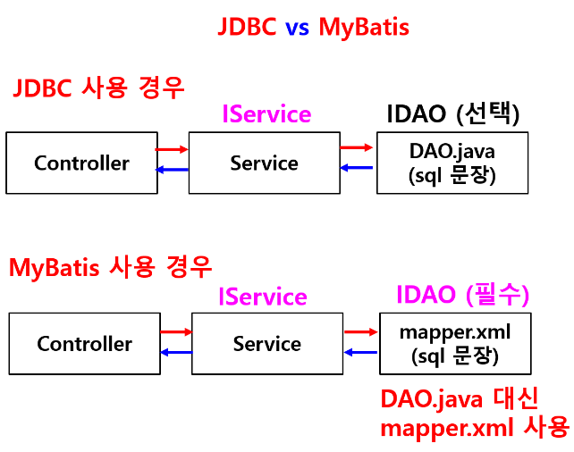
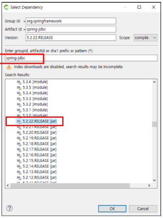
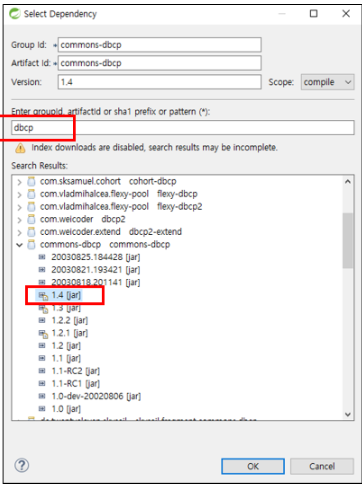
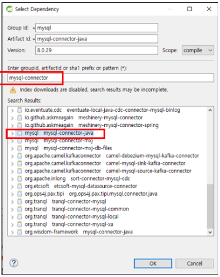
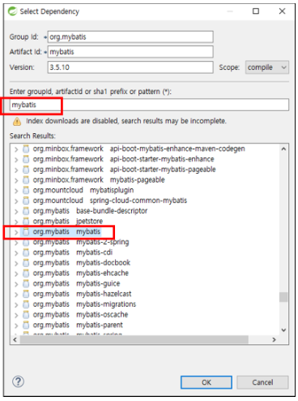
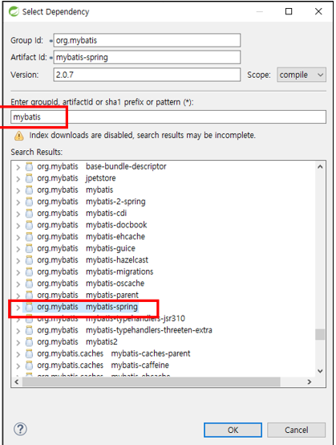
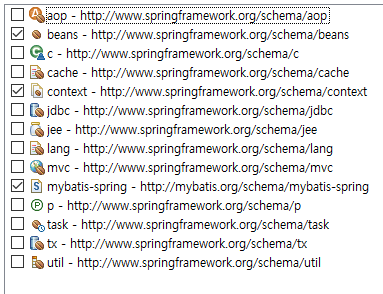
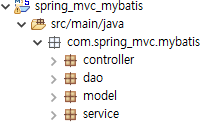

### 프레임워크 기반의 서비스 프로그래밍6(백엔드 프로그래밍)

> 웹 개념 - 웹 프로그래밍의 이해
>
> 서블릿
>
> JSP
>
> **스프링 프레임워크 : MyBatis 사용**

- **스프링 데이터베이스 연동(MyBatis사용)**

  - **MyBatis (마이바티스)**

    - ORM(Object Relational Mapping : 객체 관계 맵핑) 프레임워크
    - 자바에서 JDBC를 이용할 경우 java 언어와 SQL 언어가 한 파일에 존재해서 재사용성이 좋지 않음
    - MyBatis가 JDBC의 이런 단점을 개선하여 SQL 명령어를 별도의 XML 파일에 분리하고 SQL 명령어와 자바 객체를 맵핑해주는 기능을 제공
    - SQL 재사용 효율적. 쉬움

  - **MyBatis 특징**

    - SQL 명령어를 자바 코드에서 분리하여 XML 파일에서 관리

      

- **MyBatis 연동 스프링 프로젝트 작성 순서**

  - **1. MVC 프로젝트 생성**
  - **2. pom.xml 기본설정**
    - Java : 11
    - Spring : 5.2.22.RELEASE
    - Maven 1.8
  - **3. 프로젝트 설정**
    - Java Compiler
    - Java Build Path
    - Project Facets
    - web.xml 한글 인코딩 추가
  - **4. pom.xml에 데이터베이스 의존성 설정**
    - (라이브러리 추가 : < dependency> 추가)
    - Spring JDBC 의존성 : spring-jdbc
    - Connection Pool 의존성 : commons-dbcp
    - mysql 의존성
    - mybatis / mybatis-spring 의존성
  - **5. 데이터베이스 연결 정보설정**
    - **jdbc.properties 파일 생성**
      - jdbc.driverClassName
      - url / username / password
    - **스프링 설정 파일 생성 : application-config.xml**
      - DataSource / Mapper 지정
    - **web.xml에 변경된 내용 설정**
  - **6. 클래스 구성 : CRUD 기능 구현**
    - 컨트롤러
    - 서비스 인터페이스 / 클래스
    - VO
    - DAO / Mapper (XML)
    - 뷰 페이지 작성
    - 패키지 생성
      - controller
      - dao
      - model
      - service

  #### **< 예제>**

- **Sql에서 데이터베이스 생성**

  - 스키마 : springdb

  - 테이블 : product

    ```sql
    CREATE TABLE product(
    	prdNo CHAR(20) NOT NULL PRIMARY KEY,
        prdName VARCHAR(30) NOT NULL,
        prdPrice INT,
        prdCompany VARCHAR(30),
        prdStock INT
    );
    
    INSERT INTO product
    		VALUE('1001', '노트북', 1000000, '삼성', 10),
    			 ('1002', '냉장고', 1200000, 'LG', 5),
                 ('1003', '마우스', 30000, '로지텍', 12);
    
    SELECT * FROM product;
    ```

    

- **1. MVC 프로젝트 생성**

  - 프로젝트명 : spring_mvc_mybatis
  - 패키지명 : com.spring_mvc.mybatis

- **2. pom.xml 기본설정**

  - Java : 11
  - Spring : 5.2.22.RELEASE
  - Maven 1.8

- **3. 프로젝트 설정**

  - Java Compiler
  - Java Build Path
  - Project Facets
  - web.xml 한글 인코딩 추가

- **4. pom.xml에 데이터베이스 의존성 설정**

  - (라이브러리 추가 : < dependency> 추가)

  - Spring JDBC 의존성 : spring-jdbc

    

  - Connection Pool 의존성 : commons-dbcp

    

  - mysql 의존성

    

  - mybatis 의존성

    

  - mybatis-spring 의존성

    

- **5. 데이터베이스 연결 정보설정**

  - **5.1 src/main/resources 폴더에 database 폴더 생성하고 그 안에 jdbc.properties 파일 생성**

    - 데이터베이스 연결하기 위한 정보 설정

    - jdbc.driverClassName

    - url / username / password

      ```properties
      jdbc.driverClassName=com.mysql.cj.jdbc.Driver
      jdbc.url=jdbc:mysql://localhost:3306/springdb?serverTimezone-UTC
      jdbc.username=root
      jdbc.password=1234
      ```

  - **5.2 스프링 설정 파일 생성**

    - src/main/resources 폴더에spring 폴더 생성하고그 안에 application-config.xml 생성

      - [Namespaces]에서beans / context / mybatis-spring체크

      - DataSource / Mapper지정

        

      ```xml
      <?xml version="1.0" encoding="UTF-8"?>
      <beans xmlns="http://www.springframework.org/schema/beans"
      	xmlns:xsi="http://www.w3.org/2001/XMLSchema-instance"
      	xmlns:context="http://www.springframework.org/schema/context"
      	xmlns:mybatis-spring="http://mybatis.org/schema/mybatis-spring"
      	xsi:schemaLocation="http://mybatis.org/schema/mybatis-spring http://mybatis.org/schema/mybatis-spring-1.2.xsd
      		http://www.springframework.org/schema/beans http://www.springframework.org/schema/beans/spring-beans.xsd
      		http://www.springframework.org/schema/context http://www.springframework.org/schema/context/spring-context-4.3.xsd">
      	
          <!--DataSource / Mapper 지정-->
          
      	<context:property-placeholder location="classpath:database/jdbc.properties"/>
      	<context:component-scan base-package="com.spring_mvc.mybatis"/>
      	
      	<bean id="dataSource" class="org.apache.commons.dbcp.BasicDataSource">
      		<property name="driverClassName" value="${jdbc.driverClassName}"/>
      		<property name="url" value="${jdbc.url}"/>
      		<property name="username" value="${jdbc.username}"/>
      		<property name="password" value="${jdbc.password}"/>
      	</bean>
      	
      	<bean id="sqlSessionFactory" class="org.mybatis.spring.SqlSessionFactoryBean">
      		<property name="dataSource" ref="dataSource"/>
      		<property name="mapperLocations" value="classpath:com/spring_mvc/mybatis/**/*.xml"/>
      	</bean>
      	
      	<mybatis-spring:scan base-package="com.spring_mvc.mybatis.dao"/>
      </beans>
      ```

  - **web.xml에 변경된 내용 설정**

    - **application-config.xml 사용한다고 설정**

      ```xml
      <!-- The definition of the Root Spring Container shared by all Servlets and Filters -->
      	<context-param>
      		<param-name>contextConfigLocation</param-name>
      		<param-value>classpath:/spring/application-config.xml</param-value>		<!--이부분 설정 변경-->
      	</context-param>
      ```

      

- **6. 클래스 구성 : CRUD 기능 구현**

  - **6.1 패키지 생성**

    - controller

    - dao

    - model

    - service

      

  - **6.2 클래스 및 인터페이스 생성 : 해당 패키지 안에 생성**

    - ProductVO 클래스

      ```java
      package com.spring_mvc.mybatis.model;
      
      public class ProductVO {
      	private String prdNo;
      	private String prdName;
      	private int prdPrice;
      	private String prdCompany;
      	private int prdStock;
      	
      	
      	public String getPrdNo() {
      		return prdNo;
      	}
      	public void setPrdNo(String prdNo) {
      		this.prdNo = prdNo;
      	}
      	public String getPrdName() {
      		return prdName;
      	}
      	public void setPrdName(String prdName) {
      		this.prdName = prdName;
      	}
      	public int getPrdPrice() {
      		return prdPrice;
      	}
      	public void setPrdPrice(int prdPrice) {
      		this.prdPrice = prdPrice;
      	}
      	public String getPrdCompany() {
      		return prdCompany;
      	}
      	public void setPrdCompany(String prdCompany) {
      		this.prdCompany = prdCompany;
      	}
      	public int getPrdStock() {
      		return prdStock;
      	}
      	public void setPrdStock(int prdStock) {
      		this.prdStock = prdStock;
      	}
      	
      }
      ```

      

    - IProductService 인터페이스 / Product 클래스(인터페이스를 오버라이딩) => import org.springframework.stereotype.Service;

      ```java
      package com.spring_mvc.mybatis.service;
      
      import java.util.ArrayList;
      
      import com.spring_mvc.mybatis.model.ProductVO;
      
      public interface IProductService {
      	ArrayList<ProductVO> listAllProduct();		// 전체 상품 정보 조회
      	void insertProduct(ProductVO prd);			// 상품 정보 등록
      	void updateProduct(ProductVO prd);			// 상품 정보 수정
      	void deleteProduct(String prdNo);			// 상품 정보 삭제
      	ProductVO detailViewProduct(String prdNo);	// 상세 상품 정보 조회
      }
      ```

      ```java
      package com.spring_mvc.mybatis.service;
      
      import java.util.ArrayList;
      
      import org.springframework.beans.factory.annotation.Autowired;
      import org.springframework.beans.factory.annotation.Qualifier;
      import org.springframework.stereotype.Service;
      
      import com.spring_mvc.mybatis.dao.IProductDAO;
      import com.spring_mvc.mybatis.model.ProductVO;
      
      @Service
      public class ProductService implements IProductService {
      	
      	@Autowired
      	@Qualifier("IProductDAO")
      	IProductDAO dao;
      
      	@Override
      	public ArrayList<ProductVO> listAllProduct() {
      		return dao.listAllProduct();
      	}
      
      	@Override
      	public void insertProduct(ProductVO prd) {
      		dao.insertProduct(prd);
      
      	}
      
      	@Override
      	public void updateProduct(ProductVO prd) {
      		dao.updateProduct(prd);
      	}
      
      	@Override
      	public void deleteProduct(String prdNo) {
      		dao.deleteProduct(prdNo);
      	}
      
      	@Override
      	public ProductVO detailViewProduct(String prdNo) {
      		return dao.detailViewProduct(prdNo);
      	}
      }
      ```

      

    - IProductDAO 인터페이스

      - MyBatis에서는 DAO 인터페이스 필수

        ```java
        package com.spring_mvc.mybatis.dao;
        
        import java.util.ArrayList;
        
        import com.spring_mvc.mybatis.model.ProductVO;
        
        public interface IProductDAO {
        	public ArrayList<ProductVO> listAllProduct();				// 전체 상품 정보 조회
        	public void insertProduct(ProductVO prd);					// 상품 정보 등록
        	public void updateProduct(ProductVO prd);					// 상품 정보 수정
        	public void deleteProduct(String prdNo);					// 상품 정보 삭제
        	public ProductVO detailViewProduct(String prdNo);			// 상세 상품 정보 조회
        }
        ```

        

    - ProductMapper.xml 생성

      - application-config.xml에 dao 패키지 추가
      - <mybatis-spring:scan base-package="com.spring_mvc.mybatis.dao"/>

    - ProductController 클래스 생성

      ```java
      package com.spring_mvc.mybatis.controller;
      
      import java.util.ArrayList;
      
      import org.springframework.beans.factory.annotation.Autowired;
      import org.springframework.stereotype.Controller;
      import org.springframework.ui.Model;
      import org.springframework.web.bind.annotation.PathVariable;
      import org.springframework.web.bind.annotation.RequestMapping;
      
      import com.spring_mvc.mybatis.model.ProductVO;
      import com.spring_mvc.mybatis.service.ProductService;
      
      @Controller
      public class ProductController {
      	// DI 설정
      	@Autowired
      	ProductService prdService;
          
          
      	// 인덱스 페이지 열기 요청 처리
      	// 시작할 때 index 페이지 열기
      	@RequestMapping("/")
      	public String viewIndex() {
      		return "index";
      	}
      	
      	// 전체 상품 조회 요청 처리
      	@RequestMapping("/product/productAllList")
      	public String viewProductAllList(Model model) {
      		// 서비스 클래스의 메소드 호출해서 결과 받아옴
      		ArrayList<ProductVO> prdList = prdService.listAllProduct();
      		
      		// 모델 설정
      		model.addAttribute("prdList", prdList);
      		return "product/productAllListView";
      	}
      	// 상품 등록 폼 열기 요청 처리
      	@RequestMapping("/product/productNewForm")
      	public String viewProductNewForm() {
      		return "product/productNewForm";
      	}
      	
      	// 상품 등록 : 상품정보 DB 저장
      	@RequestMapping("/product/insertProduct")
      	public String insertProduct(ProductVO prd) {
      		prdService.insertProduct(prd);
      		
      		// DB에 데이터 저장한 후 전체 상품 조회 화면으로 포워딩
      		return "redirect:./productAllList";
      	}
      	
      	// 상품 상세 정보 조회
      	@RequestMapping("/product/productDetailView/{prdNo}")
      	public String detailViewProduct(@PathVariable String prdNo, Model model) {
      		ProductVO prd = prdService.detailViewProduct(prdNo);
      		model.addAttribute("prd", prd);
      		return "product/productDetailView";
      	}
      	
      	// 상품 정보 수정 폼 열기 요청 처리
      	@RequestMapping("/product/productUpdateForm/{prdNo}")
      	public String updateProductForm(@PathVariable String prdNo, Model model) {
      		// 수정할 상품번호 받아서, detailViewProduct()메소드 호출하면서 전달하고 해당 상품 정보(1개) 받아서 모델 설정
      		ProductVO prd = prdService.detailViewProduct(prdNo);
      		model.addAttribute("prd", prd);
      		return "product/productUpdateForm";
      	}
      	
      	// 수정 내용 DB 저장
      	@RequestMapping("/product/updateProduct")
      	public String updateProduct(ProductVO prd) {
      		prdService.updateProduct(prd);
      		return "redirect:./productAllList";
      	}
      	
      	// 상품 정보 삭제
      	@RequestMapping("/product/deleteProduct/{prdNo}")
      	public String deleteProduct(@PathVariable String prdNo) {
      		prdService.deleteProduct(prdNo);
      		return "redirect:/product/productAllList";
      	}
      }
      ```

      

    - views 폴더에 index.jsp 생성

      ```jsp
      <%@ page language="java" contentType="text/html; charset=UTF-8"
          pageEncoding="UTF-8"%>
      <!DOCTYPE html>
      <html>
      	<head>
      		<meta charset="UTF-8">
      		<title>index</title>
      	</head>
      	<body>
      		<h3>MyBatis 사용</h3>
      		
      		<a href="/mybatis/product/productAllList">전체 상품 조회</a><br><br>
      		<a href="product/productAllList">전체 상품 조회</a><br><br>
      		<a href="/mybatis/product/productNewForm">상품 등록</a><br><br>
      	</body>
      </html>
      ```

      

    - 기본 생성된 HomeController와 home.jsp 삭제실행 시켜서 index 페이지 열리는지 확인