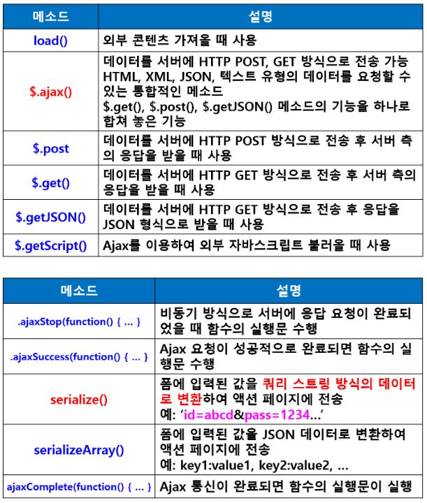
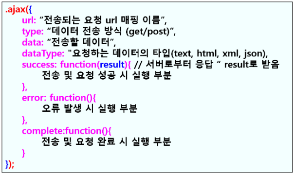

### 프레임워크 기반의 서비스 프로그래밍6(백엔드 프로그래밍)

> 웹 개념 - 웹 프로그래밍의 이해
> 
> 서블릿
> 
> JSP
> 
> **스프링 프레임워크 : MyBatis 사용**

- **스프링 데이터베이스 연동(MyBatis사용)**
  
  - **MyBatis **
    
    - ORM(Object Relational Mapping : 객체 관계 맵핑) 프레임워크
    - 자바에서 JDBC를 이용할 경우 java 언어와 SQL 언어가 한 파일에 존재해서 재사용성이 좋지 않음
    - MyBatis가 JDBC의 이런 단점을 개선하여 SQL 명령어를 별도의 XML 파일에 분리하고 SQL 명령어와 자바 객체를 맵핑해주는 기능을 제공
    - SQL 재사용 효율적. 쉬움
  
  - **MyBatis 특징**
    
    - SQL 명령어를 자바 코드에서 분리하여 XML 파일에서 관리
      
      

- **MyBatis 연동 스프링 프로젝트 작성 순서**
  
  - **1. MVC 프로젝트 생성**
  - **2. pom.xml 기본설정**
    - Java : 11
    - Spring : 5.2.22.RELEASE
    - Maven 1.8
  - **3. 프로젝트 설정**
    - Java Compiler
    - Java Build Path
    - Project Facets
    - web.xml 한글 인코딩 추가
  - **4. pom.xml에 데이터베이스 의존성 설정**
    - (라이브러리 추가 : < dependency> 추가)
    - Spring JDBC 의존성 : spring-jdbc
    - Connection Pool 의존성 : commons-dbcp
    - mysql 의존성
    - mybatis / mybatis-spring 의존성
  - **5. 데이터베이스 연결 정보설정**
    - **jdbc.properties 파일 생성**
      - jdbc.driverClassName
      - url / username / password
    - **스프링 설정 파일 생성 : application-config.xml**
      - DataSource / Mapper 지정
    - **web.xml에 변경된 내용 설정**
  - **6. 클래스 구성 : CRUD 기능 구현**
    - 컨트롤러
    - 서비스 인터페이스 / 클래스
    - VO
    - DAO / Mapper (XML)
    - 뷰 페이지 작성
    - 패키지 생성
      - controller
      - dao
      - model
      - service
  
  #### **< 예제>**

- **Sql에서 데이터베이스 생성**
  
  - 스키마 : springdb
  
  - 테이블 : product
    
    ```sql
    CREATE TABLE product(
        prdNo CHAR(20) NOT NULL PRIMARY KEY,
        prdName VARCHAR(30) NOT NULL,
        prdPrice INT,
        prdCompany VARCHAR(30),
        prdStock INT
    );
    
    INSERT INTO product
            VALUE('1001', '노트북', 1000000, '삼성', 10),
                 ('1002', '냉장고', 1200000, 'LG', 5),
                 ('1003', '마우스', 30000, '로지텍', 12);
    
    SELECT * FROM product;
    ```

- **1. MVC 프로젝트 생성**
  
  - 프로젝트명 : spring_mvc_mybatis
  - 패키지명 : com.spring_mvc.mybatis

- **2. pom.xml 기본설정**
  
  - Java : 11
  - Spring : 5.2.22.RELEASE
  - Maven 1.8

- **3. 프로젝트 설정**
  
  - Java Compiler
  - Java Build Path
  - Project Facets
  - web.xml 한글 인코딩 추가

- **4. pom.xml에 데이터베이스 의존성 설정**
  
  - (라이브러리 추가 : < dependency> 추가)
  
  - **Spring JDBC 의존성 : spring-jdbc**
    
    
  
  - **Connection Pool 의존성 : commons-dbcp**
    
    
  
  - **mysql 의존성**
    
    
  
  - **mybatis 의존성**
    
    
  
  - **mybatis-spring 의존성**
    
    

- **5. 데이터베이스 연결 정보설정**
  
  - **5.1> src/main/resources 폴더에 database 폴더 생성하고 그 안에 jdbc.properties 파일 생성**
    
    - 데이터베이스 연결하기 위한 정보 설정
    
    - jdbc.driverClassName
    
    - url / username / password
      
      ```properties
      jdbc.driverClassName=com.mysql.cj.jdbc.Driver
      jdbc.url=jdbc:mysql://localhost:3306/springdb?serverTimezone-UTC
      jdbc.username=root
      jdbc.password=1234
      ```
  
  - **5.2 >스프링 설정 파일 생성**
    
    - src/main/resources 폴더에spring 폴더 생성하고그 안에 application-config.xml 생성
      
      - [Namespaces]에서beans / context / mybatis-spring체크
      
      - DataSource / Mapper지정
        
        
      
      ```xml
      <?xml version="1.0" encoding="UTF-8"?>
      <beans xmlns="http://www.springframework.org/schema/beans"
          xmlns:xsi="http://www.w3.org/2001/XMLSchema-instance"
          xmlns:context="http://www.springframework.org/schema/context"
          xmlns:mybatis-spring="http://mybatis.org/schema/mybatis-spring"
          xsi:schemaLocation="http://mybatis.org/schema/mybatis-spring http://mybatis.org/schema/mybatis-spring-1.2.xsd
              http://www.springframework.org/schema/beans http://www.springframework.org/schema/beans/spring-beans.xsd
              http://www.springframework.org/schema/context http://www.springframework.org/schema/context/spring-context-4.3.xsd">
      ```
  
  - **web.xml에 변경된 내용 설정**
    
    - **application-config.xml 사용한다고 설정**
      
      ```xml
      <!-- The definition of the Root Spring Container shared by all Servlets and Filters -->
          <context-param>
              <param-name>contextConfigLocation</param-name>
              <param-value>classpath:/spring/application-config.xml</param-value>        <!--이부분 설정 변경-->
          </context-param>
      ```

- **6. 클래스 구성**
  
  - **6.1 패키지 생성**
    
    - controller
    
    - dao
    
    - model
    
    - service
      
      
  
  - **6.2 클래스 및 인터페이스 생성 : 해당 패키지 안에 생성**
    
    - ProductVO 클래스
    
    - IProductService 인터페이스 / Product 클래스(인터페이스를 오버라이딩) => import org.springframework.stereotype.Service;
    
    - IProductDAO 인터페이스
      
      - MyBatis에서는 DAO 인터페이스 필수
    
    - ProductMapper.xml 생성
      
      - application-config.xml에 dao 패키지 추가
      - <mybatis-spring:scan base-package="com.spring_mvc.mybatis.dao"/>
    
    - ProductController 클래스 생성
    
    - views 폴더에 index.jsp 생성

#### CRUD 기능 구현

1. **전체 상품 조회 (SELECT)**
   
   - ProductController에서 요청 받아서ProductService 클래스의 listAllProduct() 메소드 호출 
     
     ```java
     // 전체 상품 조회 요청 처리
         @RequestMapping("/product/productAllList")
         public String viewProductAllList(Model model) {
             // 서비스 클래스의 메소드 호출해서 결과 받아옴
             ArrayList<ProductVO> prdList = prdService.listAllProduct();
     
             // 모델 설정
             model.addAttribute("prdList", prdList);
             return "product/productAllListView";
         }
     ```
- IProductDAO의 listAllProduct() 메소드 호출

- ProductMapper에서 SQL 처리하고 결과 반환
  
  ```xml
  <?xml version="1.0" encoding="UTF-8"?>
  <!DOCTYPE mapper
    PUBLIC "-//mybatis.org//DTD Mapper 3.0//EN"
    "http://mybatis.org/dtd/mybatis-3-mapper.dtd">
  
    <mapper namespace="com.spring_mvc.mybatis.dao.IProductDAO">
        <resultMap id="prdResult" type="com.spring_mvc.mybatis.model.ProductVO" >
            <result property="prdNo" column="prdNo"/>
            <result property="prdName" column="prdName"/>
            <result property="prdPrice" column="prdPrice"/>
            <result property="prdCompany" column="prdCompany"/>
            <result property="prdStock" column="prdStock"/>
            <result property="prdDate" column="prdDate"/>
        </resultMap>
  
    <!--전체 상품 조회-->
    <!--주의 : id는 IProductDAO의 listAllProduct()메소드 이름과 동일해야 함-->
    <select id="listAllProduct" resultMap="prdResult">
        SELECT * FROM product ORDER BY prdNo
    </select>
  ```

- ProductService에서 받아서 ProductController에게 반환
  
  ```java
  @Service
  public class ProductService implements IProductService {
  
      @Autowired
      @Qualifier("IProductDAO")
      IProductDAO dao;
  
      @Override
      public ArrayList<ProductVO> listAllProduct() {
          return dao.listAllProduct();
      }
  ```

- ProductController에서 View 페이지로 전달
  
  ```jsp
  <%@ page language="java" contentType="text/html; charset=UTF-8"
      pageEncoding="UTF-8"%>
  <%@ taglib uri="http://java.sun.com/jsp/jstl/core" prefix="c" %>
  <%@ taglib uri="http://java.sun.com/jsp/jstl/fmt" prefix="fmt" %>
  <!DOCTYPE html>
  <html>
      <head>
          <meta charset="UTF-8">
          <title>전체 상품 조회</title>
          <style>
              #wrap{
                  margin:0 auto;
                  width: 100%;
                  text-align: center;
              }
              table{
                  margin:0 auto;
                  width: 800px;
              }
              table th{ 
                  background-color: skyblue;
              }
          </style>
      </head>
      <body>
          <div id="wrap">
              <h3>전체 상품 조회</h3>
              <table border="1">
                  <tr>
                      <th>상품번호</th>
                      <th>상품명</th>
                      <th>가격</th>
                      <th>제조사</th>
                      <th>재고</th>
                      <th>제조일</th>
                      <th>사진</th>
                  </tr>
                  <c:forEach items="${prdList }" var="prd">
                      <tr>
                          <td><a href="<c:url value='/product/productDetailView/${prd.prdNo }'/>">${prd.prdNo }</a></td>
                          <td>${prd.prdName }</td>
                          <td>${prd.prdPrice }</td>
                          <td>${prd.prdCompany }</td>
                          <td>${prd.prdStock }</td>
                          <td><fmt:formatDate pattern="yyyy-MM-dd" value="${prd.prdDate}"/></td>
                          <td>" width="30" height="20"></td>
                      </tr>
                  </c:forEach>
              </table><br>
  
              <a href="/mybatis">메인 화면으로 이동</a><br><br>
              <a href="<c:url value="/"/>">메인 화면으로 이동</a>    
          </div>
      </body>
  </html>
  ```

- 화면에 결과 출력

- **컨 -> 서비스 -> DAO -> Mapper -> 서비스 -> 컨 -> 뷰**

- 순서 : **ProductController => ProductService(dao설정) => ProductMapper(select문 작성) => productAllListView.jsp만들고 테이블형태로 출력**
2. **상품 등록(insert)**
   
   - 상품 등록 폼 생성 : productNewForm.jsp
     
     ```jsp
     <%@ page language="java" contentType="text/html; charset=UTF-8"
         pageEncoding="UTF-8"%>
     <!DOCTYPE html>
     <html>
         <head>
             <meta charset="UTF-8">
             <title>상품 등록 폼</title>
         </head>
         <body>
             <h3>상품 등록</h3>
             <form method="post" action="/mybatis/product/insertProduct">
                 <table>
                     <tr><td>상품번호</td><td><input type="text" name="prdNo"></td></tr>
                     <tr><td>상품명</td><td><input type="text" name="prdName"></td></tr>
                     <tr><td>가격</td><td><input type="text" name="prdPrice"></td></tr>
                     <tr><td>제조사</td><td><input type="text" name="prdCompany"></td></tr>
                     <tr><td>재고</td><td><input type="text" name="prdStock"></td></tr>
                     <tr><td>제조일</td><td><input type="text" name="prdDate"></td></tr>
                     <tr><td colspan="2"><input type="submit" value="등록"><input type="reset" value="취소"></td></tr>
                 </table>
             </form>
         </body>
     </html>
     ```
- 컨트롤러에 상품 등록 폼 열기 요청 처리(컨 => 뷰 페이지)
  
  ```java
  // 상품 등록 폼 열기 요청 처리
      @RequestMapping("/product/productNewForm")
      public String viewProductNewForm() {
          return "product/productNewForm";
      }
  ```

- 입력된 내용 insert 처리
  
  ```java
  // 상품 등록 : 상품정보 DB 저장
      @RequestMapping("/product/insertProduct")
      public String insertProduct(ProductVO prd) {
          prdService.insertProduct(prd);
  
          // DB에 데이터 저장한 후 전체 상품 조회 화면으로 포워딩
          return "redirect:./productAllList";
      }
  ```

- Mapper에서 SQL문 처리하고 반환
  
  ```xml
  <!--상품 등록-->
    <insert id="insertProduct" parameterType="com.spring_mvc.mybatis.model.ProductVO">
        INSERT INTO product(prdNo, prdName, prdPrice, prdCompany, prdStock, prdDate)
        VALUES(#{prdNo}, #{prdName}, #{prdPrice}, #{prdCompany}, #{prdStock}, #{prdDate})
    </insert>
  ```

- ProductService에서 받아서 ProductController에게 반환
  
  ```java
  @Override
      public void insertProduct(ProductVO prd) {
          dao.insertProduct(prd);
      }
  ```

- **컨 -> 서비스 -> DAO -> Mapper -> 서비스 -> 컨 -> 뷰**
3. **상품 상세 정보 조회**
   
   - 상품번호에 링크 설정(상품번호 클릭하면 상품 상세 정보 조회 화면으로 이동)
     
     ```java
     <a href="<c:url value='/product/productDetailView/${prd.prdNo}'/>"> ${prd.prdNo }</a>
     ```
   
   - 컨트롤러에서 **@PathVariable**로 전달 받음
     
     ```java
     // 상품 상세 정보 조회
         @RequestMapping("/product/productDetailView/{prdNo}")
         public String detailViewProduct(@PathVariable String prdNo, Model model) {
             ProductVO prd = prdService.detailViewProduct(prdNo);
             model.addAttribute("prd", prd);
             return "product/productDetailView";        // productDetailView페이지로 반환
         }
     ```
   
   - Mapper에서 SQL문 처리하고 반환
     
     ```xml
     <!--상품 상세 정보 조회 : 상품 1개 조회-->
       <select id="detailViewProduct" parameterType="String"
                                        resultType="com.spring_mvc.mybatis.model.ProductVO">
           SELECT * FROM product WHERE prdNo=#{prdNo}
       </select>
     ```
- ProductService에서 받아 ProductController에게 반환
  
  ```java
  @Override
      public ProductVO detailViewProduct(String prdNo) {
          return dao.detailViewProduct(prdNo);
      }
  ```
4. **상품 정보 수정 (UPDATE)**
   
   - 상품 업데이트 폼 생성(**productUpdateForm.jsp**)
     
     ```jsp
     <%@ page language="java" contentType="text/html; charset=UTF-8"
         pageEncoding="UTF-8"%>
     <%@ taglib uri="http://java.sun.com/jsp/jstl/core" prefix="c" %>
     <%@ taglib uri="http://java.sun.com/jsp/jstl/fmt" prefix="fmt" %>
     <!DOCTYPE html>
     <html>
         <head>
             <meta charset="UTF-8">
             <title>상품 정보 수정</title>
         </head>
         <body>
             <h3>상품 정보 수정</h3>
             <form method="post" action="/mybatis/product/updateProduct">
                 <table>
                     <tr><td>상품번호</td><td><input type="text" name="prdNo" value="${prd.prdNo }" readonly></td></tr>
                     <tr><td>상품명</td><td><input type="text" name="prdName" value="${prd.prdName }"></td></tr>
                     <tr><td>가격</td><td><input type="text" name="prdPrice" value="${prd.prdPrice }"></td></tr>
                     <tr><td>제조사</td><td><input type="text" name="prdCompany" value="${prd.prdCompany }"></td></tr>
                     <tr><td>재고</td><td><input type="text" name="prdStock" value="${prd.prdStock }"></td></tr>
                     <tr><td>재조일</td><td><input type="text" name="prdDate" value="<fmt:formatDate pattern="yyyy-MM-dd" value="${prd.prdDate}"/>"></td></tr>
                     <tr><td colspan="2"><input type="submit" value="완료"><input type="reset" value="취소"></td></tr>
                 </table>
             </form><br><br>
     
             <a href="<c:url value='/product/productAllList'/>">전체 상품 조회</a><br><br>
         </body>
     </html>
     ```
- 상품 정보 수정 폼 열기 요청처리
  
  ```java
  // 상품 정보 수정 폼 열기 요청 처리
      @RequestMapping("/product/productUpdateForm/{prdNo}")
      public String updateProductForm(@PathVariable String prdNo, Model model) {
          // 수정할 상품번호 받아서, detailViewProduct()메소드 호출하면서 전달하고 해당 상품 정보(1개) 받아서 모델 설정
          ProductVO prd = prdService.detailViewProduct(prdNo);
          model.addAttribute("prd", prd);
          return "product/productUpdateForm";
      }
  ```

- 상품 정보 수정 요청 / ProductService에서 받아 ProductController에게 반환
  
  ```java
  // 수정 내용 DB 저장
      @RequestMapping("/product/updateProduct")
      public String updateProduct(ProductVO prd) {
          prdService.updateProduct(prd);
          return "redirect:./productAllList";
      }
  ```
  
  ```java
  @Override
      public void updateProduct(ProductVO prd) {
          dao.updateProduct(prd);
      }
  ```

- Mapper에서 SQL문 처리하고 반환
  
  ```xml
   <!--상품 정보 수정-->
    <update id="updateProduct" parameterType="com.spring_mvc.mybatis.model.ProductVO">
        UPDATE product
        SET prdName=#{prdName}, prdPrice=#{prdPrice}, prdCompany=#{prdCompany}, prdStock=#{prdStock}, prdDate=#{prdDate}
        WHERE prdNo=#{prdNo}
    </update>
  ```
5. **상품 정보 삭제**
   
   - 상품 상세 정보 조회에서 상품 정보 삭제 요청
     
     ```java
     // 상품 정보 삭제
         @RequestMapping("/product/deleteProduct/{prdNo}")
         public String deleteProduct(@PathVariable String prdNo) {
             prdService.deleteProduct(prdNo);
             return "redirect:/product/productAllList";
         }
     ```
   
   - ProductService에서 받아 ProductController에게 반환
     
     ```java
     @Override
         public void deleteProduct(String prdNo) {
             dao.deleteProduct(prdNo);
         }
     ```
   
   - Mapper에서 SQL문 처리하고 반환
     
     ```xml
     <!--상품 정보 삭제-->
       <delete id="deleteProduct" parameterType="String">
           DELETE FROM product WHERE prdNo=#{prdNo} 
       </delete>
     ```
- 삭제 확인 메시지 출력(자바스크립트)
  
  ```jsp
  <a href="javascript:deleteCheck();">상품 정보 삭제</a>    <!--링크-->
  
  <!--삭제 확인 메세지 출력-->
  <script>
      function deleteCheck(){
          var answer = confirm("삭제하시겠습니까?");
          if(answer == true){
              location.href="/mybatis/product/deleteProduct/${prd.prdNo}";
          }
      }
  </script>
  ```

#### REST & AJAX

- **REST란?**
  
  - 브라우저에서 페이지 요청시
    - PC에서는 페이지 전체를 다시 전송해서 표시해도 문제 없지만 스마트폰 등의 모바일 기기에서는 기존화면은 그대로 유지하면서 피룡한 내용만 추가해서 화면에 표시
    - 모바일 기기가 유선기기보다 네트워크 전송량이 떨어지므로 현재 화면은 그대로 유지하면서 필요한 데이터만 전송받아 빠르게 표시
    - 따라서 데이터만 전송하는 기능의 표준화 필요성이 대두되었는데 REST 방식이 그 대안으로 사용됨
  - URI가 고유한 리소스를 처리하는 공통방식
  - EX> /board/112로 요청할 경우 게시글중 112번째 글 의미
  - REST방식으로 제공되는 API를 REST API(또는 RESTful API)라고 함
  - 트위터와 같은 OPEN API에서 많이 사용됨

- **스프링에서 REST 방식의 데이터 처리**
  
  - 스프링 3버전
    - @ResponseBody 어노테이션 지원
    - 메소드 레벨 : 메소드 위에 붙임
  - 스프링4버전
    - @RestController 어노테이션 이용 : 권장
    - 컨트롤러 레벨
      - REST 기능을 하는 컨트롤러에 붙임
      - 모든 메소드에 적용

- **Synchronous (동기식) 통신 vs Asynchronous (비동기식) 통신**
  
  - **Synchronous (동기식) 통신**
    - Request를 보내고 Request에 대한 Response를 받는 것으로 두 서버 사이의 Transaction을 맞추는 통신 방식
    - Request를 보낸 Thread는 Response가 도착하기 전까지는 아무 것도 하지 못하는 Block 상태가 됨을 의미
    - Request1 -> Response1, Request -> Response2
    - 요청과 응답값의 순서를 보장하고, 보낸 요청에 대한 처리 결과 값을 보장받을 수 있기 때문에 Response에 대한 처리 결과를 보장받고 처리해야 되는 서비스에 적합
  - **Asynchronous (비동기식) 통신**
    - Request를 보내고 아직 Request에 대한 Response를 받지 않고도 다른 일 처리 가능한 통신방식
    - 처리 속도가 빠름
    - Response에 대한 처리 결과를 보장받고 처리해야 되는 서비스에는 적합하지 않음
    - 비동기식 통신을 하기 위해서는 클라이언트에서 서버로 요청 메시지를 보낼 때, 본문에 데이터를 담아서 보내야 하고, 서버에서 클라이언트로 응답을 보낼때에도 본문에 데이터를 담아서 보내야 함
    - 이 본문이 바로 Body에 해당
    - 즉, 요청 본문은 requestBody, 응답 본문은 responseBody를 담아서 보냄
    - @RequestBody 어노테이션과 @ResponseBody 어노테이션이 각각 HTTP 요청 바리를 자바 객체로 변환하고, 자바 객체를 다시 HTTP 응답 바디로 변환
    - @ResponseBody가 붙은 파라미터에는 HTTP 요청의 본문 body 부분이 그대로 전달

- **Ajax (Asynchronous JavaScript and XML)**
  
  - 클라이언트에서 비동기 방식으로 자바스크립트를 이용하여화면 전환 없이 서버 측에 데이터를 요청할 때 사용
  
  - TEXT, HTML, XML, JSON 등의 데이터 처리 가능
  
  - 웹 서버 환경에서 실행
  
  - **Ajax 관련 메소드**
    
    
    
    - **$.ajax() 메소드**
      
      - 사용자가 지정한 URL 경로에 있는 파일의 데이터를 전송하고입력한 URL 경로의 파일로부터 요청한 데이터를 불러오는데 사용
      
      - 불러올 수 있는 외부 데이터는 텍스트, HTML, XML, JSON 유형 등 다양
        
        