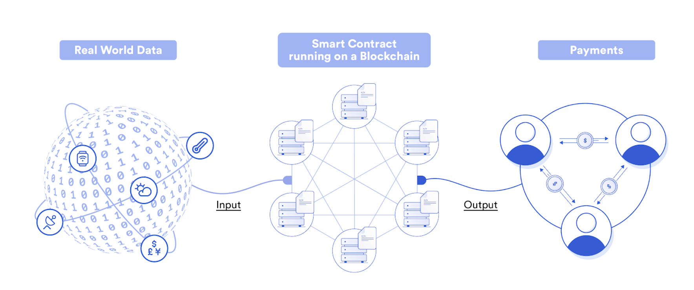
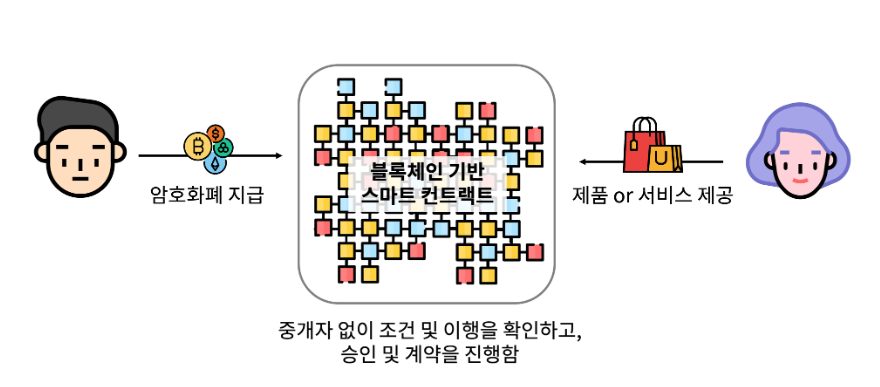

# Smart Contract

### 1. 스마트 컨트랙트란?

- smart contract는 블록체인이 1세대에서 2세대로 넘어갈 수 있게 되는 가장 중요한 계기 중 하나로 **블록체인  기술을 활용해 제 3의 인증기관 없이 개인간 계약이 이루어질 수 있도록 하는 기술**입니다. 즉, 계약상의 급부와 반대 급부를 프로토콜화하여 소프트웨어 및 하드웨어에 미리 저장하고 해당 계약을 이행하는 과정에서 조건 충족 여부에 대한 판단을 인간이 아닌 컴퓨터 등 기계가 대신 실행함으로써 제 3의 인증기관이 필요없도록 하는 개념을 의미합니다.

  

- 스마트 컨트랙트는 1994년 닉 재보(Nick Szabo)의 논문에 처음 제시되었으나 이론상으로만 그쳤습니다. 이후 블록체인을 기반으로 하는 이더리움?(Ethereum) 메인넷에서 스마트 컨트렉트를 실질적으로 구현하는 것이 가능해졌고 현재 블록체인 상에서는 다양한 형태의 스마트 컨트랙트가 사용되고 있습니다.

  - Ex> 비트코인 네트워크에서는 블록체인상에 단순히 비트코인의 입출금내역(UTXO:Unspent Transaction Output)만을 기록할 수 있었고 거래 그 이상의 동작을 블록체인 상에서 구현하는 것이 어려웠습니다.

    하지만 스마트 컨트랙트의 출현으로 디지털자산은 결제 수단 등의 기능을 넘어 블록체인의 생태계 확장이 가능하도록 하는 수단으로서 동작하였으며 실제로 다양한 방식의 블록체인 생태계 확장이 이루어지게 되어 큰 의미를 가지고 있습니다.

- 스마트 컨트랙트는 블록체인을 활용했기 때문에 뛰어난 보안성과 동시에 공신력있는 제 3자 혹은 기관이 필요하지 않다는 점에서 탈중앙화(decentralized)를 구현했다는 평가를 받고 있습니다.

### 2. 스마트 컨트랙트의 기본 성질

- **관측가능성(observability)** : 스마트 계약은 서로의 계약 이행 가능성을 관찰하거나 성과를 입증할 수 있어야 함
- **검증 가능성(verifiability)** : 계약을 이행 또는 위반할 경우 계약 당사자들이 이를 알 수 있어야 함
- **프라이버시(privacy)** : 계약 내용은 계약에 필요한 당사자들만이 알 수 있어야 함
- **강제 가능성(enforceability)** : 계약이 이루어질 수 있도록 구속력이 있어야 함

### 3. 이더리움에서 시작된 스마트 컨트렉트

- 블록체인이 등장하고 이더리움의 창시자 `Vitalik Buterin`이 이더리움에서 스마트 컨트랙트를 구현하면서 본격적으로 사용되기 시작했습니다. `Vitalik Buterin`은 이더리움을 블록체인 상에서 코드를 공개하는 오픈소스 프로젝트로 개발했으며 스마트 컨트랙트는 사전에 정해진 계약자 간의 규칙에 따라 디지털자산을 자동으로 이동하는 시스템이라 설명했습니다.

### 4. 스마트 컨트랙트의 가치

- **보안** : 분산된 인프라에서 계약을 실행하기 때문에 공격당할 수 있는 단일장애지점, 뇌물을 받을 수 있는 중앙 기관 및 당사자 또는 중앙관리자가 결과를 조작할 수 있는 매커니즘이 없습니다.
- **신뢰성** : 다수의 개별노드가 컨트랙트 로직에 대한 중복 처리 및 검증을 하기 때문에 유저들은 조작 저항 및 네트워크 가동시간을 보장받을 수 있어 컨트랙트가 늘 계약조건에 따라 시간에 맞춰 실행된다는 것을 보장받을 수 있습니다.
- **공평함** : P2P기반 분산 네트워크를 사용해 계약 진행 및 계약 조건을 실행하면 이윤을 추구하는 중앙 중개인에 의해 손실되는 가치가 줄어듭니다.
- **효율성** : 계약 백엔드 프로세스(에스크로, 유지보수, 실행 및 지불)가 자동화되면서 계약의 당사자들은 수동 데이터 입력, 계약 당사자의 의무 이행 여부 및 중개인의 거래 처리 등을 기다리지 않아도 됩니다.

### 5. 스마트 컨트랙트의 사용처

- **권한관리(토큰), 금융상품(DeFi), 게임, 보험** 등이 있습니다.

출처 : https://upbitcare.com/academy/education/blockchain/70 

​		  https://blog.chain.link/what-is-a-smart-contract-and-why-it-is-a-superior-form-of-digital-agreement-korean/