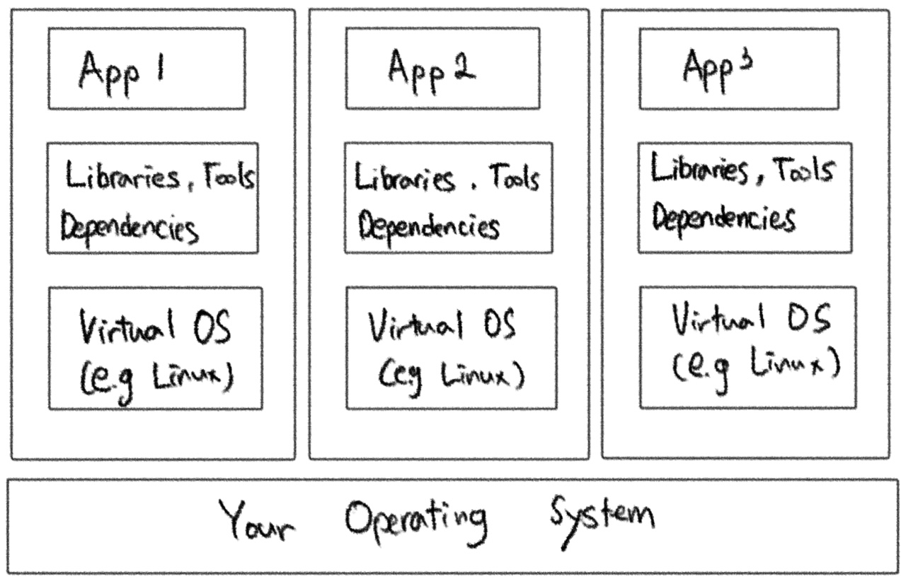
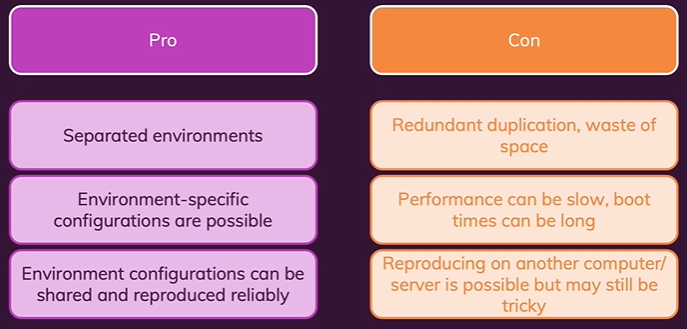
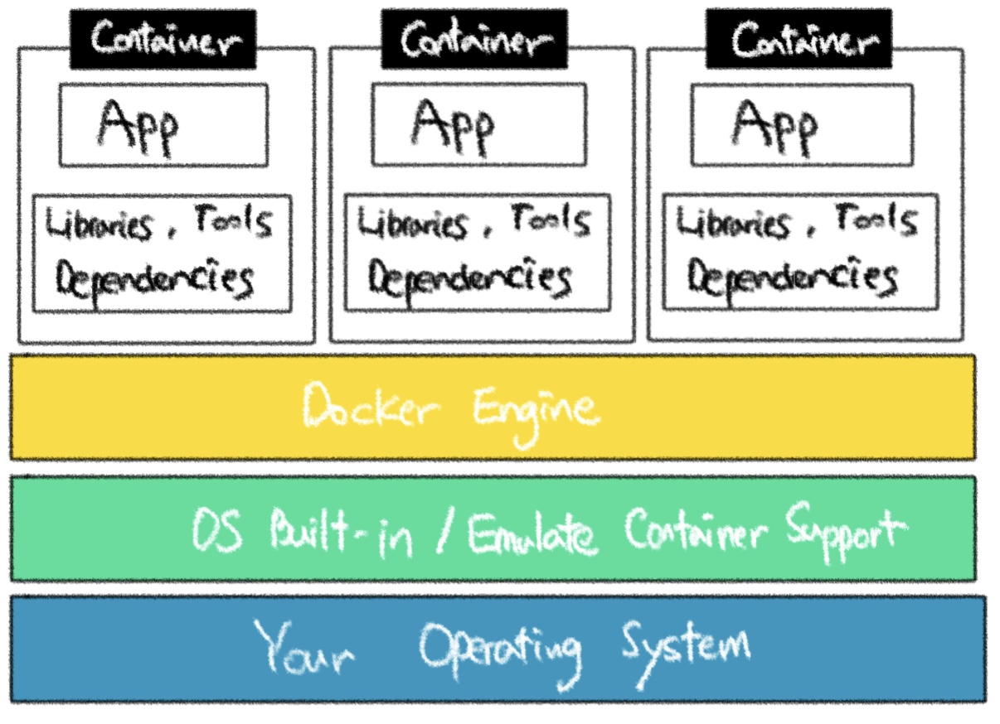

# Docker Container&VM

### 1. 가상 머신(Virtual Machine)

- 가상머신은 **호스트 운영 체제에 독립적인 자체 셀(shell)을 지닌 캡슐화된 가상 운영체제를 지닌 것 입니다**. 가상머신을 사용한다는 것은 호스트 운영체제 즉, Windows, macOS 또는 Linux가 있고 그 위에 가상머신을 설치한다는 것 입니다.

- **작동 원리**

  가상머신에는 내부에서 실행되는 자체 운영 체제인 가상 운영체제가 있습니다. 이 가상머신은 컴퓨터와 같기 때문에 가상머신에서 에뮬레이트를 할 수 있고, 그것은 가상으로 존재하지만 다른 머신이기 때문에 우리는 원하는 무엇(라이브러리, 종속성 및 도구...등)이든 설치할 수 있습니다. 따라서 프로그램에 필요한 모든 것과 거기에 설치되는 모든 도구가 포함된 도커, 컨테이너와 동일한 결과를 얻을 수 있습니다.

- **가상머신은 모든 것이 보유된 캡슐화된 환경으로 서로 다른 프로젝트나 가상머신 구성을 동료와 공유하여 동일한 환경에서 작업하고 있는지 확인할 수 있습니다.**

  

- **가상머신의 문제점?**

  - 가상 운영 체제를 지닌 여러 가상머신에서 발생하는 <u>오버헤드</u> 입니다. 모든 가상머신은 실제로 우리 머신 위에서 실행되기 때문에 이러한 머신이 여러대 있는 경우 <u>새로운 컴퓨터를 머신 내부에 설치하게 되고 메모리, CPU 등 하드 드라이브 공간을 낭비</u>하게 됩니다.
  - 모든 가상머신에 많은 도구가 설치되어 있고 애플리케이션에 직접적으로 쓰이지는 않지만 문제가 될 수 있습니다.

- **장점 / 단점**

  - **장점**

    - **분리된 환경을 생성**할 수 있습니다.
    - 모든 것을 안정적으로 공유하고 재생산 할 수 있습니다.

  - **단점**

    - 중복 복제 즉, **낭비되는 공간이 발생**합니다.
    - **성능저하**가 일어날 수 있습니다.
    - 모든 시스템에 가상머신을 설정해야 하여 동일한 방식으로 구성해야 하기 때문에 까다로울 수 있습니다.
    - 공유할 수 있는 단일 구성 파일이 없습니다.

    

    

### 2. Doker Container

- 컨테이너를 사용하면 호스트 운영체제를 하나의 머신에 몇대의 머신을 설치하지 않고 컨테이너 에뮬레이트를 지원하는 내정 컨테이너를 활용합니다.  그리고 그 위에 도커 엔진이라는 도구를 실행하여 도커가 이것을 작동하도록 처리합니다.

  

- 컨테이너는 예를 들어 NodeJS와 같이 코드에 필요한 운영 체제, 수많은 추가도구 또는 이와 유사한 것을 포함하지 않습니다. 컨테이너 내부에 작은 운영체제 레이어가 있을 수는 있지만 가상머신에 설치하는 것 보다 훨씬 작은 운영 체제의 매우 가벼운 버전(이미지)입니다.
- 컨테이너는 다른 사람들이 컨테이너를 다시 만들 수 있도록 하거나 이미지라 불리는 것에 빌드할 수도 있습니다. 그 이미지를 타인과 공유하여 모든 사람이 자신의 시스템에서 우리의 시스템에 있는 동일한 컨테이너를 실행할 수 있도록 할 수 있습니다.

### 3. 컨테이너 VS 가상머신

- **컨테이너**
  - 운영 체제와 시스템에 미치는 영향이 적으며 최소한의 디스크 공간을 사용합니다.
  - 이미지와 구성파일이 있기 때문에 공유, 재구축 그리고 배포가 매우 쉽습니다.
  - 앱과 환경을 캡슐화하지만 쓸데없는 부가적인 것까지 캡슐화 하지 않습니다.
- **가상 머신**
  - 운영체제와 시스템에 많은 영향을 미치며 많은 디스크 공간을 사용합니다.
  -  공유, 재구축 및 배포를 모두 수행할 수 있지만 컨테이너와 도커보다 까다롭습니다.
  - 환경을 캡슐화 하지만 필요한 것만 캡슐화 하는 것이 아니라 모든 것을 캡슐화 합니다.

