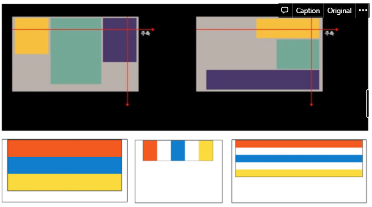

### CSS

### 1. 스타일 시트(CSS)

- **Cascading Style Sheets** : 계단형 스타일 시트

  - 단계적으로 스타일 적용
  - 여러 스타일이 겹치면 맨 마지막 스타일 적용

- HTML의 레이아웃 배치 등의 한계를 보완하기 위해 개발된 독립언어

- 일정 기능들을 미리 지정하여 여러 부분에서 동일하게 적용

- 가능한 작업

  - HTML문서 내의 글꼴, 크기, 색상, 배경, 테두리, 레이아웃, 배치, 여백 등 지정
  - 글자의 정렬방식, 그림자 지정 등 다양한 효과
  - 애니메이션, 동적 기능 구현 가능

- **장점**

  - 자유롭게 웹 문서 편집
    - HTML한계점 극복 가능
  - 통일감 있는 문서 작성
    - 한 번만 정의하여 문서에 일관되게 적용 가능
  - 편리한 문서 관리
    - 외부 스타일 스타일시트 사용 할 때
    - 여러 웹 문서에 동일한 스타일 시트 사용가능하고 한 번만 수정하여 모든 웹 문서의 스타일을 동시에 변경가능

- 스타일 시트 적용 방법

  - (1) 문서 내부에 정의(Embedded Style)

    - < head> 태그에 삽입

    - 문서 전체에 특정 효과 주기 위해 사용

      

  - (2) **외부 문서에 연결(Linked Style)**

    - 별도의 스타일 시트 문서를 만들어 두고 필요한 HTML문서에 연결하여 사용

    - 웹사이트의 모든 문서에 동일한 효과를 적용하여 웹사이트에 통일감을 주고 싶을 때 사용

    - 규모가 커지면 반드시 외부 문서에 연결하여 사용

      

  - (3) 태그에 직접 정의(Inline Style)

    - 특정 태그에만 스타일 시트를 적용할 때 사용
    
      

- **다중 스타일 시트**

  - 하나의 요소에 대하여 외부, 재부, 인라인 스타일이 서로 다르게 지정되어 있는 경우 적용되는 스타일
  - 스타일 적용 순서
    - 웹 브라우저 디폴트 값
    - 외부 스타일
    - < head> 부분의 내부 스타일
    - **태그에 정의된 인라인 스타일(최종 적용된 스타일)**

### 2. 스타일 시트의 기본 형식

- **선택자(selector)**

  - 스타일을 적용할 대상
  - HTML 문서의 태그, 아이디, 클래스, 속성 등으로 선택

- **형식 : { 속성 : 값;}**

  - 변경(적용)하고자 하는 속성
  - 글꼴, 크기, 색상, 위치 등

- 예> 모든 < h1>태그에 스타일 적용

  - h1{color : red**;**} → 세미콜론 반드시!! 있어야 함

- 선택자 유형

  - 태그 선택자

    - 태그명 사용

    - 요소(Element) 선택자라고도 함

    - HTML문서에 있는 같은 모든 태그에 동일하게 적용

    - 태그명{속성 : 값;}

      

  - 클래스 선택자

    - 문서에서 특정 부분에만 필요한 CSS적용할 때 사용

    - . 사용

    - 사용자 정의 선택자 또는 도트(.) 선택자라고 함

    - 정의한 클래스 선택자를 태그에 적용

    - 여러 태그에 적용 가능

    - 그룹화 의미

    - HTML태그에 class = “클래스이름” 으로 지정되어 있어야 함

    - 형식
      - . 클래스이름 { 속성 : 값; }
      - **< 태그명 class = “클래스이름”>< /태그명>**

      

  - 아이디 선택자

    - 문서에서 특정 부분에만 필요한 CSS적용할 때 사용

    - 필요한 부분에 **유일한 아이디**를 지정하고 CSS적용

    - 식별 선택자라고도 함

    - **#**사용

    - HTML태그에 **id= “아이디이름”** 으로 지정되어 있어야 함

    - 형식
      - \#아이디명{ 속성 : 값;}
      - < 태그명 **id = “아이디이름”**>< /태그명>

      

  - 속성 선택자

    - 문서에 삽입된 HTML태그의 지정된 속성 값에 따라 선택자로 정의

    - 예> < a>태그의 title속성 값

      < a title = “산업기사” href = “[www.naver.com](http://www.naver.com)”>< /a>

    - 형식

      - 태그명[ 속성=”값”] : 일치하는

      - 태그명[ 속성^=”값”] : 시작하는

      - 태그명[ 속성$=”값”] : 끝나는

        

      

  - 상태 선택자

    - 태그의 상태에 따라서 선택 가능
    - 선택자 : **checked** - 체크된 input태그 선택
    - 선택자 : **focus**- 포커스를 받은 input태그 선택
    - 선택자 : **enable**- 사용 가능한 input태그 선택
    - 선택자 : **disable**- 사용 불가능한 input태그 선택

### 3. CSS 속성

- **텍스트 속성**

  - font-family : "굴림", "맑은 고딕", ...; 	=> (1순위, 2순위, ...)
  - font-size : 40px;		=>글자크기
  - color : blue;              => 글자색
  - font-style : italic;     => 글자모양
  - font-weight : bold;     => 글자굵게
  - text-decoration : underline;     => 밑줄긋기
  - letter-spacing : 3px;     =>글자사이의 간격
  - word-spacing : 5px;     => 단어사이의 간격
  - line-height : 10px;     => 줄간격
  - text-align : center; , left;     =>글자 가운데정렬, 왼쪽정렬
  - text-shadow : 2px, 2px, 2px, black;    => 가로, 세로 크기, 색상;

- **배경 색상 / 이미지 관련 속성**

  - **배경색**

    - background-color : #333;
    - background-color : rgb(0,255,0);

  - 배경 이미지 / 반복

    - background-image : url(back.png);
    - background-repeat : repeat;
    - background-repeat : no-repeat;
    - background-repeat : repeat-x;
    - background-repeat : repeat-y;

  - 테두리 속성

    - 테두리의 유형 / 두께 / 색상 지정
      - border : solid 1px black;
      - border-style : solid;
      - border-width : 3px;
      - border-radius : 10px;     =>모서리 둥글게

    

  - 여백 속성(padding, margin)

    

- **display 속성 : inline / block / inline-block**

  - block
    - 행으로 나란히 배치되며 옆으로 나란히 배치 안됌.
    - 여백여부 : 0
  - inline
    - 옆으로 나란히 배치
    - 여백없이 내용물 공간만큼만 차지
  - inline-block
    - 인라인, 블록 성격 모두 가지고 있음
    - 옆으로 나란히 배치하면서 박스내 여백 존재 : 0

- **float 속성**

  - 해당 요소를 떠 있게 만드는 속성
  - 기본 레이아웃 흐름에서 벗어나 왼쪽이나 오른쪽으로 이동하는 것을 의미
  - left : 왼쪽에 위치
  - right : 오른쪽에 위치

- **목록 관련 속성**

  - type 있고 / 없음

  - 블릿 기호 없애고 가로로 배치

    

- **위치 관련 속성 : postion 속성**

  - **static(디폴트)**

    - 다른 요소와 겹치지 않게 배치
    - 위치를 지정하지 않으면 static 적용.**(디폴트)**

  - **relative**

    - **static의 원래 위치를 기준으로 계산**

  - **absolute**

    - 가장 가까운 상위 요소(부모)를 기준으로 배치

    - 상위 요소가 static인 경우 브라우저 화면 기준

    - 문서의 기본 margin 없애기

      ***{margin : 0;}**

  - **fixed**

    - **브라우저 화면을 기준으로 고정 위치에 배치**
    - 스크롤시 고정되어 있음

  - **레이어(겹침)**

    - z-index 속성
    - 요소들이 겹칠 때 순서 지정
    - 나중에 배치하는 것이 위에 놓임
    - z-index값이 클수록 위에 놓음

    

- **자식 / 자손 선택자 (상속 선택자)**

  - 자식 / 자손의 개념

    

  - **자식 선택자 : >부호 사용**
    - 선택자 > 자식 선택자
    - 선택자A > 선택자B
    - \#header > h1
  - **자손(후손) 선택자 : 띄어 쓰기(간격)**
    - 선택자 자손선택자
    - 선택자A 선택자B
    - \#header h1
    - \#pageNav ul li a : hover
    - < table> 태그에 자식 선택자 사용시 주의
      - table >tr >th{color:red;} : 적용안됨
      - 개발자 도구에서 Elements 확인하면 < tbody>태그 존재
        - **table > tbody > tr > th {color: red;} : 적용됨**
  - **first-child 선택자**
    - .wrap div:first-child
    - .wrap div:first-child + div
  - **nth-child(숫자)**
    - .wrap div:nth-child(1)
    - .wrap div:nth-child(2)
    - .wrap div:nth-child(3)
  - **동적(반응) 선택자**
    - 선택자 : active - 마우스로 클릭한 태그 선택
    - 선택자 : hover - 마우스를 올린 태그 선택
  - **가운데 정렬**
    - align.html
    - 컨테이너 태그 자신을 가운데 정렬
      - margin :0 auto; width : 400px;
    - 안에 포함된 내용을 가운데 정렬
      - text-align : center;
    - 주의 < table>인 경우
      - margin:0 auto; width:400px;
        - margin:0 auto; 사용할 경우 width 속성값이 있어야 함

- **문서 외부에 CSS 정의**

  - CSS파일 인코딩 : UTF-8
    - **Window / Preferences / Web / CSS Files**
    - **Encoding : ISO 10646/Unicode(UTF-8) 선택**
  - CSS 파일 생성 (.css)
  - HTML < head> 태그에
    - **< link rel="stylesheet" type="text/css" href="a.css">**

- **overflow 속성**

  - 자식 요소가 부모 요소의 범위를 벗어났을 때 어떻게 처리할 것인지 지정
  - **hidden**
    - 부모 영역을 벗어나는 부분은 보이지 않게 처리
  - **scroll**
    - 스크롤바 표시 (가로, 세로)
  - **auto**
    - 자동으로 필요한 부분에만 스크롤바 표시
  - 예제 : overflow.html
  - **투명도 / 가시성**
    - **투명도(불투명도)**
      - opacity 속성
        - 0 ~ 1 사이의 값 지정
        - 0 : 투명 (안 보임)
        - 1 : 불투명 (보임)
        - 0.5 : 반투명
    - **가시성 (보임 / 안 보임)**
      - visibility 속성
        - hidden : 숨김 (안 보임)
        - visible : 보임

- **그림자 효과**

  - 이미지 등의 요소에 그림자 표시
  - box-shadow: none | x-position y-position blur spread color | inset | initial | inherit
  - none : 그림자 효과를 없음
  - x-position : 가로 위치. 양수면 오른쪽, 음수면 왼쪽. (필수)
  - y-position : 세로 위치. 양수면 아래쪽, 음수면 위쪽. (필수)
  - blur : 그림자를 흐릿하게 만듦. 값이 클 수록 더욱 흐려짐.
  - spread : 양수면 그림자를 확장하고, 음수면 축소
  - color : 그림자 색상 지정
  - inset : 그림자를 요소의 안쪽에 만듦
  - initial : 기본값으로 설정
  - inherit : 부모 요소의 속성값을 상속받음

### 4. CSS 속성

- **키워드 단위**
  - 키워드에 해당되는 스타일 자동 적용
- **크기 단위**
  - **%** : 기본으로 설정된 크기를 기준으로 상대적인 크기를 지정(0%가 초기에 설정된 크기)
  - **em** : 배수를 나타내는 단위(1배 : 1em = 100% / 1.5배 : 1.5em = 150%)
  - **px** : 크기를 절대적으로 지정(픽셀), font-size인 경우 px 또는 pt 다 적용가능
- **색상단위**
  - RGB : red, green, black 3가지 색상을 조합해서 색상 표현(0~255 숫자 입력)
  - GRBA : RGB색상 단위에 알파 값을 추가한 형태
    - 알파값 : 투명도를 나타내며 0.0~1.0 숫자 입력(0.0 완전 투명 / 1.0 : 완전 불투명)
  - **HEX코드단위** : RGB색상 단위를 간단하게 표시하는 방법
    - 색상을 16진수로 표현
    - 각 색상 요소에 00부터 FF사이의 값 입력
    - \#ff0000, #00ff00, #0000ff, #333333
    - \#000, #fff, #777 이렇게 줄여서 사용하기도 함
  - **URL단위**
    - 이미지나 글꼴 파일 불러올 때 사용

### 5. 반응형 웹

- PC, TV, 내비게이션, 스마트 기기 등 다양한 기기의 화면이나 환경에 맞게 자유자재로 변하도록 만들어진 웹

- **반응형 웹의 장점**

  - 유지보수 간편
  - 마케팅에 유리
  - 비용 면에서 효과적
  - 검색 엔진 최적화
  - 미래지향적 기술

- 유지보수 간편

  - 모바일 버전과 데스크톱 버전 같은 두 개의 웹사이트를 만들게 되면
  - 웹사이트 수정/갱신할 때 모바일 버전과 데스크톱 버전을 개별적로 수정해야 하므로 업무량이 늘어나고 작업 내용 복잡
  - 모바일 버전, 태블릿 버전, 데스크톱 버전 등 모든 디자인을 하나의 HTML 파일과 CSS 파일에서 작업하기 때문에 유지보수 용이

- 마케팅에 유리

  - 환경이나 기기에 따라 최적화된 구조로 웹사이트를 변경해서 보여줄 수 있기 때문에 확실하게 내용 전달 가능

- 비용면에서 효과적

  - 두 가지 버전의 웹 사이트를 만들지 않아도 되기 때문에 기업비용 측면에서 상당히 효과적

- 검색 엔진 최적화

  - 특정 키워드로 검색했을 때 검색 결과에서 상위권에 나타나도록 관리하는 작업인데,
  - 반응형 웹은 하나의 주소와 하나의 파일(html)로만 이루어져 있어서 검색 결과에 좀 더 잘 노출될 수 있음

- 미래지향적 기술

  - 환경에 따라 최적화된 구조로 바꾼 웹사이트를 보여 주게되니까, 앞으로 어떤 화면의 기기가 나올지 모른 상황에서 미래에 대비할 수 있는 웹 기술 중 가장 미래지향적인 기술로 간주\

- 반응형 웹 제작의 핵심 기술

  - 가변 그리드

    - 고정크기인 픽셀(px)표현은 한계가 있기 때문에 px대신에 %로 제작하는 기술
    - width : 90%;
    - 그리드 기술을 사용하여 px을 %로 바꾸어 비율로 제작하면 가변적으로 작동하기는 하지만 기기나 환경에 따라 구조를 바꾸지는 못함
    - 화면을 제어할 ‘뷰포트’와 화면의 크기나 환경을 감지하여 구조를 바꿔줄 ‘미디어쿼리’ 필요

  - **미디어 쿼리**

    - 화면의 크기나 환경을 감지하여 웹사이트를 변경하는 기술
    - 컴퓨터 기기의 환경 또는 종류를 감지해야 그 기기에 맞게 웹사이트의 구조를 바꿀 수 있기 때문에 반응형 웹 제작할 때 반드시 필요한 기술

    - 기본 문법

      - **@media [미디어 유형] [and] (조건문){실행문}**
        - **조건문이 사실인 경우 뒤에 오는 것을 해석하라는 의미**
        - **실행문 : 일반적으로 CSS코드 작성**
        - **미디어 유형 : 생략 가능(all, print, screen, tv, projection,….) / 생략시 all 적용 / 스마트기기는 screen사용**

    - 주의!!

      - **and 다음에는 반드시 공백이 있어야 함**

      - **min 접두사는 반드시 크기가 작은 순서대로 작성하고 max 접두사는 반드시 크기가 큰 순서대로 작성**

      - 순서가 중요한 이유

        - **min : 최소 또는 그 이상이라는 뜻으로 점차 커지는 것 의미**
        - **max : 최대 또는 그 이하라는 뜻으로 점차 작아지는 것 의미**

      - **미디어 쿼리를 사용해서 브라우저의 크기를 감지할 때는 HTML 문서 크기를 기준으로 감지한다는 것**

        

      - 쿼리

        - 미디어에게 질문하고 감지하여 웹사이트를 변경하는 기술

        - 어떤 종류의 미디어인지? / 미디어 화면의 크기는 어느정도 인지?

          

          ​	

  - 뷰포트

    - 화면에 보이는 영역을 제어하는 기술

    - **< meta> 태그 name=”viewport”**

    - **웹 페이지를 모바일 디바이스에 최적화 시켜주는 태그**

    - **width : 뷰포트의 너비**

    - initial-scale

      - **뷰포트의 초기 배율**
      - **1이하 : 축소**
      - **1이상 : 확대**

    - minimum-scale

      - 뷰포트의 최소 축소 비율
        - **기본값 : 0.25**

    - maximum-scale

      - 뷰포트의 최대 확대 비율
        - **기본값 : 5.0**

    - user-scalable

      - **뷰포트의 확대/축소 여부**
      - **기본값 : yes**
      - **no로 설정하면 사용자가 페이지 확대할 수 없음**

    - 영역 확인 방법

      - 크롬 브라우저 개발자 도구에서 확인

    - 데스크톱 컴퓨터(노트북) : 해상도를 화면 크기로 감지

    - 스마트 기기 : 기본 설정값을 보이는 영역(viewport)로 감지

    - 뷰포트 기술로 스마트 기기의 보이는 영역을 실제 화면 크기로 변경

    - 미디어 쿼리가 기기의 화면 크기를 정확하게 감지할 수 있도록 하기 위해 뷰포트 기술 이용

      

  - **플랙서블 박스**

    - 가변적인 박스를 만드는 기술인 동시에 웹사이트의 구조 설계를 위한 기술

    - 구성

      - 플렉서블 박스 : 컨테이너(부모박스)
        - wrap처럼 모든 요소를 감싸고 있는 박스
        - 특정 속성값을 적용해서 가변적인 박스로 작동
      - 플렉스 아이템 : 자식 박스
        - 플렉서블 박스 안에 들어있는 박스
        - 정렬대상
        - 속성값에 의해 작동

    - 가변적인 박스를 간단하게 만들어줄 뿐 아니라 박스를 쉽게 배치할 수 있다는 장점

    - 플렉서블 박스의 특정 속성값을 설정하여, 여러 박스의 높이/길이/위치/배치 순서 등이 유연하게 작동하게 하는 박스를 간단하게 만들 수 있음

      

  - **플렉서블 박스의 축과 축의 방향**

    - 플렉서블 박스에는 플렉스 아이템(자식 박스)을 지탱하기 위한 기둥과 같은 존재인 축이 두 개 있는데, 바로 주축과 교차축이라고 함

    - 주축 (main axis)

      - 중심이 되는 축
      - 주축을 따라 플렉스 아이템이 배치됨

    - 축의 방향

      - 주축이 가로일 경우 박스들이 왼쪽에서 오른쪽으로 배치되고 (역방향 가능)
      - 주축이 세로일 경우에는 박스들이 위에서 아래로 배치됨 (역방향 가능)

    - 교차축(cross axis)은 주축에 교차하는 축

      

  - flexbox 적용
    - 플렉서블 박스(컨테이너)에 설정하는 속성
    - display : 부모 박스 배치 형태
      - flex; // 수직 정렬
      - inline-flex; 수평 정렬
    - flex-direction : item 배치 형태
      - row : 왼쪽 -> 오른쪽
      - row-reverse: 왼쪽 <- 오른쪽
      - column : 위 -> 아래
      - column-reverse : 위 <- 아래
    - flex-wrap
      - wrap : 여러 줄
      - nowrap : 1 줄
      - wrap-reverse: 여러 줄. 아래 -> 위

- **가변 폰트**

  - 글자를 가변적이게 만들어 주는 가변폰트
  - 반응형 웹에서 글자 크기를 상대적인 단위로 사용하는 방법
  - viewport-lrelative length units(뷰포트 비례단위)
    - vw : 브라우저의 너비를 100을 기준으로 해서 글자 크기 결정
    - vh : 높이를 100을 기준으로 해서 글자크기 결정
    - vmin : 너비, 높이 중 작은 쪽 기준
    - vmax : 너비, 넢이 중 큰 쪽 기준
    - 브라우저 비율에 따라 글자 크기가 변경

- **width와 max-width 속성의 차이**

  - width : 100%; - 창의 너비에 맞춰 크기 조정
  - max-width : 100%; - 창의 너비에 맞춰 크기 조정
    - 차이점은 멀티 미디어 요소 자신의 기본크기 이상으로는 늘어나지 않음
      - video {max-width : 100;}

- **정렬 방식**

  - justify-content
    - flex-start(기본값) : 주축의 시작점으로 배치
    - flex-end : 주측의 끝점으로 배치
    - center : 중앙으로 배치
    - space-between : item 사이에 간격 배치. 빈 공간이 있을 때 (간격 동일하게)
    - space-around : item 사이에 간격 배치 빈 공간이 있을 때 (양 옆에도 공간)
    - space-evenly : 동일한 공간으로 배치