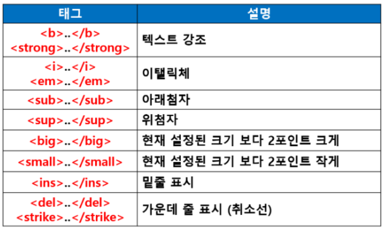
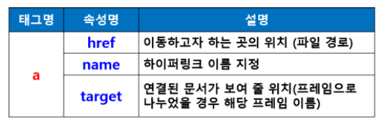
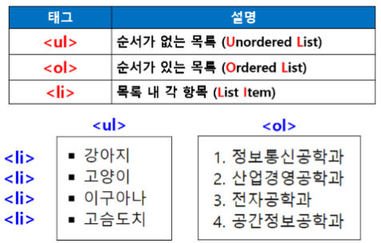
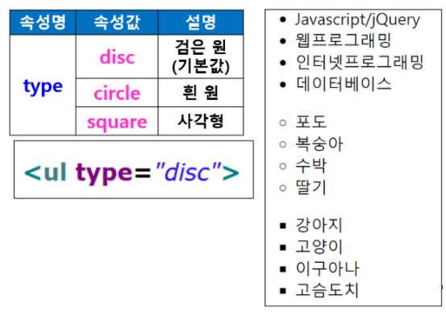
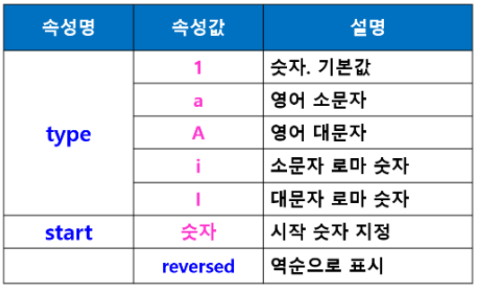
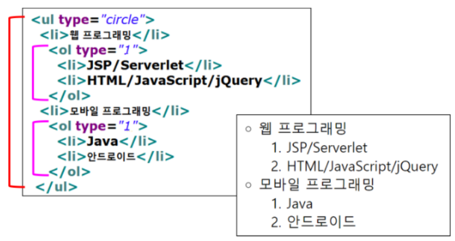
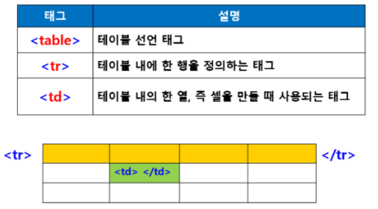
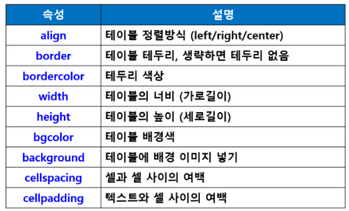
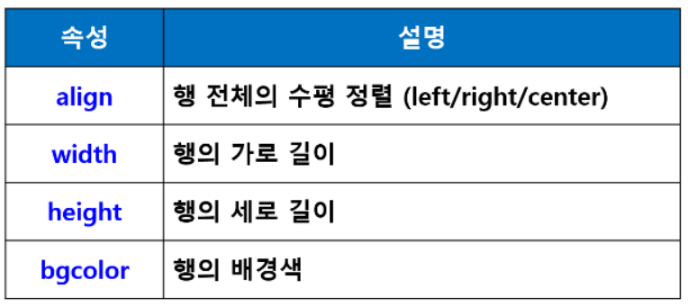
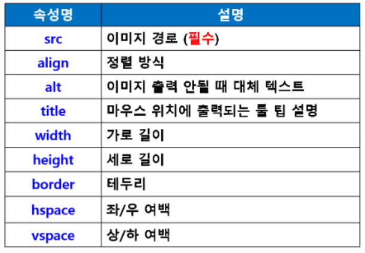

### HTML

> Hyper Text Markup Language
>
> 문서간에 서로 링크가 설정되어 링크 설정 부분을 클릭하면 해당 문서로 이동하는 기동
>
> 웹 브라우저에서 하이퍼텍스트 기능을 구현하는 웹 페이지 작성 언어

- **HTML문서의 구성**

  - 태그라는 명령어
  - 출력하고자 하는 문서 내용
  - 태그(tag)
    - HTML에서 사용하는 명령어(문자열 기호)
    - 원하는 모양과 형태로 브라우저에게 명령을 내림
  - 태그 사용 형식
    - 대부분 시작태그(**<태그명>**)와 종료태그(**</종료태그>**)를 함께 사용
    - <태그명>출력내용</태그명>
      - 
안녕하세요

    - <**태그명 속성명 = “속성값”**>출력내용<**/태그명**>
      - <**a href = “a.html” target = “iFam”**>이동<**/a**>
    - 예외로 종료 태그 없이 혼자 사용
      - < br >  : 줄바꿈
      - < img sr = “a.jpg" > : 이미지 삽입
      - < hr>: 수평선 삽입

  

- **기본 태그**

  - HTML 문서 구조 태그
    - < html>< /html >
      - 문서의 시작과 끝 표시
      - 크게 두 부분으로 이루어져 있음(head, body)
    - < head>< /head>
      - 웹브라우저에 보이지느는 않지만 웹브라우저가 알아야 할 문서정보 포함
      - < meta>태그 : 문자 인코딩 및 문서키워드, 문서정보
        - < meta charset = “UTF-8">
      - < link> 태그 : 외부 리소스 연결
        - < link rel = “stylesheet" href = “StyleSHeet.css">
      -  < title></ title> : 문서의 제목
    - < body>< /body>
      - 문서의 몸통부분
      - 실제 화면에 보이는 문서내용 포함
      - 대부분 태그가 < body>< /body>사이에 위치

  - 텍스트 관련 태그
    - 제목 : < hn>< /hn> (예: < h1>< /h1>)
      - < h1>제목출력 크기1< /h1>
      - Headline의 약어
      - 줄바꿈하여 출력
      - 크기는 1~6 : 1이 가장 크고 6이 가장 작음
      - 예제 : h.html
    - 본문 : < p> < /p> < br> < hr>
      -  
태그
        - 문단을 나누는 태그(paragraph)
        - < br>태그를 2번 사용한 만큼의 간격
        - < p>태그 여러 번 연속적으로 사용해도 행, 간격 더 벌어지지 않음
      - < br>태그
        - 줄바꿈 태그
        - 여러 줄을 바꾸려면 여러 개 사용
          - < br>< br>< br>
      -  
태그
        - 또는< hr/>
        - 수평줄 표시
    - 주석처리
      - <!-- -->
      - <!--HTML주석표시입니다 -->

  - 텍스트 형태 (장식 효과)

    

  - **< b>< i>< strong>< em>**
  - **< sub>< sup>**
  - **< ins>< del>**
  - **앵커 태그 : < a>< /a>**
  - **< pre>< /pre>태그 : 입력한 형식 그대로 출력하는 테그**
  - 줄바꿈 / 공백
    -  < br> : 줄바꿈(여러 행일 경우 여러 개 사용 가능)
    - &nbsp : 공백(여러 칸 띄울 때는 여러개 사용), 한 칸의 공백만 표현

- **하이퍼링크 태그**

  - 하이퍼링크로 문서 연결한< a>태그(앵커 태그)

  - 새 창 또는 새 탭에서 링크 열기

  - 한 페이지안에서 지정된 영역으로 이동

    

- 사이트로 이동,
  - < a href = “[www.naver.com](http://www.naver.com)”>네이버 사이트로 이동< /a>

- 다른 문서로 이동
  - **< a href=”newMember.html”>회원가입< /a>**

- 문서 내 다른 영역으로 이동
  - < a href = “#jQuery”>id가 jQuery인 영역으로 이동< /a>
  - 문서내에 id = “jQuery”인 영역으로 이동
  - **< h3 id=”jQuery”>jQuery 영역입니다< /h3>**

- target
  - target은 하이퍼링크의 대상인 문서를 어디에서 보여줄지를 지정
  - _blank : 새 창에서 출력
  - target = “iFrame” : iFrame영역에서 출력

- 목록 태그
  - 기본 목록 : < ul>< ol>< li>

  - 정의 목록 : < dl>< dt>< dd>

    

  - 순서가 없는 < ul>태그 속성

    

  - 순서가 있는 <ol>태그 속성

    

  - 목록태그 중첩

    

  - 정의 목록 태그
    - < dl> : 정의목록(Definition List)
    - < dt> : 정의 용어(Definition term)
    - < dd>

- **테이블 태그**

  - 테이블 관련 태그

    

  - caption

  - < thead>, < tbody>, < tfoot>

  - table태그 속성

    

  - **< tr> 태그 속성**

    

  - **< thead>, < tbody>, < tfoot>**
    - 표의 제목과 본문 등 구분
    - 셀을 그룹지어 놓으면 시각 장애인들도 화면 판독기를 통해 테이블의 구조를 쉽게 이해할 수 있고
    - CSS를 사용하여 테이블의 각 부분에 다른 스타일을 적용할 수 있어 편리함

- **이미지 /이미지맵 태그**

  - < img> 태그

  - 인라인 태그로 이미지 바로옆에 다른 요소가 나란히 배치

  - 여러개의 < img>태그를 복사하면 나란히 오른쪽에 표시

    

  - **이미지 파일 경로**

    - HTML 파일과 같은 폴더에 있는 경우

      - 이미지 파일명만 적음
      - **< img src = “사진.jpg”>**

    - 하위 폴더에 있는 경우

      - 폴더명 / 이미지 파일명
      - **< img src=”image/사진.jpg”>**

    - 상위 폴더에 있는 경우

      - ../폴더명/이미지파일명
      - **< img src = “../image/사진.jpg”>**

    - 이미지 맵

      - 하나의 이미지에 여러 개의 링크를 만들어 놓고
      - 각 영역마다 다른 링크 연결

      

    - < img> 태그의 usemap 속성 사용
      - **이미지 맵 지정**
      - 사용 방법
        - **< map> 태그를 이용해 이미지 맵을 만들고**
        - **< img> 태그의 usemap 속성으로 이미지 맵 지정**
      - 이미지 좌표 값 필요
        - **이미지 좌표 값 찾기 : 그림판 사용**
        - **이미지 맵 예제 : imageMap.html**

- 문서 삽입 태그

  - **현재 html 문서 내에 다른 문서 포함**