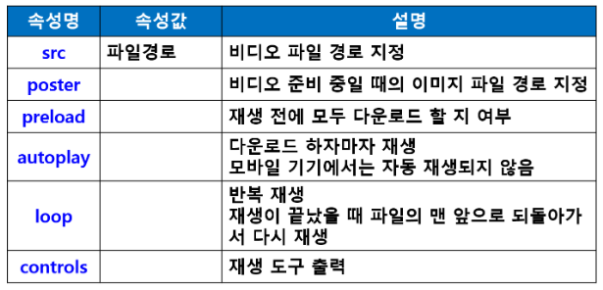
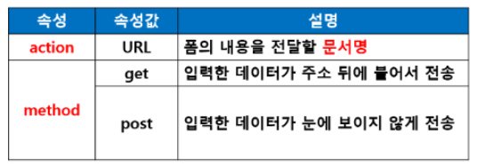
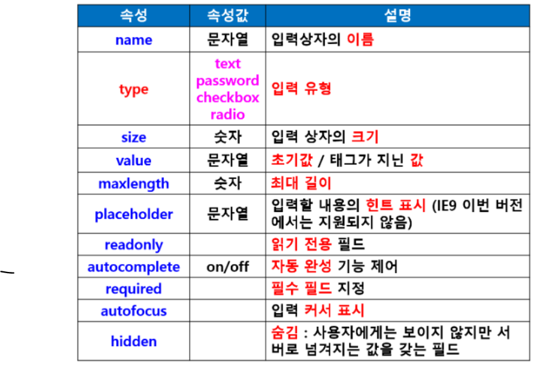
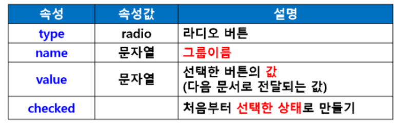
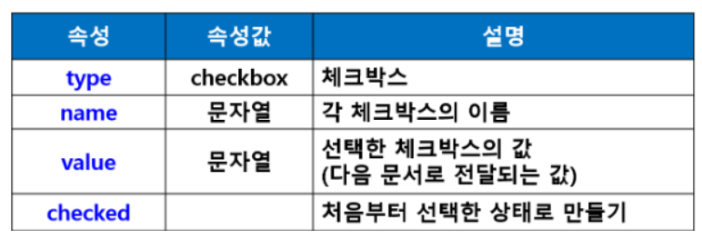
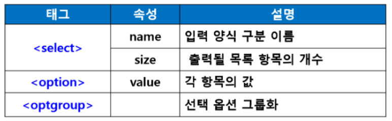
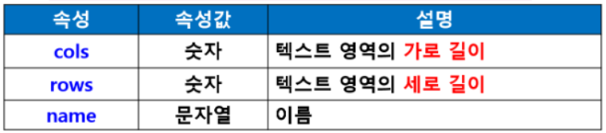
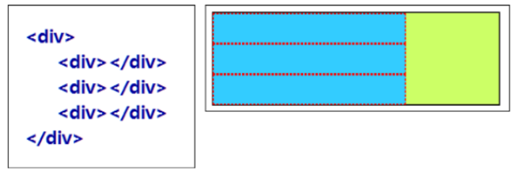
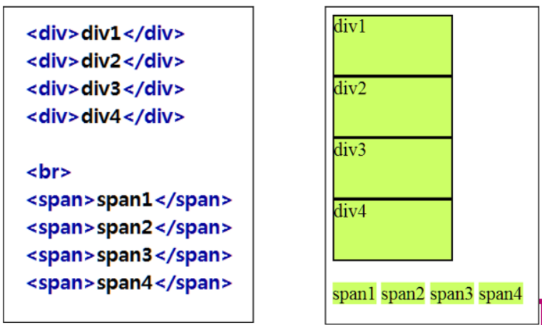
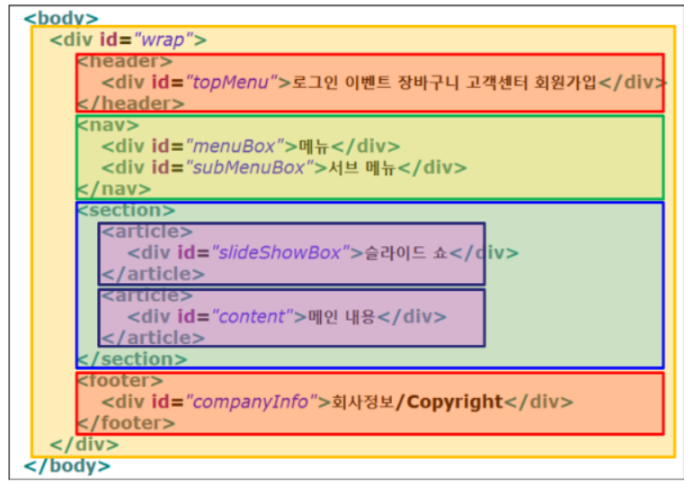

### HTML2

- 오디오 태그 : < audio>

  - **오디오 파일 재생**
  - < audio> 태그 속성
    - src : 오디오 파일 경로
    - preload
      - **재생하기 전에 오디오 파일을 모두 다운로드**
    - **autoplay : 자동 재생**
    - **loop : 반복 재생**
    - **controls : 재생 도구 출력**
    - **< audio src = “audio.mp3" preload = “auto" control loop>**

- < source> 태그

  - **여러 미디어 파일 한꺼번에 지정**

  - **브라우저에 따라 지원하는 오디오 코덱이나 비디오 코덱이 다르기 때문에 한 가지 파일만 사용했을 경우 일부 브라우저에서 지원하지 않는 경우 발생**

  - 따라서 여러 유형의 미디어 파일 지정

  - < audio>

    ​	< source src = “a.ogg” type = “audio/ogg”>
    
       < source src = “a.mp3” type = “audio/mpec”>
    
    < /audio>

- 비디오 태그 : < video>

  - 비디오 파일 재생

  - mp4, ogv, webm 파일 형식

  - < track> 태그

    - **자막 표시**
    - **WebVTT 형식 파일 (.vtt)**
    - **Web Video Text Tracks**

  - 비디오 태그 속성

    	

  - 입력 양식 태그

    - **입력 폼을 만들 때 사용하는 태그**

    - < form>

      - 입력 양식을 구성하는 기본 골격 제공

        

      - < form method = “post" action = “join.jsp">

    - < label>

      - 폼 요소에 캡션(라벨) 붙이기
      - < label>< /label>

    - < input>

      - 데이터를 입력받기 위한 태그
      - < input type = “text" id="id" name="id">
      - input태그 속성

      

  - < lable>+< input>
    - < lable>아이디< input type = “text" id="id" name="id">< /lable>

- **< select>< option>**

- **< textarea>**

- **라디오 버튼(radio**)

  - **여러 항목 중에 한 개를 선택할 때 사용**

  - < input type = “radio" name = “year" value = “3" > 3학년

  - < input type = “radio" name = “year" value = “4" checked>4학년

    

- **체크박스(checkbox)**

  - 여러 항목 중에 여러 개를 선택할 때 사용

  - < input type = “checkbox" id = “game" name = “hobby" value = “게임" checked>게임

  - < input type = “checkbox" id = “movie" name = “hobby" value = “영화">영화

    

- **드롭다운 목록 표시 : < select>태그**

  - < select name = “nation">

    < option value = “미국">미국< /option>

    < option value = “중국">중국< /option>

    < option value = “호주" selected>호주< /option>

    

  - 여러 라인 입력 : < textarea> 태그

    - < textarea rows = “10" cols = “50" name = “content">< /textarea>
    
      

- 공간 분할 태그 (HTML5 시멘틱 구조 태그)

  - < div>

    - block형식으로 공간 분할

    - 중첩사용

      

  - < span>

    - inline 형식으로 공간 분할

      

- **HTML5 시멘틱 구조 태그**

  - 시멘틱(Sementic) : 의미의, 의미론적인

    - 역할과 기능에 맞는 요소로 영역 구분(각 요소가 의미가 있다는 것

  - 시멘틱 구조의 특징

    - HTML4로 만든 웹 문서의 결과 화면이나 HTML5로 만든 웹 문서의 결과 화면만 보면 웹 브라우저에 보이는 모습은 동일하지만
    - 실제로 웹 브라우저에서 문서를 처리할 때 큰 차이

  - 장점

    - 소스만으로도 문서 내용 쉽게 이해
      - **태그만 보고도 어느 부분이 제목이고, 메뉴이고, 실제 내용인지 쉽게 구분**
    - 편리한 검색
      - **사이트 검색 시 필요한 내용을 정확하게 찾을 수 있어 편리**
      - **< header>나 < nav> 태그 부분은 검색하지 않고 < section>이나 < article> 태그 부분만 찾아서 검색**
    - 뛰어난 웹 접근성
      - 시각 장애인들이 웹 보조 기구로 사용하는 화면 판독기에서 시멘틱 태그를 통해 제목과 내용을 구별하여 사용자에게 정확한 내용 전달 가능
    - 다양한 장치에 통일된 결과 제공
      - **태그에 역할이 정해졌기 때문에 어떤 장치에서든 동일하게 문서 해독 가능**

  - **< header> : 헤더(제목)**

  - **< nav> : 내비게이션(메뉴)**

  - **< aside> : 사이드바**

  - **< section> : 콘텐츠(내용)**

  - **< article> : 콘텐츠 안의 내용 영역 구분**

  - **< footer> : 푸터( 주소, 연락처, 저작권, 기업 정보 등)**

    