### JavaScript

> ECMA 스크립트 (ECMAScript 도는 ES)
>
> 정식 명칭 : ECMAScript
>
> Ecma International이 ECMA-262 기술 규격에 따라 정의하고 있는 표준화된 스크립트 프로그래밍 언어
>
> ES5, ES6 : 큰 변화 발생동적인 웹 페이지를 작성하기 위하여 사용되는 언어
>
> 웹의 표준 프로그램 언어
>
> 모든 웹 브라우저에서 자바스크립트 지원
>
> 전 세계적으로 가장 많이 사용되는 언어 1위
>
> 웹 브라우저 뿐 아니라 스마트폰 용 애플리케이션 개발 등 각종 분야에서 능력과 가치 인정 받고 있음
>
> 초기에는 브라우저에 내장되어 제한된 기능만 지원하였으나 현재 Ajax(Asynchronous JavaScript and XML)라는 기술과 함께 영향력이 증가

- **자바스크립트 기능**

  - HTML이 지원하지 못하는 다양한 기능 지원
    - 동적인 움직임 / 이벤트 발생 처리 /경고 메시지 출력
  - Ajax를 이용하여 새로운 내용을 동적으로 로딩하거나 서버에 전송하여 동적인 페이지 생성
  - 애니메이션 기능 추가 (페이드인, 페이드아웃, 크기 변경, 위치 이동 등)
  - /동영상을 재생하는 인터액티브 컨텐츠 제어
  - 웹 페이지 폼의 입력값을 서버에 보내기 전에 내용 검증
  - 브라우저 사용자의 특성(웹 페이지 탐색 움직임, 게시물 읽을 때의 습관 등)에 대한 정보를 서버로 전송하여 웹 분석, 사용자 동작 트래킹, 웹 서비스 개인화 등에 사용

- **자바스크립트 실행**

  - 스크립트 언어이기 때문에 컴파일 되지 않고
  - 인터프리터를 통해 웹 브라우저에서 한 줄 씩 바로 실행
  - 위에서 아래로 실행
  - 인터프리팅 언어 (스크립트 언어)
    - 독자적으로 실행되지 않고 다른 프로그램에 내장되어 사용
    - 소스코드를 컴파일 하지 않고 한 줄씩 인터프리터를 통해 바로 실행

  **자바스크립트 용도**

  - 이벤트에 반응하는 동작 구현
  - HTML 요소들의 크기나 색상 등을 동적으로 변경
  - 사용자가 입력한 값들을 검증
  - 게임이나 애니메이션 구현
  - AJAX 기술을 사용하여 서버와 데이터를 비동기적으로 교환

- **비동기식 처리**

  - 서버 측에 데이터를 요청한 후 데이터 수신이 완료될 때까지 기다리지 않고 다른 작업 진행

- **자바스크립트 기본 구조**

  - HTML 문서에 < script>< /script> 태그 삽입

    

  - **Internal 방식**

    - HTML 문서에 삽입
    - 일반적으로 <head> 부분에 삽입하나
    - <body> 안의 임의 부분에 삽입하기도 함
    - 실행 순서는 head부분 먼저 실행되고 body부분이 그다음에 실행된다

  - **External 방식**

    - **별**도의 자바스크립트 파일 (.js)로 작성하여 HTML 문서에서 소스 지정
    - < script src="js/join.js"></script>

    **Inline 방식**

    - 자바스크립트 양이 소량일 때 간단하게
    - HTML 태그의 이벤트 핸들러 속성을 이용하여 사용
    - 예 : 함수 호출
      - < body onLoad=”start()”>

- 데이터를 출력하는 기본 방법

  - window.alert(내용)
    - 출력내용을 알림창(경고창)으로 출력
    - window객체 생략 가능
  - console.log(내용) : 개발자 도구의 console 창에 출력
  - doucument.write(내용)
    - 화면(문서)에 내용 출력(이미지 출력)
  - DOM(문서 객체 모델) 사용 (태그에 출력)

- **자바스크립트 코드 입력 시 주의점**

  - 대소문자 구별
  - 문장 끝에 세미콜론(;) 사용
  - 문자열에서 따옴표 겹침 오류 주의
  - document.write(”내용”);
  - document.write(’내용’);   ⇒둘 다 사용 가능
  - document.write(“내”내용”용”);
    - document.write(“내’내용’용”);
      - 겉에 큰따옴 면 안에 작은 따옴표
      - 겉에 작은 따옴표 면 안에 큰 따옴표
    - 특수문자 사용 가능
      - document.write(“내\”내용\”용”);
  - 괄호 짝이 맞아야 함 : () / {} 중첩 사용시 주의

- 데이터 입력

  - confirm()

     함수로 입력 받기

    - 자바스크립트 내장 함수
    - [확인]/[취소] 버튼이 있는 대화상자 출력하고
    - [확인] 버튼 누르면 true 반환
    - [취소] 버튼 누르면 false 반환

  - prompt()

     함수로 입력 받기(연습용)

    - **prompt(“출력 메시지”) ;**
    - **prompt(“출력 메시지”, “기본값”) ;**

  - **DOM** 사용

  - **< input> 태그와 value 속성** 사용

- 변수와 변수 선언

  - 변수

    - 프로그램 실행 중에 값을 저장하기 위한 메모리 내의 임시 저장소

  - 변수선언

    - 명시적 변수 선언

      - var
      - let
      - const

    - 변수를 필요한 곳에 사용하면 자동으로 생성되기 때문에 반드시 선언하지 않아도 됨

    - 변수의 데이터 타입은 실행 시 결정 (동적 타이핑)

    - 명시적으로 선언할 경우에 예약어 var(let, const) 사용(명시적 선언 권장

      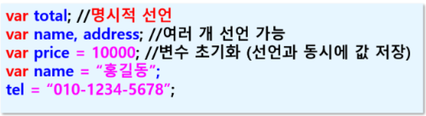

- **자바스크립트에서 식별자(변수명, 함수명 등) 명명 규칙**

  - 시작은 반드시 영문자나 _ 사용, 숫자 사용할 수 없음

  - 대소문자 구별

  - 키워드 사용 할 수 없음

  - 특수문자나 공백은 사용할 수 없음

  - 한글 사용가능 (영문 사용 권장)

    의미 있는 단어 사용 (예: name, address, age)

- **정적 타이핑 언어 vs 동적 타이핑 언어**

  - 타입 (type) : 자료형 (데이터의 타입)
  - 정적 타이핑 언어
    - 변수의 데이터 타입을 컴파일 시에 결정
    - C, C++, Java 등
    - 선언한 변수의 데이터 타입에 따라 값 저장
    - int a = 10;
  - 동적 타이핑 언어
    - 변수의 데이터 타입을 실행 시 결정
    - 데이터 타입을 지정하지 않고 변수에 값 저장
    - var name = “홍길동”;

- **변수의 유형**

  - 전역변수(멤버변수)

    - (1) 전역변수 범위 (< script>태그 바로 아래)에 명시적으로 선언

    - (2) 명시적으로 선언하지 않고 사용하는 변수

      - var가 붙든 안 붙든 다 전역 변수

      - 자바 스크립트 코드내 모든 곳에서 사용 가능

        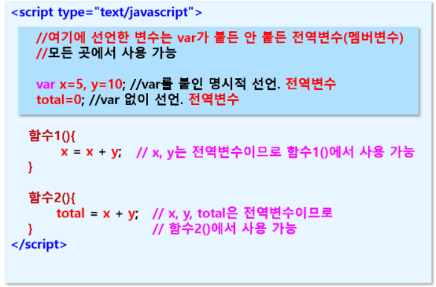

  - 지역변수

    - 함수내에서 var 붙여서 선언된 변수만 지역 변수

    - 함수 내에서만 사용 가능

    - 함수 내에서 var 붙이지 않고 사용하는 변수는 전역 변수로 간주

      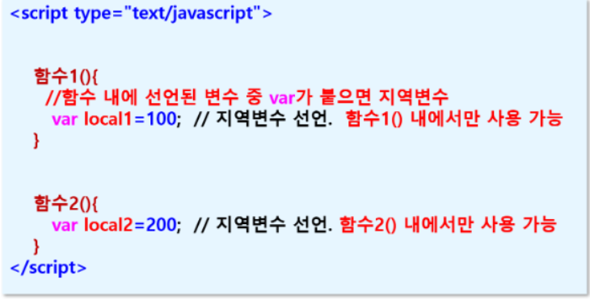

​					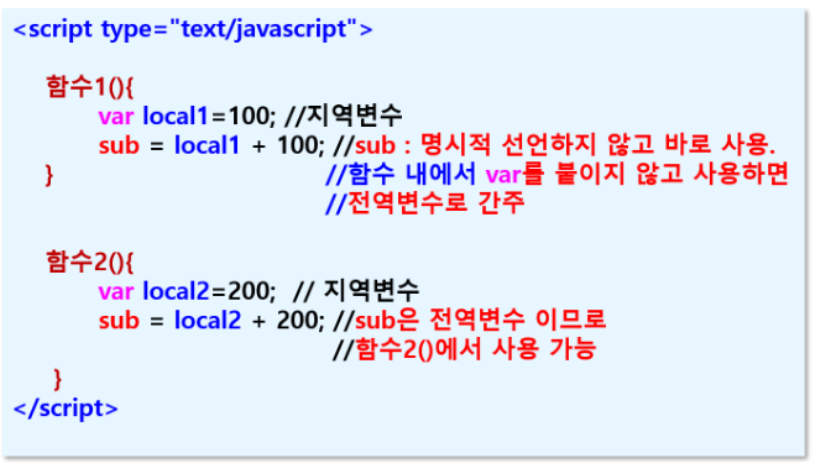

- **var vs let**

  - var와 let 차이점1
    - var :동일한 변수명으로 여러 개 선언해도 오류 없음
    - let : 이미 선언된 변수명으로 선언 불가
  - var와 let 차이점2 : scope(범위)
    - var : function 단위의 scope
    - let : block({}) 단위의 scope

- **let과 const의 차이**

  - let : 재할당 가능(값 변경 가능)
  - const : 재할당 불가(값 변경 불가)

- **호이스팅(Hoisting**)

  - 변수와 함수의 메모리 공간을 선언 전에 미리 할당 하는 것으로 선언은 뒤에 했는데 선언문 전에 변수 사용하는 것

  - var로 선언된 변수는 가능

  - let으로 선언된 변수는 불가능

    console.log(name);

    var name = “홍길동”;

- 연산자

  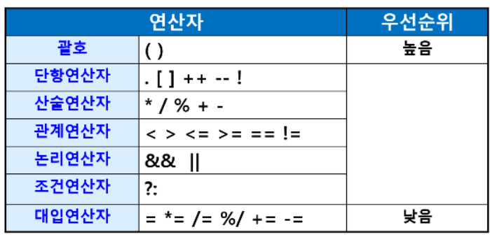

- **자바스크립트에서 사용되는 데이터 타입**
  - 숫자 : 정수형, 실수형
  - 문자 :’a’;
  - 문자열 : “string” ‘작은 따옴표도 사용 가능’
  - NaN
    - Not a Number(숫자가 아닌데 숫자로 사용할 경우
  - 논리값 : true / false
  - undefined와 null
    - null : ‘참조 객체 없음’을 의미(값이 없을 때)
    - undefined : 값의 유형을 알 수 없음
- **데이터 형변환**
  - parseInt() : 정수값으로 형변환
  - parseFloat() : 실수값으로 형변환
  - String() / toString() : 문자열로 형변환

### 2. 제어문

- 프로그램의 흐름을 제어

  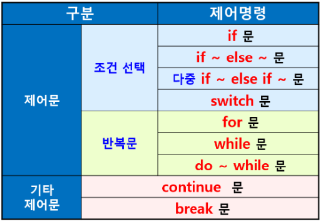

  - **switch문**

    - 수식으로는 값의 결과가 정수, 실수, 문자열, 객체 값이어야 함

      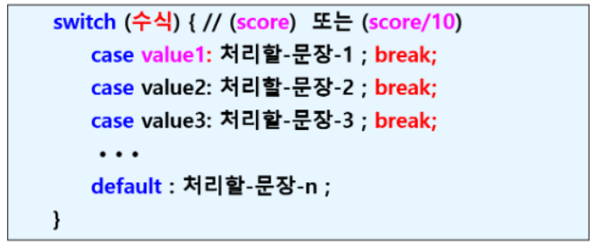

  - **반복문**

    - for문 / for in 문

      - for in 문

        - 배열이나 객체를 쉽게 탐색

          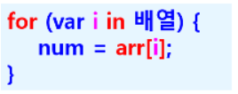

    - while문

      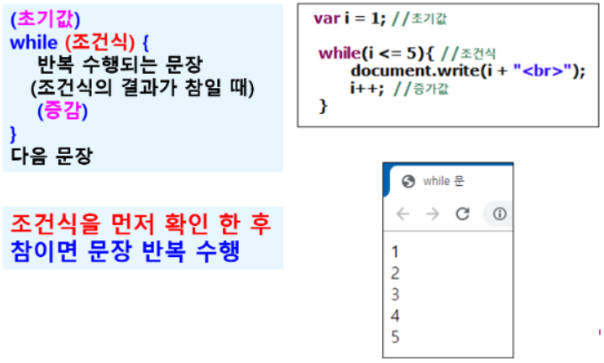

    - do ~ while문

      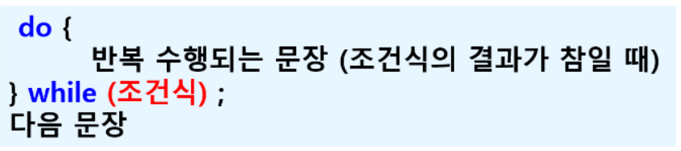

- **배열(Array)**

  - 동일한 이름을 갖는 원소들의 연속적인 저장 영역

  - 배열의 원소는 메모리 내에서 순서대로 저장된다

  - 각 배열의 원소는 인덱스 ([0]부터 시작)로 구별

    - **var num = new Array(3);**

      

  - 배열의 크기 (원소의 개수) : length 속성

    - **length**

  - **자바스크립트의 배열은 각 원소에 다른 유형의 데이터 저장 가능**

    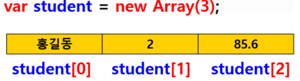

- **배열 선언 형식**

  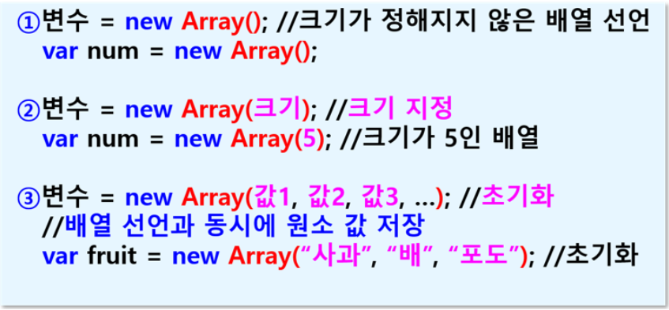

- **배열의 초기화 방법**

  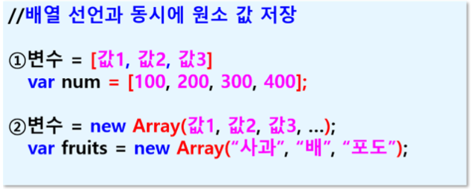

- 배열 사용
  - **배열 원소에 값 저장**
    - a[2] = 10; //3번째 원소에 10 저장
  - **배열 원소에 들어 있는 값 출력**
    - var x = arr[0]; //변수에 배열 첫 번째 원소값 저장
    - write(a[1]);//2번째 원소의 값 출력
  - **!!!주의**
    - **배열의 전체 원소에 값을 저장하거나 출력하기 위해서는 반복문 사용**
    - **배열은 크기가 정해져 있기 때문에 반복 횟수를 정할 수 있으므로 for문 사용**
    - **반복문 시작은 반드시 0부터(첨자가 [0]부터)**
