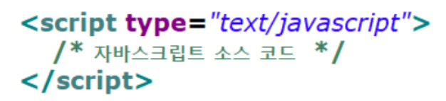

### JavaScript

> ECMA 스크립트 (ECMAScript 도는 ES)
>
> 정식 명칭 : ECMAScript
>
> Ecma International이 ECMA-262 기술 규격에 따라 정의하고 있는 표준화된 스크립트 프로그래밍 언어
>
> ES5, ES6 : 큰 변화 발생동적인 웹 페이지를 작성하기 위하여 사용되는 언어
>
> 웹의 표준 프로그램 언어
>
> 모든 웹 브라우저에서 자바스크립트 지원
>
> 전 세계적으로 가장 많이 사용되는 언어 1위
>
> 웹 브라우저 뿐 아니라 스마트폰 용 애플리케이션 개발 등 각종 분야에서 능력과 가치 인정 받고 있음
>
> 초기에는 브라우저에 내장되어 제한된 기능만 지원하였으나 현재 Ajax(Asynchronous JavaScript and XML)라는 기술과 함께 영향력이 증가

- **자바스크립트 기능**

  - HTML이 지원하지 못하는 다양한 기능 지원
    - 동적인 움직임 / 이벤트 발생 처리 /경고 메시지 출력
  - Ajax를 이용하여 새로운 내용을 동적으로 로딩하거나 서버에 전송하여 동적인 페이지 생성
  - 애니메이션 기능 추가 (페이드인, 페이드아웃, 크기 변경, 위치 이동 등)
  - /동영상을 재생하는 인터액티브 컨텐츠 제어
  - 웹 페이지 폼의 입력값을 서버에 보내기 전에 내용 검증
  - 브라우저 사용자의 특성(웹 페이지 탐색 움직임, 게시물 읽을 때의 습관 등)에 대한 정보를 서버로 전송하여 웹 분석, 사용자 동작 트래킹, 웹 서비스 개인화 등에 사용

- **자바스크립트 실행**

  - 스크립트 언어이기 때문에 컴파일 되지 않고
  - 인터프리터를 통해 웹 브라우저에서 한 줄 씩 바로 실행
  - 위에서 아래로 실행
  - 인터프리팅 언어 (스크립트 언어)
    - 독자적으로 실행되지 않고 다른 프로그램에 내장되어 사용
    - 소스코드를 컴파일 하지 않고 한 줄씩 인터프리터를 통해 바로 실행

  **자바스크립트 용도**

  - 이벤트에 반응하는 동작 구현
  - HTML 요소들의 크기나 색상 등을 동적으로 변경
  - 사용자가 입력한 값들을 검증
  - 게임이나 애니메이션 구현
  - AJAX 기술을 사용하여 서버와 데이터를 비동기적으로 교환

- **비동기식 처리**

  - 서버 측에 데이터를 요청한 후 데이터 수신이 완료될 때까지 기다리지 않고 다른 작업 진행

- **자바스크립트 기본 구조**

  - HTML 문서에 < script>< /script> 태그 삽입

    

  - **Internal 방식**

    - HTML 문서에 삽입
    - 일반적으로 <head> 부분에 삽입하나
    - <body> 안의 임의 부분에 삽입하기도 함
    - 실행 순서는 head부분 먼저 실행되고 body부분이 그다음에 실행된다

  - **External 방식**

    - **별**도의 자바스크립트 파일 (.js)로 작성하여 HTML 문서에서 소스 지정
    - < script src="js/join.js"></script>

    **Inline 방식**

    - 자바스크립트 양이 소량일 때 간단하게
    - HTML 태그의 이벤트 핸들러 속성을 이용하여 사용
    - 예 : 함수 호출
      - < body onLoad=”start()”>
