### JavaScript3

- **Object**

  - **내장객체**

    - 미리 정의되어 있는 객체

    - 선언 과정을 통해 객체 변수를 정의해서 사용

    - 특별한 경우에는 사용자 정의 객체를 정의하여 사용

    - 대부분의 경우에는 내장 객체 사용

    - 대표적 내장 객체

      - **Date** 

        - 날짜와 시간을 처리하기 위한 객체

        - 웹 페이지에 오늘 날짜와 시간, 요일 등을 표시

        - **Date객체의 시간/날짜 정보를 반환하는 메소드**

          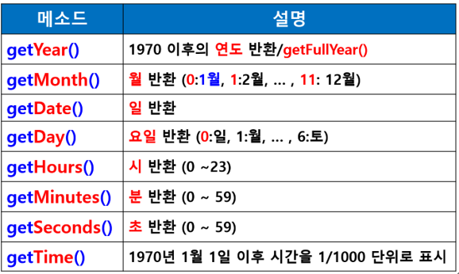

        - **Date객체의 시간/날짜 정보를 설정하는 메소드**

          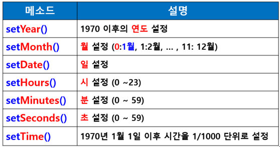

        - **날짜/시간 정보의 포맷을 변경한는데 사용되는 메소드**

          - parse(날짜 문자열) : 문자열을 시간으로 변경
          - toGMTString() : 문자열을 GMT날짜로 복귀
          - toLocalString() : 날짜를 문자열로 반환

      - **Array** 

        - 배열을 만들기 위한 객체

        - Ex> 

          - var arr = new Array(3); // 생성
          - arr.push("홍길동");  // 데이터 삽입(사용법 : 객체.메소드();)

        - **주요 메소드들**

          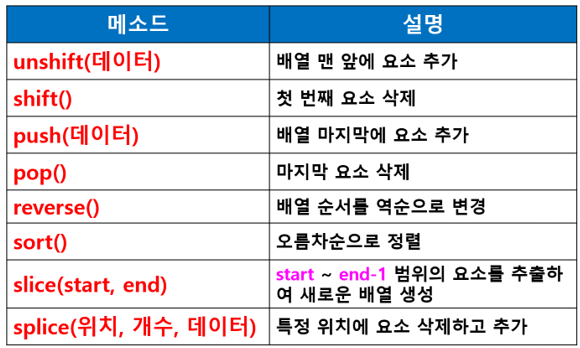

      - **String** 

        - 문자열을 다루기 위한 객체 

          - var name = new String();
          - name.fontsize(5);

        - new를 이용해서 객체를 생성하지 않고 상수형태("문자열")로 문자열을 만들어도 객체의 특징 모두 사용

          - var name = "홍길동";

          - name.fontsize(5);

          - 객체로 자동 변환(일시적)

          - **주요 메소드들**

            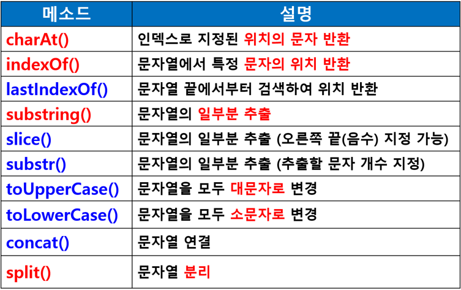

          - **charAt(인덱스)**

            - 인덱스로 지정된 위치의 문자 반환
            - 인덱스는 0부터 시작
            - charAt(3); =>문자열 str에서 4번째 문자 반환

          - **substring(start, end)**

            - 문자열의 일부분을 추출
            - start ~ end-1까지의 문자열
            - 인덱스는 0부터 시작

          - **indexOf("문자")**

            - 문자열에서 지정된 문자의 위치를 인덱스 값으로 반환
            - 인덱스는 0부터 시작
            - **검색할 때 왼쪽부터 찾아서 처음 발견한 문자의 위치를 알려주는 것**
            - 찾고자 하는 문자가 없으면 **-1 반환**

          - **split("구분자")**

            - 구분자로 문자열 분리
              - str = "1998-09-09";
              - var bitth = str.split("-"); =>문자열이 "-"를 기준으로 분리되어 배열에 순서대로 저장
              - birth[0] : 1998 / birth[1] : 09 / birth[2] : 09 가 각각 저장됨  

      - **Math** 

        - 수학적 계산을 위한 객체

        - 상수값은 속성으로, 수학은 메소드로 제공

        - Math객체는 속성이나 메소드로 접근하기 위해 따로 객체변수 선언하지 않음

        - 형태 : Math.속성  /  Math.메소드()

        - **주요 메소드들**

          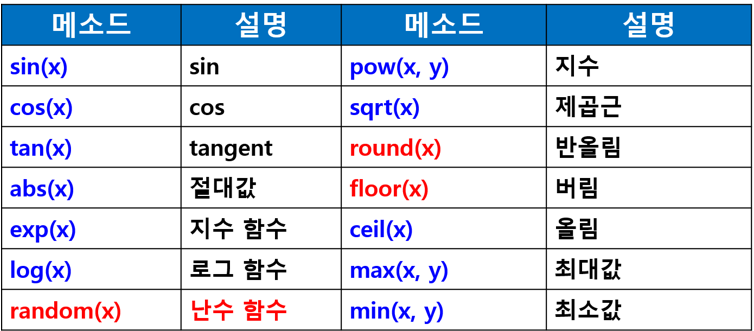

      - **Math.random()**

        - 1~10 사이의 수중에 랜덤 숫자 생성
        - var num = 1 + Math.floor(Math.random()*10);
          - 0.01223454 ~ 0.999999999 : 0과 1사이의 실수
          - floor() : 소수점 이하를 버리게 함
          - 1 + : 1부터 시작하도록 베이스를 1
          - *10 : 0.xxx, 1.xxx

      - **Screen** : 화면의 해상도, 색상, 크기에 관한 정보를 제공하는 객체

    - Ex> 

      - 생성 : var today = new Date();  /  var arr = new Array(3);
      - 사용(객체.메소드()) : today.getMonth();  /  arr.sort();

  - **브라우저 객체**

    - 웹 브라우저를 대상으로 이루어진 객체

    - **window : 창**
  
      - 창에 대한 전반적인 상황을 제어하는 최상위 객체
  
      - 자바스크립트에서 사용되는 모든 객체는 window 객체의 하위에 존재
  
      - Navigator 객체만 제외하고 모든 객체는 window객체를 통해서 접근하여 사용
  
      - window는 사용시 생략 가능
  
        - window.document.pic.src = “a.jpg”;
        - document.pic.src = “a.jpg”;
          - 문서 내에서 name 속성이 pic인 객체의 src 속성
          - < img name=”pic” src=”a.jpg”>
  
      - **주요 속성**
  
        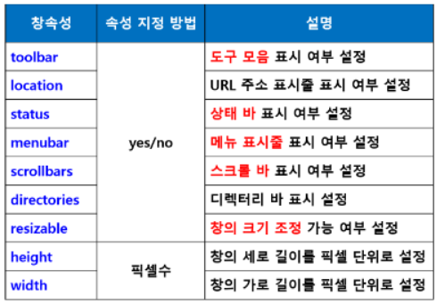
  
      - **주요 메소드**
  
        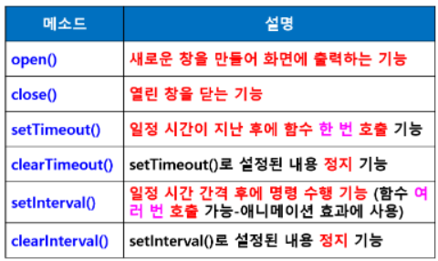
  
        - **open() 메소드**
  
          - window.open(“URL”, “창이름”, “창 속성”);
          - 새로운 창을 만들거나 기존 창을 열어서 화면에 출력하는 기능
  
        - **setTimeout()**
  
          - 타이머 설정과 해제
  
          - **일정 시간이 지난 후에 호출함수를 1번만 실행**
  
          - Ex>setTimeout(’winClose()’, 1000);
  
            1초 후에 winClose() 함수 호출
  
        - **clearTimeout(타이머ID)**
  
          - 시간 설정한 것 해제
          - setTimeout() 메소드가 반환하는 타이머 ID를 받아 타이머ID에 해당하는 타이머 설정 해제
          - 타이머ID = setTimeout(’호출함수’, 지연시간);
          - clearTimeout(타이머ID);
  
        - **setInterval()**
  
          - 타이머 설정과 해제
  
          - 일정 시간 간격안에 반복 실행
  
          - setInterval(’호출함수’, 지연시간)
  
          - Ex>setInterval(’showTime(), 1000);
  
            1초간격으로 showTime() 함수 호출
  
        - **clearInterval(타이머ID**)
  
          - 시간 설정한 것 해제
  
        - **document : 문서**
  
        - **history : 웨 브라우저 기록 정**보
  
        - **location : 주소 정보**
  
          - 현재 브라우저의 주소창에 표시된 주소값에 관련된 내용을 다루는 객체
  
            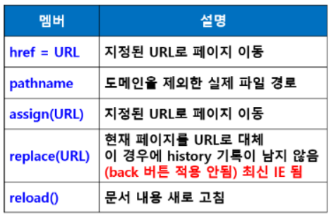
  
      - navigator : 웹 브라우저의 종류 정보
  
    - 브라우저 객체의 계층 구조
  
      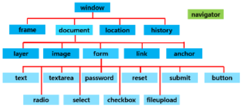
  
  - **문서 객체(DOM)**
  
    - 객체 지향 모델로써 구조화된 문서를 표현하는 방식
  
    - HTML 문서에 접근하기 위한 표준 모델
  
    - 표준은 대부분의 브라우저에서 DOM을 구현하는 기준
  
    - 문서 내의 모든 요소를 정의하고, 각각의 요소에 접근하는 방법을 제공
  
    - 웹 브라우저에 보여지는 HTML 문서 태그 요소에 대한 정보와 문서에 대한 여러가지 속성 제공
  
    - document 객체의 하위 객체를 이용하여 문서 내에서 일어나는 다양한 기능 제어
  
    - document 객체의 하위 객체
  
      - layer, image, area, anchor, **form**
  
    - **DOM사용 시기**
  
      - HTML 문서가 로드되고 나서 피싱 작업을 거쳐 DOM트리 생성
      - DOM 문서가 로드될 때 모든 DOM을 사용할 수 있게 되는 때가 됨
  
    - **document객체의 주요 속성**
  
      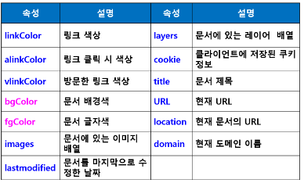
  
    - **document 객체의 주요 메소드**
  
      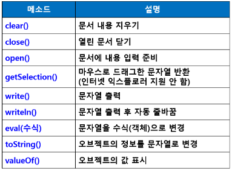
  
    - **문서 내의 요소(태그) 제어 메소드**
  
      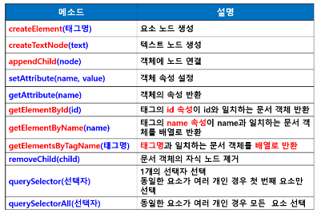
  
    - **문서 내의 요소(태그) 제어 메소드 사용시 주의점**
  
      - 문서 내에서 요소(객체)들이 생성되기 전에 자바스크립트를 선언하게 되면 요소를 선택할 수 없음
  
        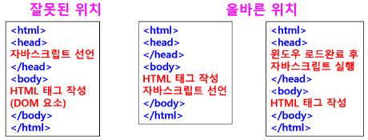
  
    - **DOM 주요메소드 사용**
  
      - createElement() 예제 : createElementH3.html
  
    - **문서 내의 요소(태그) 제어 메소드**
  
      - getElementById()
  
        - id를 통해 문서내에서 요소(태그)를 참조하는 메소드
  
        - 지정한 id 속성값을 갖는 개체중 첫 번째 개체 참조
  
        - var 참조변수 = document.getElementById('id');
  
          <xxx id = "abc"...>
  
      - querySelector() / querySelectorAll()
  
      - getElementsByTagName('태그명');
  
        - 
  
  - 사용자 정의 객체