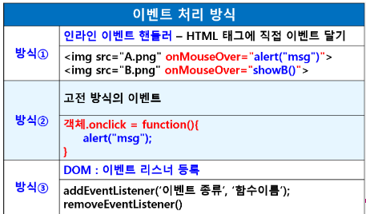
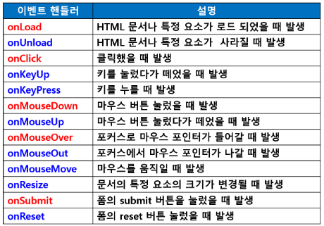
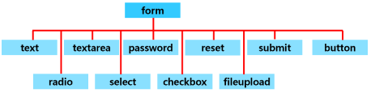

### JavaScript4

- **이벤트 핸들러와 이벤트 처리**

  - 사용자로 부터 발생되는 여러가지 이벤트 처리

- **자바스크립트에서의 이벤트 처리 방식**

  

  

- **이벤트 리스너**

  - 객체.addEventListner('이벤트명', function(){

    });

  - 객체.removeEventListner('이벤트명', function(){

    });

  - 화살표 함수 사용 가능

    - 객체.addEventListener('click', () => {

      });

- **마우스 관련 이벤트**

- 폼 유효성 확인

  - form 객체

    - document객체의 하위 객체

    - form 태그 내에 들어 있는 여러 입력 양식들 제어

    - form의 하위 객체들

      

      

  - form객체의 사용 방법

    - 태그의 name속성을 객체로 사용하는 경우
      - < form name = "joinForm">
      - < input type = "text" name = "id">
      - joinForm.id.focus();
    - 문서 객체 모델(DOM) 방식을 사용하는 경우
      - < input type = "text" id = "name">
      - var name = document.getElementById("name");
      - name.focus():

  - select객체

    - 리스트 박스에 있는 여러 항목 중 선택
    - 항목 선택하면 selectIndex속성에 선택된 항목의 인덱스 값 저장(0부터 시작)
    - 하나도 선택하지 않으면 selectedIndex 값이 -1

  - radio 객체

    - 그룹 중에서 1개만 선택 가능
    - 그룹에 속한 여러개의 라디오 버튼의 이름이 동일하므로 radio객체는 배열 형태로 사용
    - checked 속성이 true이면 체크된 상태
    - false 이면 체크되지 않은 상태
    - for문에서
      - if(joinForm.emailTcv[i].checked == true)
