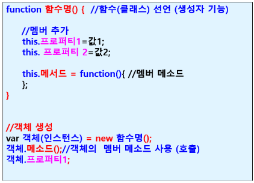
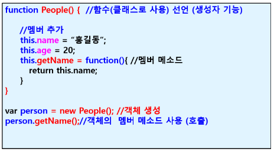
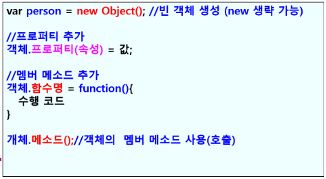

### JavaScript5

- **사용자 정의 객체**

  - 사용자가 직접 필요한 객체 생성
  - 속성 : 데이터
  - 메소드 : 기능(작업)

- **리터럴 이용**

  

- **생성자 함수(function) 이용**

  - 함수선언과 같은 방식으로 function 키워드 사용하여 선언

  - 함수 클래스처럼 사용

    - function 함수명(){....} : 생성자 기능

  - this.프로퍼티(속성)

  - new 연산자 사용해서 객체 생성

    

  

- **new Object() 이용**

  

- **class 정의하고 객체 생성**
  - class 키워드 사용
  - 생성자 / Getters / Setters 가능
  - 호이스팅 불가능
- JSON(**J**ava**S**cript **O**bject **N**otation)
  - 자바스크립트 객체 표기법
  - key와 value 값이 쌍으로 구성된 형태의 객체 표기법
  - 클라이언트와 서버 사이에서 데이터 교환 목적으로 사용
  - 웹 서버에서 수신하는 데이터는 문자열인데. 문자열 데이터를 JSON파싱 함수를 사용해서 파싱하면 자바스크립트 객체로 변환 가능
  - 최근 브라우저들은 전부 내장객체로 JSON변환 기능 지원
  - 제이슨 데이터 형식
    - {key:value} : {"name":"홍길동}
  - 메소드
    - JSON.stringify()
      - 자바스크립트 객체를 JSON data로 변환
    - JSON.parse()
      - JSON data를 자바스크립트 객체로 변환