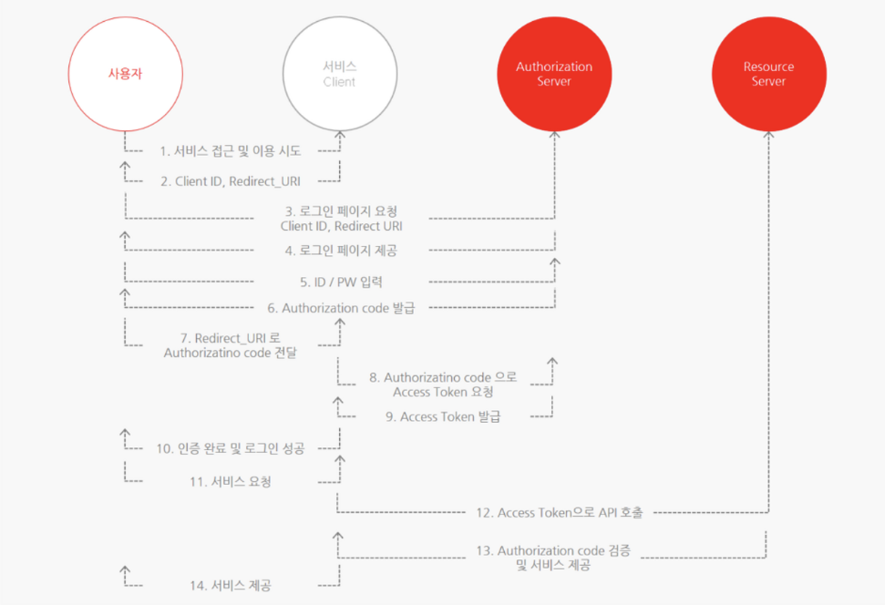

# OAuth

> OAuth는 인터넷 사용자들이 비밀번호를 제공하지 않고 다른 웹사이트 상의 자신들의 정보에 대해 웹사이트나 애플리케이션의 접근 권한을 부야할 수 있는 공통적인 수단으로 사용되는 접근위임을 위한 개방형 표준이다.

#### 어떨 때 쓰는가?

- 웹 서핑을 하다보면 구글, 페이스북 등과 같은 소셜계정으로 간편히 회원가입 및 로그인 할 수 있는 웹 어플리케이션을 쉽게 찾아볼 수 있다.

  연동되는 외부 웹 어플리케이션에서 제공하는 기능을 간편하게 사용할 수 있는 장점이 있다

#### 1. OAuth 구성요소

| 구분                     | 설명                                                         |
| ------------------------ | ------------------------------------------------------------ |
| **Resource Owner**       | 웹 서비스를 이용하려는 유저, 자원을 소유하는 자  'Resouce'는 개인정보라고 생각하면 된다. |
| **Client**               | 자사 또는 개인이 만든 애플리케이션 서버 client가 Resource server에게 필요한 자원을 요청하고 응답하는 관계이다. |
| **Authorization Server** | 권한을 부여(인증에 사용할 아이템을 제공)해주는 서버다. 사용자는 이 서버로 ID, PW를 넘겨 Authorization Code를 발급 받을 수 있다. Client는 이 서버로 Authorization Code를 넘겨 Token을 받을 수 있다. |
| **Resource Server**      | 사용자의 개인정보를 가지고있는 애플리케이션 (Google, Facebook, Kakao 등) 회사 서버  Client는 Token을 이 서버로 넘겨 개인정보를 응답 받을 수 있다. |
| **Access Token**         | 자원에 대한 접근 권한을 Resource Owner가 인가하였음을 나타내는 자격증명 |
| **Refresh Token**        | Client는 Authorization Server로 부터 access token(비교적 짧은 만료기간을 가짐) 과 refresh token(비교적 긴 만료기간을 가짐)을 함께 부여 받는다. access token은 보안상 만료기간이 짧기 때문에 얼마 지나지 않아 만료되면 사용자는 로그인을 다시 시도해야한다. 그러나 refresh token이 있다면 access token이 만료될 때 refresh token을 통해 access token을 재발급 받아 재 로그인 할 필요없게끔 한다. |

- 직접 사용자가 로그인 하는것이 아닌, 소셜 미디어로 로그인을 할 경우,

  **client(개인 서비스)는 Resource Owner(사용자)를 대신해 로그인** 하는데, 이때 필요한 정보를 Resource Server(kakao, naver, ...)에서 얻어 서로 비교해 유효성을 판단한다.

  client가 유저의 (로그인)정보/자원(resource)을 Resource Server에 요청해 대신 로그인 하는 것이다.

- 단계

  1. Resource Owner로 부터 동의(허용)

     - 자신의 정보를 대신 사용하기 때문에 client가 어떤 정보를 활용하는지, 어떤 기능을 사용하려는지 모른다.

       나쁜 마음을 가지면 개인정보를 마구잡이로 악용할수 있을 수도 있기 때문이다.
       그러므로 client는 Resource Owner의 동의를 구해야 한다.

  2. Resource Server로 부터 client 신원확인

     - 자신의 정보를 대신 사용하기 때문에 client가 어떤 정보를 활용하는지, 어떤 기능을 사용하려는지 모른다.

       나쁜 마음을 가지면 개인정보를 마구잡이로 악용할수 있을 수도 있기 때문이다.
       그러므로 client는 Resource Owner의 동의를 구해야 한다.

출처 : [[WEB\] 📚 OAuth 2.0 개념 정리 (그림으로 이해하기 쉽게) (tistory.com)](https://inpa.tistory.com/entry/WEB-📚-OAuth-20-개념-💯-정리)]