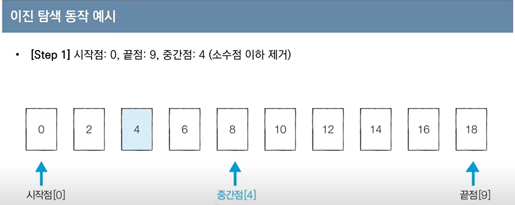
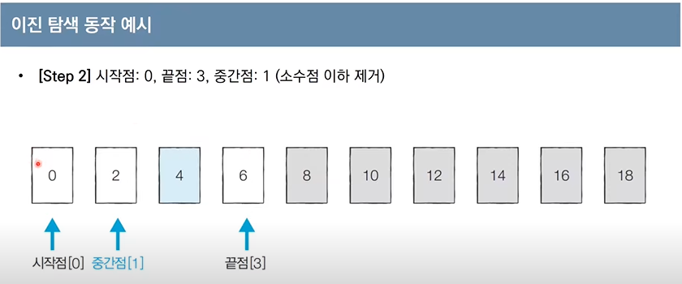
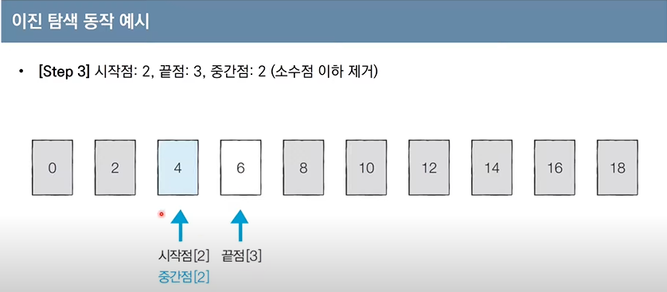
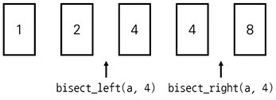
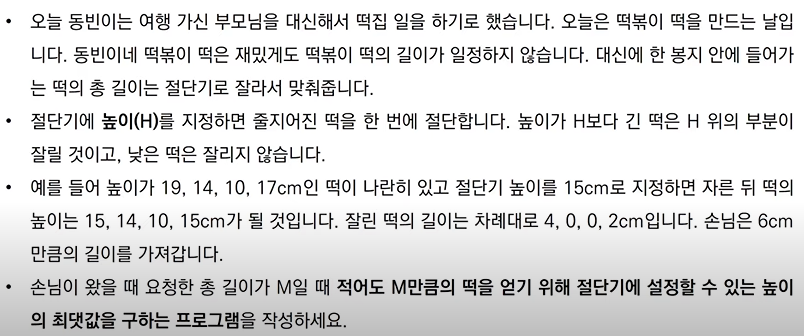
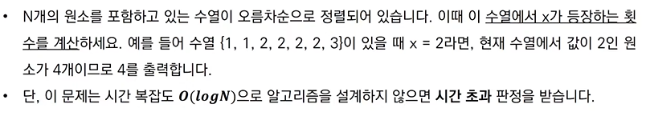
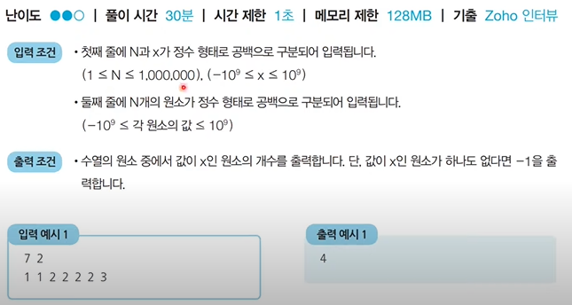

### 이진탐색(Binary_search)

> 순차탐색 : 리스트 안에 있는 특정한 데이터를 찾기 위해 앞에서부터 데이터를 하나씩 확인하는 방법
>
> 이진탐색 : 정렬되어 있는 리스트에서 탐색범위를 절반씩 좁혀가며 데이터를 탐색하는 방법으로 시작점, 끝점, 중간점을 이용하여 탐색 범위를 설정한다







- 단계마다 탐색범위를 2로 나누는 것과 동일하므로 연산횟수는 logN에 비례한다.

- **이진 탐색 소스코드 : 재귀적 구현**

  ```python
  # 이진 탐색 소스코드 구현(재귀함수)
  def binary_search(array, target, start,end):
      if start > end:
          return None
      mid = (start + end) // 2
      # 찾은 경우 중간점 인덱스 반환
      if array[mid] == target:
          return mid
      # 중간점의 값보다 찾고자 하는 값이 작은 경우 왼쪽 확인
  	elif array[mid] > target:
          return binary_search(array, target, start, mid-1)
      # 중간점의 값보다 찾고자 하는 값이 큰 경우 오른쪽 확인
      else:
          return binary_search(array, target, mid+1, end)
      
  # n과 target입력 받기
  n, target = list(map(int, input().split()))
  # 전체 원소 입력받기
  array = list(map(int, input().split()))
  
  # 이진 탐색 수행 결과 출력
  result = binary_search(array, target, 0, n-1)
  if result == 'None':
      print('원소가 존재하지 않습니다.')
  else:
      print(result + 1)		# 입력 : 10 7
      						# array : 1 3 5 7 9 11 13 15 17 19
          					# 결과 : 4
      
  ```

- **이진 탐색 소스코드 : 반복문 구현**

  ```python
  # 이진 탐색 소스코드 구현(반복문)
  def binary_search(array, target, start,end):
      while start <= end:
          mid = (start + end) // 2
          # 찾은 경우 중간점 인덱스 반환
          if array[mid] == target:
              return mid
          # 중간점의 값보다 찾고자 하는 값이 작은 경우 왼쪽확인
          elif array[mid] > target:
              end = mid - 1
          # 중간점의 값보다 찾고자 하는 값이 큰 경우 오른쪽 확인
          else:
              start = mid + 1
       return None
  
  # n과 target입력 받기
  n, target = list(map(int, input().split()))
  # 전체 원소 입력받기
  array = list(map(int, input().split()))
  
  # 이진 탐색 수행 결과 출력
  result = binary_search(array, target, 0, n-1)
  if result == 'None':
      print('원소가 존재하지 않습니다.')
  else:
      print(result + 1)		# 입력 : 10 7
      						# array : 1 3 5 7 9 11 13 15 17 19
          					# 결과 : 4
  ```

- **파이썬 이진 탐색 라이브러리**

  - `bisect_left(a, x)` : 정렬된 순서를 유지하면서 배열 a에 x를 삽입할 가장 왼쪽 인덱스를 반환

  - `bisect_right(a, x)` : 정렬된 순서를 유지하면서 배열 a에 x를 삽입할 가장 오른쪽 인덱스를 반환

    

    ```python
    from bisect import bisect_left, bisect_right
    
    a = [1,2,4,4,8]
    x = 4
    
    print(bisect_left(a, x))	# 결과 : 2
    print(bisect_right(a,x))	# 결과 : 4
    ```

  - 값이 특정 범위에 속하는 데이터 개수 구하기

    ```python
    from bisect import bisect_left, bisect_right
    
    # 값이 [left_value, right_value]인 데이터의 개수를 반환하는 함수
    def count_by_range(a, left_value, right_value):
        right_index = bisect_right(a, right_value)
        left_index = bisect_left(a, left_value)
        return right_index - left_index
    
    # 배열 선언
    a = [1,2,3,3,3,3,4,4,8,9]
    
    # 값이 4인 데이터 개수 출력
    print(count_by_range(a, 4, 4))			# 결과 : 2
    # 값이 [-1, 3] 범위에 있는 데이터 개수 출력
    print(count_by_range(a, -1, 3))			# 결과 : 6
    ```

- **파라메트릭 서치**
  - 파라메트릭 서치란 <u>최적화 문제를 결정문제('예' 혹은 '아니오')로 바꾸어 해결하는 기법</u>이다.
    - 예 > 특정한 조건을 만족하는 가장 알맞은 값을 빠르게 찾는 최적화 문제
  - 일반적으로 코테에서 파라메트릭 서치 문제는 **이진 탐색을 이용하여 해결할 수 있다**.

#### 문제

- **떡볶이 떡 만들기** 

  

​		

```python
# 떡의 개수(N)과 요청한 떡의 길이(M)을 입력받는다
n, m = list(map(int, input().split()))
# 각 떡의 개별 높이 정보를 입력
array = list(map(int, input().split()))

# 시작점과 끝점 설정
start = 0
end = max(array)

# 이진 탐색 수행(반복)
result = 0
while(start <= end):
    total = 0
    mid = (start + end) //2
    for x in array:
        # 잘랐을 떄의 떡의 양 계산
        if x > mid:
            total += x - mid
    # 떡의 양이 부족한 경우 더 많이 자르기(왼쪽부분 탐색)
    if total < mid:
        end = mid - 1
    # 떡의 양이 충분한 경우 덜자르기(오른쪽 부분 탐색)
    else:
        result = mid	# 최대한 덜 잘랐을 때가 정답이므로 여기에서 result에 기록
        start = mid + 1
# 정답출력
print(result)

```

- **정렬된 배열에서 특정 수의 개수 구하기**

  

​		

```python
from bisect import bisect_left, bisect_right

# 값이 [left_value, right_value]인 데이터의 개수를 반환하는 함수
def count_by_range(array, left_value, right_value):
    left_index = bisect_left(array, left_value)
    right_index = bisect_right(array, right_value)
    return right_index - left_index

# 데이터 개수 N과 찾고자 하는 값 x 입력받기
n, x = list(map(int, input().split()))
# 전체 데이터 입력
array = list(map(int, input().split()))

# 값이 [x, x] 범위에 있는 데이터의 개수 계산
count = count_by_range(array, x, x)

# 값이 존재하지 않는다면 -1
if count == 0:
    print(-1)
else:
    print(count)
```

