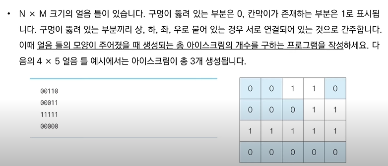
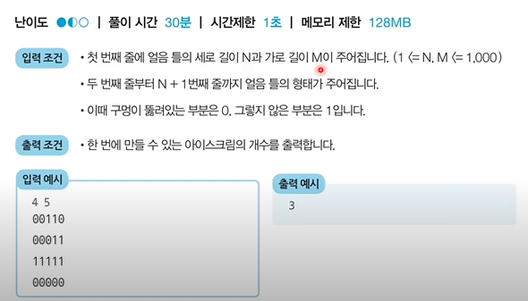
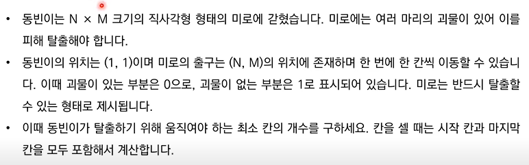
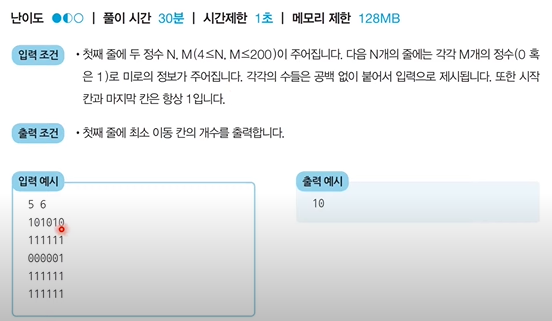

### DFS / BFS

> 그래프 탐색 알고리즘
>
> 탐색이란 많은 양의 데이터 중에 원하는 데이터를 찾는 과정이다
>
> 코딩 테스트에서 굉장히 자주 등장하는 유형이다

#### 스택 자료구조

- 먼저 들어온 데이터가 나중에 나가는 형식(선입후출)의 자료구조이다.

- **입구와 출구가 동일한 형태**로 스택을 시각화할 수 있다.

- 스택 동작 예시

  - **삽입(5) - 삽입(2) - 삽입(3) - 삽입(7) - 삭제() - 삽입(1) - 삽입(4) - 삭제()**

    => 결과 : 5, 2, 3, 1

  - 스택 구현 예제

    ```python
    stack = []
    
    # 삽입(5) - 삽입(2) - 삽입(3) - 삽입(7) - 삭제() - 삽입(1) - 삽입(4) - 삭제()
    stack.append(5)
    stack.append(2)
    stack.append(3)
    stack.append(7)
    stack.pop()
    stack.append(1)
    stack.append(4)
    stack.pop()
    
    print(stack[::-1])  # 최상단 원소부터 출력	
    print(stack)  # 최하단 원소부터 출력
    
    # 출력 : [1, 3, 2, 5]
    #		[5, 2, 3, 1]
    ```

#### 큐 자료구조

- 먼저 들어온 데이터가 먼저 나가는 형식(선입선출)의 자료구조이다

- 큐는 **입구와 출구가 모두 뚫려 있는 터널과 같은 형태**로 시각화 할 수 있다.

- 큐 동작 예시

  - **삽입(5) - 삽입(2) - 삽입(3) - 삽입(7) - 삭제() - 삽입(1) - 삽입(4) - 삭제()**

    => 결과 : 4, 1, 7, 3

  - 큐 구현 예제

    ```python
    from collections import deque
    
    # 큐(Queue) 구현을 위해 deque 라이브러리 사용
    queue = deque()
    
    # 삽입(5) - 삽입(2) - 삽입(3) - 삽입(7) - 삭제() - 삽입(1) - 삽입(4) - 삭제()
    queue.append(5)
    queue.append(2)
    queue.append(3)
    queue.append(7)
    queue.popleft()
    queue.append(1)
    queue.append(4)
    queue.popleft()
    
    print(queue)	# 먼저 들어온 순서대로 출력
    queue.reverse()	# 역순으로 바꾸기
    print(queue)	# 나중에 들어온 원소부터 출력
    
    # 출력 : deque([3, 7, 1, 4])
    #		deque([4, 1, 7, 3])
    ```

#### 재귀 함수

- **재귀 함수(Recursive Function)란 자기 자신을 다시 호출**하는 함수를 의미한다.

- 단순한 형태의 재귀 함수 예제

  - '재귀 함수를 호출합니다' 라는 문자열을 무한히 출력

  - 어느 정도 출력하다가 최대 재귀 깊이 초과 메시지가 출력

    ```python
    def recursive_function() :
          print('재귀 함수를 호출합니다.')
          recursive_function()
    recursivce_function()
    ```

- 재귀 함수의 종료 조건

  - 재귀 함수를 문제풀이에서 사용 할 때는 재귀 함수의 종료 조건을 반드시 명시해야 한다.

  - 종료 조건을 제대로 명시하지 않으면 함수가 무한히 호출 될 수 있다.

    - 종료 조건을 포함한 재귀 함수 예제

    ```python
    def recursive_function(i) :
          if i == 100 :
                  return
          print(f"{i} {'번쨰 함수에서'} {i+1} {'번째 함수를 호출합니다.'}")
          recursive_function(i+1)
          print(f"{i} {'번째 재귀 함수를 종료합니다.'}")
    recursive_function(1)
    ```

- 팩토리얼 구현 예제

  - n! = 1  x 2 x 3 x ... x (n-1) x n

  - 수학적으로 0!과 1!의 값은 1이다.

    ```python
    # 반복적으로 구현한 n!
    def factorial_iterative(n) :
          result = 1
          # 1부터 n까지 수를 차례대로 곱하기
          for i in range(1, n+1) :
                  result *= i
          return result
    
    # 재귀적으로 구현한 n!
    def factorial_recursive(n) :
          if n <= 1 : # n이 1이하인 경우 1반환
              return 1
          # n! = n*(n-1)!를 그대로 코드로 작성하기
          return n*factorial_recursive(n-1)
    # 각각의 방식으로 구현한 n! 출력(n = 5)
    print(f"{'반복적으로 구현 :'} {factorial_iterative(5)}")		# 반복적으로 구현 : 120
    print(f"{'재귀적으로 구현 :'} {factorial_recursive(5)}")		# 재귀적으로 구현 : 120
    ```

- 최대공약수 계산 (유클리드 호제법) 예제

  - 두 개의 자연수에 대한 최대 공약수를 구하는 대표적인 알고리즘으로 유클리드 호제법이 있다.

  - 유클리드 호제법

    - 두 자연수 a, b에 대하여 (a>b) a를 b로 나눈 나머지를 r이라고 하자.
    - 이 때 a와 b의 최대공약수는 b와 r의 최대 공약수와 같다.

  - 유클리드 호제법의 아이디어를 그대로 재귀 함수로 작성할 수 있다.

    - 예시 : GCD(192, 162)

      | 단계 |  a   |  b   |
      | :--: | :--: | :--: |
      |  1   | 192  | 162  |
      |  2   | 162  |  30  |
      |  3   |  30  |  12  |
      |  4   |  12  |  6   |

    ```python
    def gcd(a, b) :
        if a % b == 0 :
            return b
        else :
            return gcd(b, a % b)
    print(gcd(192, 162))
    ```

- 재귀 함수 사용의 유의 사항

  - 재귀 함수를 잘 활용하면 복잡한 알고리즘을 간결하게 작성할 수 있다.
    - 단, 오히려 다른 사람이 이해하기 어려운 형태의 코드가 될 수도 있으므로 신중하게 사용해야 한다.
  - 모든 재귀 함수는 반복문을 이용하여 동일한 기능을 구현할 수 있다.
  - 재귀 함수가 반복문보다 유리한 경우도 있고 불리한 경우도 있다.
  - 컴퓨터가 함수를 연속적으로 호출하면 컴퓨터 메모리 내부의 스택 프레임에 쌓인다.
    - 그래서 **스택을 사용해야 할 때 구현상 스택 라이브러리 대신에 재귀 함수를 이용**하는 경우가 많다.

#### DFS

- **깊이 우선 탐색**이라고도 부르며 그래프에서 **깊은 부분을 우선적으로 탐색**하는 알고리즘이다.

- **스택 자료구조(혹은 재귀 함수)**를 이용한다.

  1. 탐색 시작 노드를 스택에 삽입하고 방문 처리를 한다.
  2. 스택의 최상단 노드에 방문하지 않은 인접한 노드가 하나라도 있으면 그 노드를 스택에 넣고 방문처리한다. 방문하지 않은 인접노드가 없으면 스택에서 최상단 노드를 꺼낸다.
  3. 더 이상 2번의 과정을 수행할 수 없을 때까지 반복한다.

- DFS  소스코드 예제

  ```python
  # DFS 메소드 정의
  def dfs(graph, v, visited) :
      # 현재 노드를 방문 처리
      visited[v] = True
      print(v, end=" ")
      # 현재 노드와 연결된 다른 노드를 재귀적으로 방문
      for i in graph[v] :
          if not visited[i] :
              dfs(graph, i, visited)
  # 각 노드가 연결된 정보를 표현(2차원 리스트)
  graph = [
      [],
      [2, 3, 8],
      [1, 7],
      [1, 4, 5],
      [3, 5],
      [3, 4],
      [7],
      [2, 6, 8],
      [1, 7]
  ]
  # 각 노드가 방문된 정보를 표현(1차원 리스트)
  visited = [False] * 9
  
  # 정의된 DFS 함수 호출
  dfs(graph, 1, visited)						# 출력 : 1 2 7 6 8 3 4 5
  ```

#### BFS

- **너비 우선 탐색**이라고도 부르며, 그래프에서 **가까운 노드부터 우선적으로 탐색**하는 알고리즘이다.
- **큐 자료구조**를 이용하며, 구체적인 동작 과정은 다음과 같다.
  1. 탐색 시작 노드를 큐에 삽입하고 방문 처리를 한다.
  2. 큐에서 노드를 꺼낸 뒤에 해당 노드의 인접 노드중에서 방문하지 않은 노드를 모두 큐에 삽입하고 방문 처리한다.\
  3. 더 이상 2번의 과정을 수행할 수 없을 때까지 반복한다.

- BFS 소스코드 예제

  ```python
  from collections import deque
  
  # BFS 메소드 정의
  def bfs(graph, start, visited) :
      # 큐 구현을 위해 deque 라이브러리 이용
      queue = deque([start])
      # 큐가 빌때까지 반복
      while queue :
          # 큐에서 하나의 원소를 뽑아 출력하기
          v = queue.popleft()
          print(v, end = " ")
          # 아직 방문하지 않은 인접한 원소들을 큐에 삽입
          for i in graph[v] :
              if not visited[i] :
                  queue.append(i)
                  visited[i] = True
                  
  # 각 노드가 연결된 정보를 표현(2차원 리스트)
  graph = [
      [],
      [2, 3, 8],
      [1, 7],
      [1, 4, 5],
      [3, 5],
      [3, 4],
      [7],
      [2, 6, 8],
      [1, 7]
  ]
  # 각 노드가 방문된 정보를 표현(1차원 리스트)
  visited = [False] * 9
  
  # 정의된 BFS함수 호출
  bfs(graph, 1, visited)					# 결과 : 1 2 3 8 1 7 4 5 6 
  ```
  

#### 음료수 얼려 먹기 예제





- 문제 해결 아이디어

  - 얼음을 얼릴 수 있는 공간이 상, 하, 좌, 우로 연결되어 있다고 표현할 수 있으므로 그래프 형태로 모델링 할 수 있다. 
  - DFS를 활용한 알고리즘
    1. 특정한 지점의 주변 상, 하, 좌, 우를 살펴본 뒤에 주변 지점중에서 값이 '0'이면서 아직 방문하지 않은 지점이 있다면 해당 지점을 방문한다.
    2. 방문한 지점에서 다시 상, 하, 좌, 우를 살펴보면서 방문을 진행하는 과정을 반복하면 연결된 모든 지점을 방문 할 수 있다.
    3. 모든 노드에 대하여 1~2번의 과정을 반복하며 방문하지 않은 지점의 수를 카운트 한다. 

  ```python
  # DFS로 특정 노드를 방문하고 연결된 모든 노드들도 방문
  def dfs(x, y) :
      
      # 주어진 범위를 벗어나는 경우에는 즉시 종료
      if x <= -1 or x >= n or y <= -1 or y >= m :
          
          return False
          # 현재 노드를 아직 방문하지 않았다면
      if graph[x][y] == 0 :
          # 해당 노드 방문처리
          graph[x][y] = 1
          # 상, 하, 좌, 우의 위치들도 모두 재귀적으로 호출
          dfs(x-1 , y)
          dfs(x, y-1)
          dfs(x+1, y)
          dfs(x, y+1)
          return True
      return False
  
  # 공백을 기준으로 구분하여 입력 받기
  n, m = map(int, input().split())
  
  # 2차원 리스트의 맵 정보 입력받기
  graph = [list(map(int, input())) for i in range(n)]
  
  result = 0
  for i in range(n) :
      for j in range(m) :
          # 현재 위치에서 DFS 수행
          if dfs(i, j) == True :
              result += 1
  print(result)								 
  ```

#### 미로탈출 문제





- 문제해결 아이디어

  - BFS는 시작 지점에서 가까운 누드부터 차례대로 그래프의 모든 노드를 탐색한다.
  - 상, 하, 좌, 우로 연결된 모든 노드로의 거리가 1로 동일하다.
    - 따라서 (1, 1) 지점부터 BFS를 수행하여 모든 노드의 최단 거리 값을 기록하면 해결할 수 있다.

  ```python
  from collections import deque
  
  # BFS 소스코드 구현
  def bfs(x, y) :
      # 큐(Queue) 구현을 위해 deque 라이브러리 사용
      queue = deque()
      queue.append((x, y))
      # 큐가 빌 때까지 반복하기
      while queue :
          x, y = queue.popleft()
          # 현재 위치에서 4가지 방향으로의 위치 확인
          for i in range(4) :
              nx = x + dx[i]
              ny = y + dy[i]
              # 미로 찾기 공간을 벗어난 경우 무시
              if nx < 0 or nx >= n or ny < 0 or ny >= m :
                  continue
              # 벽인 경우 무시
              if graph[nx][ny] == 0 :
                  continue
              if graph[nx][ny] == 1 :
                  graph[nx][ny] = graph[x][y] + 1
                  queue.append((nx, ny))
      # 가장 오른쪽 아래까지의 최단거리 반환
      return graph[n - 1][m - 1]
  
  # n, m을 공백 기준으로 구분하여 입력받기
  n, m = map(int, input().split())
  
  # 2차원 리스트의 맵 정보 입력 받기
  graph = [list(map(int, input())) for _ in range(n)]
  
  # 이동할 4가지 방향 정의(상, 하, 좌, 우)
  dx = [-1, 1, 0, 0]
  dy = [0, 0, -1, 1]
  
  # BFS를 수행한 결과 출력
  print(bfs(0, 0))
  ```

  
