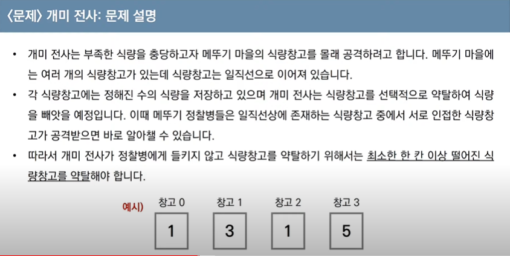
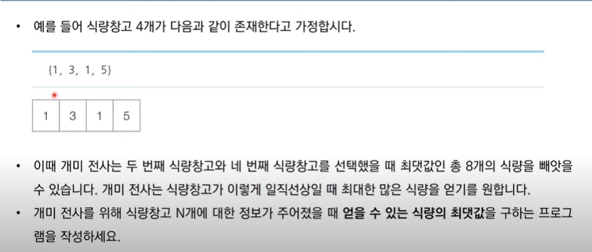
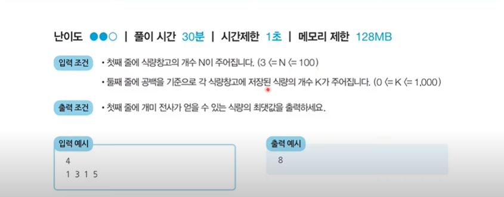
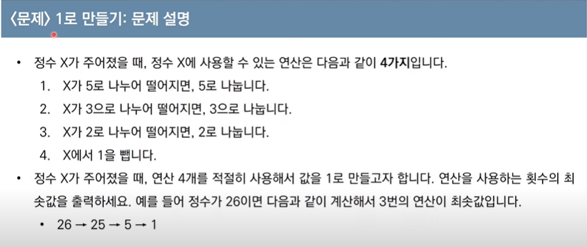
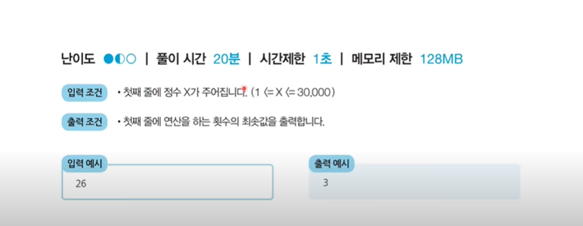
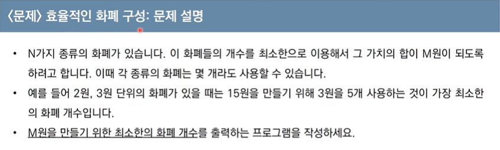
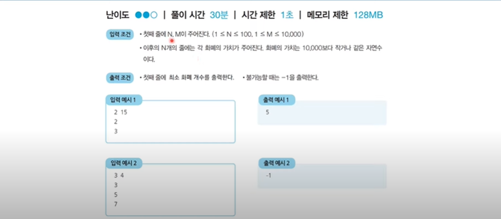
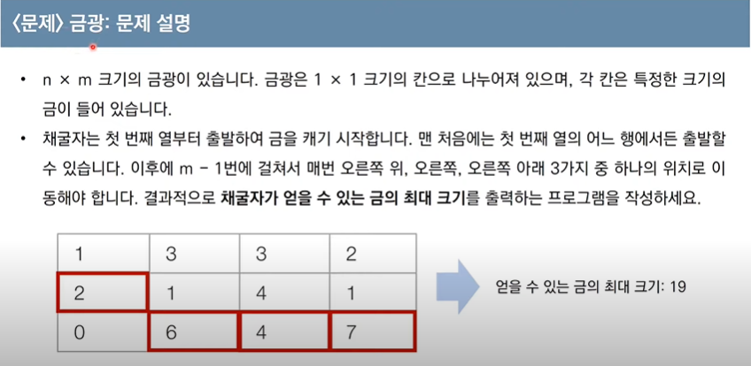
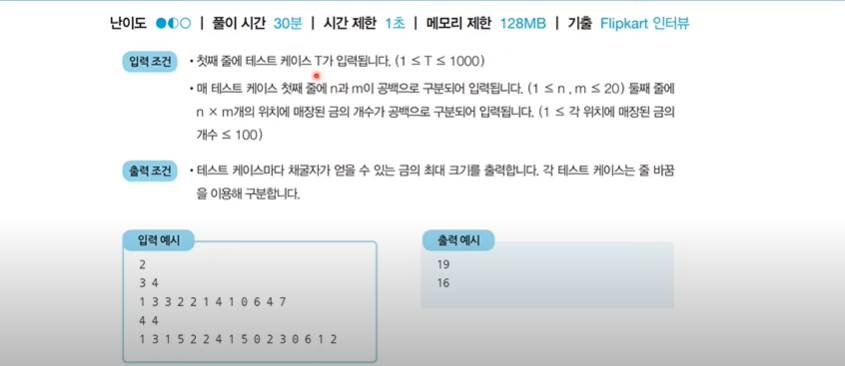

### Dynamic_programming

> 다이나믹 프로그래밍은 메모리를 적절히 사용하여 수행 시간 효율성을 비약적으로 향상시키는 방법이다.
>
> 이미 계산된 결과는 별도의 메모리 영역에 저장하여 다시 계산하지 않도록 한다.
>
> 다이나믹 프로그래밍의 구현은 일반적으로 두 가지 방식(탑다운과 보텀업)으로 구성된다.
>
> 다이나믹 프로그래밍은 동적 계획법이라고도 부른다.

#### 1. 일반적인 프로그래밍 분야에서 동적(Dynamic)이란?

- 자류구조에서 동적 할당(Dynamic Allocartion)은 **'프로그램이 실행되는 도중에 실행에 필요한 메모리를 할당하는 기법'**을 의미한다.

- 반면에 다이나믹 프로그래밍에서 '다이나믹'은 별 의미없이 사용된 단어이다.

- 다이나믹 프로그래밍은 문제가 다음의 조건을 만족할 때 사용할 수 있다.

  - **최적 부분 구조(Optimal Substructure)**
    - 큰 문제를 작은 문제로 나눌 수 있으며 작은 문제의 답을 모아서 큰 문제를 해결할 수 있다.
  - **중복되는 부분 문제(Overlapping Subproblem)**
    - 동일한 작은 문제를 반복적으로 해결해야 한다.

- **피보나치 수열(다이나믹 프로그래밍으로 해결할 수 있는 대표적 문제)**

  - 예> 피보나치 수열은 [1, 1, 2, 3, 5, 8, 13, 21, 34, 55, 89, ...]과 같은 형태의 수열이며 다이나믹 프로그래밍으로 효과적으로 계산할 수 있다.

  - **점화식**이란 <u>인접한 항들 사이의 관계식</u>을 의미한다. 

  - 피보나치 수열을 점화식으로 표현 : a<sub>n</sub> = a<sub>n-1</sub> + a<sub>n-2</sub>, a<sub>1</sub> = 1, a<sub>2</sub> = 1

  - 실제로 이러한 수열을 프로그램상으로 표현할 때는 **배열이나 리스트**를 활용하여 구현한다.

    ```python
    # 피보나치 함수(Fibonacci Function)를 재귀함수로 표현
    def fibo(x):
        if x = 1 or x = 2:
            return 1
        return fibo(x - 1) + fibo(x - 2)
    
    print(fibo(4))		# 결과 : 3
    ```

    - 피보나치 수열을 단순 재귀함수로 해곃나면 지수 시간 복잡도를 가지게 된다(중복문제)		

  - **다이나믹 프로그래밍을 활용한 피보나치 수열 해결**

    - 최적 부분 구조 : 큰 문제를 작은 문제로 나눌 수 있다.
    - 중복되는 부분 문제 : 동일한 작은 문제를 반복적으로 해결한다.

#### 2. 탑다운(하향식) vs 보텀업(상향식)

- 탑다운(메모이제이션) 방식은 하향식이라고도 하며 보텀업 방식은 상향식이라고도 한다.
- 다이나믹 프로그래밍의 전형적인 형태는 보텀업 방식이다.
  - 결과 저장용 리스트는 DP테이블이라고도 부른다.
- 메모이제이션은 <u>이전에 계산된 결과를 일시적으로 기록해 두는 넓은 개념</u>을 의미한다.
  - 메모이제이션은 다이나믹 프로그래밍에 국한된 개념은 아니다.
  - 한 번 계산된 결과를 담아 놓기만 하고 다이나믹 프로그래밍을 위해 활용하지 않을 수도 있다.

#### 3. 메모이제이션(Memoization)

- 메모이제이션은 다이나믹 프로그래밍을 구현하는 방법 중 하나이다.

- <u>한 번 계산한 결과를 메모리 공간에 메모</u>하는 기법이다.

  - 같은 문제를 다시 호출하면 메모했던 결과를 그대로 가져온다.
  - 값을 기록해 둔다는 점에서 **캐싱(Caching)**이라고도 한다.

- 탑다운 다이나믹 프로그래밍 소스코드

  ```python
  # 탑다운 다이나믹 프로그래밍 소스코드
  # 한 번 계산된 결과를 메모이제이션하기 위한 리스트 초기화
  d = [0] * 100
  
  # 피보나치 함수를 재귀함수로 구현(탑다운 다이나믹 프로그래밍)
  def fibo(x):
      # 종료 조건(1 혹은 2일 때 1반환)
      if x == 1 or x == 2:
          return 1
      # 이미 계산한 적 있는 문제라면 그대로 반환
      if d[x] != 0:
          return d[x]
      # 아직 계산하지 않은 문제라면 점화식에 따라서 피보나치 결과 반환
      d[x] = fibo(x - 1) + fio(x - 2)
      return d[x]
  
  print(fibo(99))		# 결과 : 218922995834555169026
  ```

- 보텀업 다이나믹 프로그래밍 소스코드

  ```python
  # 앞서 계산된 결과를 저장하기 위한 DP테이블 초기화
  d = [0] * 100
  
  # 첫 번째 피보나위 수와 두 번째 피보나치 수는 1
  d[1] = 1
  d[2] = 1
  n = 99
  
  # 피보나치 함수 반복문으로 구현(보텀업 다이나믹 프로그래밍)
  for i in range(3, n + 1):
      d[i] = d[i-1] + d[i-2]
  print(d[n])			# 결과 : 218922995834555169026
  ```

#### <예제>

- **개미 전사 문제**

  

  

  

  ```python
  # 정수 n 입력받기
  n = int(input())
  # 모든 식량 정보 입력받기
  k = list(map(int, input().split()))
  
  # 앞서 계산된 결과를 저장하기 위한 DP테이블 초기화
  d = [0] * 100
  
  # 다이나믹 프로그래밍 진행(보텀업)
  d[0] = k[0]
  d[1] = max(k[0], k[1])
  for i in range(2, n):
      d[i] = max(d[i-1], d[i-2] + k[i])
      
  # 계산된 결과 출력
  print(d[n-1])
  
  ```

- **1로 만들기**

  

  

  ```python
  x = int(input())
  
  d = [0] * 30001
  
  for i in range(2, x+1):
      # 현재의 수에서 1을 빼는 경우
      d[i] = d[i-1] + 1
      # 현재의 수가 2로 나누어 떨어지는 경우
      if i % 2 == 0:
          d[i] = min(d[i], d[i // 2] + 1)
      # 현재의 수가 3으로 나누어 떨어지는 경우
      if i % 3 == 0:
          d[i] = min(d[i], d[i // 3] + 1)
      # 현재의 수가 5로 나누어 떨어지는 경우
      if i % 5 == 0:
          d[i] = min(d[i], d[i // 5] + 1)
  
  print(d[x])
  ```

- **효율적인 화폐 구성**

  

  

  ```python
  # 정수n, m 입력받기
  n, m = map(int, input().split())
  # n개의 화폐정보 입력받기
  array = []
  for i in range(n):
      array.append(int(input()))
  
  # 한 번 계산된 결과를 저장하기 위한 DP 테이블 초기화
  d = [10001] * (m + 1)
  
  # 다이나믹 프로그래밍 진행(보텀업)
  d[0] = 0
  for i in range(n):
      for j in range(array[i], m + 1):
          if d[j - array[i]] != 10001: # (i-k)원을 만드는 방법이 존재하는 경우
              d[j] = min(d[j], d[j - array[i]] + 1)
  # 계산된 결과 출력
  if d[m] == 10001:	# 최종적으로 m원을 만드는 방법이 없는 경우
      print(-1)
  else:
      print(d[m])
  ```

- **금광**

  

  

  ```python
  # 테스트케이스 입력
  for tc in range(int(input())):
      # 금광 정보 입력
      n, m = map(int, input().split)
      array = list(map(int, input().split()))
      # 다이나믹 프로그래밍을 위한 2차원 테이블 초기화
      dp = []
      index = 0
      for i in range(n):
          dp.append(array[index : index + m])
          index += m
      # 다이나믹 프로그래밍 진행
      for j in range(1, m):
          for i in range(n):
              # 왼쪽 위에서 오는 경우
              if i == 0: left_up = 0
          	else: left_up = dp[i-1][j-1]
              # 왼쪽 아래에서 오는 경우
              if i == n - 1 : left_down = 0
          	else: left_down = dp[i+1][j-1]
              # 왼쪽에서 오는 경우
              left = dp[i][j-1]
              dp[i][j] = dp[i][j] + max(left_up, left_down, left)
      result = 0
      for i in range(n):
          result = max(result, dp[i][m-1])
      print(result)
  ```

  

  