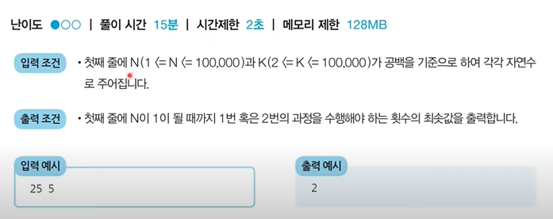
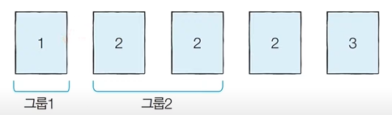

### 그리디 알고리즘

> 그리디 알고리즘(탐욕법)은 현재 상황에서 지금 당장 좋은 것만 고르는 방법을 의미한다.
>
> 일반적인 그리디 알고리즘은 문제를 풀기 위한 최소한의 아이디어를 떠올리 수 있는 능력을 요구한다.
>
> 그리디 해법은 그 정당성 분석이 중요하다. 단순히 가장 좋아 보이는 것을 반복적으로 선택해도 최적의 해를 구할 수 있는지 검토한다.

### 거스름 돈


- 문제 해결 아이디어

  - 최적의 해를 빠르게 구하기 위해서는 가장 큰 화폐 단위부터 돈을 거슬러 주면 된다.
  - N원을 거슬러 줘야할 때 가장 먼저 500원으로 거슬러 줄 수 있을 만큼 거슬러준다
    - 이후에 100원, 50원, 10원짜리 동전을 차례대로 거슬러 줄 수 있을 만큼 거슬러 주면된다.

   ```python
   n = 1260
   count = 0
   
   array = [500, 100, 50, 10]
   
   for coin in array :
         count += n // coin
         n = coin
   print(count)
   ```

#### 1이 될 때까지

- 어떠한 수 N이 1이 될때까지 다음의 두 과정 중 하나를 반복적으로 선택하여 수행하려고 합니다. 단, 두 번째 연산은 N이 K로 나누어 떨어질 때만 선택할 수 있습니다.
  1. N에서 1을 뺍니다.
  2. N을 K로 나눕니다.
- 예를 들어 N이 17, K가 4라고 가정합시다. 이때 1번의 과정을 한 번 수행하면 N은 16이 됩니다. 이후에 2번의 과정을 두 번 수행하면 N은 1이 됩니다. 결과적으로 이 경우 전체 과정을 실행한 횟수는 3이 됩니다. 이는 N을 1로 만드는 최소 횟수 입니다.
- N과 K가 주어질 때 N이 1이 될 때까지 1번 혹은 2번의 과정을 수행해야 하는 최소 횟수를 구하는 프로그램을 작성하세요.



- 문제 해결 아이디어

  - 주어진 N에 대하여 최대한 많이 나누기를 수행하면 된다.
  - N의 값을 중링 때 2 이상의 수로 나누는 작업이 1을 뺴는 작업보다 수를 훨씬 많이 줄일 수 있다.

  ```python
  n, k = map(int, input().split())
  
  result = 0
  
  while True :
      # n이 k로 나누어 떨어지는 수가 될 때까지 빼기
      target = (n // k) * k
      result += (n - target)
      n = target
      # n이 k보다 작을 때 (더이상 나눌 수 없을 때) 반복문 탈출
      if n < k :
          break
      result += 1
      n //= k
  
  # 마지막으로 남은 수에 대해서 1씩 빼기
  result += (n-1)
  print(result)
  ```

### 곱하기 혹은 더하기

- 각 자리가 숫자(0부터 9)로만 이루어진 문자열 S가 주어졌을 때, 왼쪽부터 오른쪽으로 하나씩 모든 숫자를 확인하며 숫자 사이에 'x' 혹은 '+' 연산자를 넣어 결과적으로 만들어질 수 있는 가장 큰 수를 구하는 프로그램을 작성하시오. 단, '+' 보다 'x'를 먼저 계산하는 일반적인 방식과는 달리, 모든 연산은 왼쪽에서 부터 순서대로 이루어진다고 가정합니다.
- 예를들어 02984라는 문자열로 만들 수 있는 가장 큰수는 ((((0+2)x9)x8)x4) =576입니다. 또한 만들어질 수 있는 가장 큰 수는 항상 20억 이하의 정수가 되도록 입력이 주어집니다.

​		

- 문제 해결 아이디어

  - 대부분의 경우 '+' 보다 'x' 가 더 값을 크게 만든다.
  - 다만 두 수중에서 하나라도 0 혹은 1인경우 곱하기보다는 더하기를 수행하는 것이 효율적이다.
  - 따라서 두 수에 대하여 연산을 수행할 때, 두 수중에서 하나라도 1이하인 경우에는 더하며 두 수가 모두 2이상인 경우에는 곱하면 정답이다.

  ```python
  data = input()
  
  # 첫 번째 문자를 숫자로 변경하여 대입
  result = int(data[0])
  
  for i in range(1, len(data)) :
      # 두 수 중에서 하나라도 0 혹은 1인경우 더하기 수행
      num = int(data[i])
      if num <= 1 or result <= 1 :
          result += num
      else :
          result *= num
  print(result)
  ```

#### 모험가 길드

- 한 마을에 모함가가 N명 있습니다. 모험가 길드에서는 N명의 모험가를 대상으로 '공포도'를 측정했는데, '공포도'가 높은 모험가는 쉽게 공포를 느껴 위험 상황에서 제대로 대처할 능력이 떨어집니다.

- 모험가 길드장인 동빈이는 모험가 그룹을 안전하게 구성하고자 공포도가 X인 모험가는 반드시 X명 이상으로 궝한 모험가 그룹에 참여해야 여행을 떠날 수 있도록 규정했습니다.

- 동빈이는 최대 몇 개의 모험가 그룹을 만들 수 있는지 궁금합니다. N명의 모험가에 대한 정보가 주어졌을 때, 여행을 떠날 수 있는 그룹 수의 최댓값을 구하는 프로그램을 작성하시오.

- 예를들어 N = 5이고 각 모험가의 공포도가 2 3 1 2 2와 같다고 가정합시다.

  - 이 경우 그룹 1에 공포도가 1, 2, 3인 모험가를 한 명씩 넣고, 그룹2에 공포도가 2인 남은 두 명을 넣게 되면 총 2개의 그룹을 만들 수 있습니다.

  - 또한 몇 명의 모험가는 마을에 그대로 남아 있어도 되기 때문에 모든 모험가를 특정한 그룹에 넣을 필요는 없습니다.

    

- 문제 해결 아이디어

  - 앞에서부터 공포도를 하나씩 확인하며 현재 그룹에 포함된 모험가의 수가 현재 확인하고 있는 공포도보다 크거나 같다면 이를 그룹으로 설정하면 된다.

  

- 이러한 방법을 이용하면 공포도가 오름차순으로 정렬되어 있다는 점에서 항상 최소한의 모험가의 수만 포함하여 그룹을 결성하게 된다.

  ```python
  n = int(input())
  k = list(map(int, input().split()))
  k.sort()
  
  result = 0  # 총 그룹의 수
  count = 0  # 현재 그룹에 포함된 모험가의 수
  
  for i in k :  # 공포도를 낮은 것부터 하나씩 확인하며
      count += 1  # 현재 그룹에 해당 모험가를 포함시키기
      if count >= i :  # 현재 그룹에 포함된 모험가의 수가 현재의 공포도 이상이라면 그룹 결성
          result += 1  # 총 그룹의 수 증가시키기
          count = 0  # 현재 그룹에 포함된 모험가의 수 초기화
  print(result)  # 총 그룹의 수 출력
  ```

  