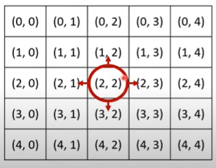
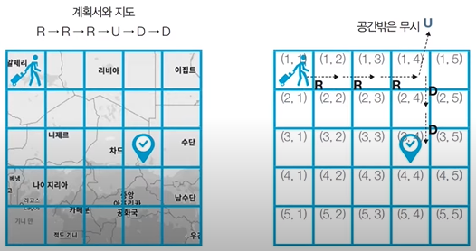
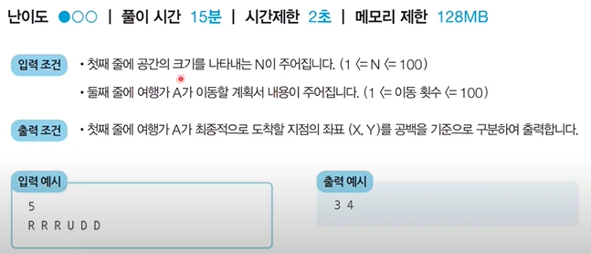
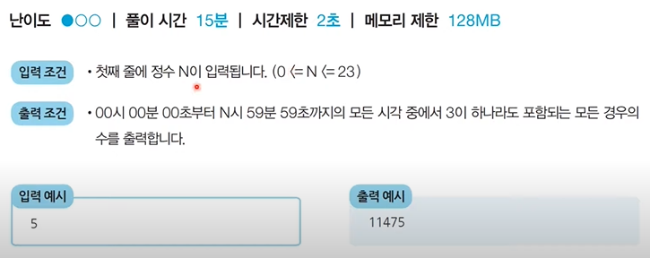
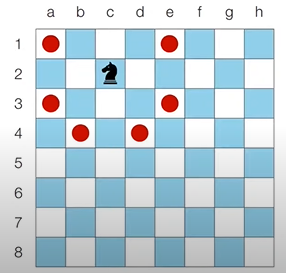
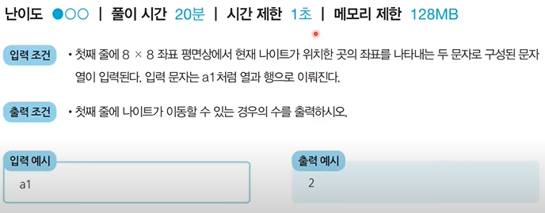

### 구현(Implement)

> 구현이란 머리속에 있는 알고리즘을 소스코드로 바꾸는 과정이다.
>
> 흔히 알고리즘 대회에서 구현 유형의 문제란? 풀이를 떠올리는 것은 쉽지만 소스코드로 옮기기 어려운 문제를 지칭한다.

- 구현의 예시

  - 알고리즘은 간단한데 코드가 지나칠 만큼 길어지는 문제
  - 실수 연산을 다루고, 특정 소수점 자리까지 출력해야 하는 문제
  - 문자열을 특정한 기준에 따라서 끊어 처리해야 하는 문제
  - 적절한 라이브러리를 찾아서 사용해야 하는 문제

- 일반적으로 알고리즘 문제이서의 2차원 공간은 **Matrix(행렬)**의 의미로 사용된다.

  

  ```python
  for i in range(5):
      for j in range(5):
          print('(', i, ',', j, ')', end=' ')
      print()
  ```

- 시뮬레이션 및 완전탐색 문제에서는 2차원 공간에서 **방향 벡터**가 자주 활용된다.

  

  ```python
  # 동, 북, 서, 남
  dx = [0, -1, 0, 1]	# 새로
  dy = [1, 0, -1, 0]	# 가로
  
  # 현재 위치
  x, y = 2, 2
  for i in range(4):
      # 다음위치
      nx = x + dx[i]
      ny = y + dy[i]
      print(nx, ny)
  ```


#### 문제

- **상하좌우**

  - 여행가 A는 N X N 크기의 정사각형 공간 위에 서 있습니다. 이 공간은 1 X 1 크기의 정사각형으로 나누어져 있습니다. 가장 왼쪽 위 좌표는 (1, 1)이며 가장 오른쪽 좌표는  (N, N)에 해당합니다. 여행가 A는 상, 하, 좌, 우 방향으로 이동할 수 있으며, 시작 좌표는 항상 (1, 1)입니다. 우리 앞에는 여행가 A가 이동할 계획이 적힌 계획서가 놓여 있습니다

  - 계획서에는 하나의 줄에 띄어쓰기를 기준으로 하여 L, R, U, D 중 하나의 문자가 반복적으로 적혀 있습니다. 각 문자의 의미는 다음과 같습니다.

    - L : 왼쪽으로 한 칸 이동
    - R : 오른쪽으로 한 칸 이동
    - U : 위로 한 칸 이동
    - D : 아래로 한 칸 이동

  - 이 때, 여행가 A가 N X N 크기의 정사각형 공간을 벗어나는 움직임은 무시됩니다. 예를들어 (1, 1)의 위치에서 L 혹은 U를 만나면 무시됩니다. 다음은 N = 5인 지도와 계획서 입니다.

    

    

    ```python
    # N 입력받기
    n = int(input())
    x, y = 1, 1
    plans = input().split()
    
    # L, R, U, D에 따른 이동방향
    dx = [0. 0, -1, 1]
    dy = [-1, 1, 0, 0]
    move_types = ['L', 'R', 'U', 'D']
    
    # 이동 계획을 하나씩 확인
    for plan in plans:
        # 이동 후 좌표 구하기
        for i in range(len(move_types)):
            if plan == move_types[i]:
                nx = x + dx[i]
                ny = y + dy[i]
        # 공간을 벗어나는 경우 무시
        if nx < 1 or ny < 1 or nx > n or ny > n:
               continue
        # 이동 수행
        x, y = nx, ny
        
    print(x, y)
    ```

- **시각**

  - 정수 N이 입력되면 00시 00분 00초부터 N시 59분 59초까지의 모든 시각 중에서 3이 하나라도 포함되는 모든 경우의 수를 구하는 프로그램을 작성하세요. 예를 들어 1을 입력했을 때 다음은 3이 하나라도 포함되어 있으므로 세어야 하는 시각입니다.

    - 00시 00분 03초
    - 00시 13분 30초

  - 반면 다음은 3이 하나도 포함되어 있지 않으므로 세면 안되는 시각입니다.

    - 00시 02분 55초
    - 01시 27분 45초

    

    ```python
    # h 입력 받기
    h = int(input())
    
    count = 0
    for i in range(h + 1):
        for j in range(60):
            for k in range(60):
                # 매 시각 안에 '3'이 포함되어 있으면 카운트 증가
                if '3' in str(i) + str(j) + str(k):
                    count += 1
                    
    print(count)
    ```

- **왕실의 나이트**

  - 행복 왕국의 왕실 정원은 체스판과 같은 8 X 8 좌표 평면입니다. 왕실 정원의 특정한 한 칸에 나이트가 서있습니다. 나이트는 매우 충성스러운 신하로서 매일 무술을 연마합니다.
  - 나이트는 말을 타고 있기 때문에 이동할 때는 L자 형태로만 이동할 수 있으며 정원 밖으로는 나갈 수 없습니다.
  - 나이트는 특정 위치에서 다음과 같은 2가지 경우로 이동할 수 있습니다.
    1. 수평으로 두 칸 이동한 뒤에 수직으로 한 칸 이동하기
    2. 수직으로 두 칸 이동한 뒤에 수평으로 한 칸 이동하기

  - 이처럼 8 X 8 좌표 평면상에서 나이트의 위치가 주어졌을 때 나이트가 이동할 수 있는 경우의 수를 출력하는 프로그램을 작성하세요. 왕실의 정원에서 행 위치를 표현할 때는 1부터 8로 표현하며, 열 위치를 표현할 때는 a부터 h로 표현합니다.

    - c2에 있을 때 이동할 수 있는 경우의 수는 6가지 입니다.

      

      

    ```python
    # 현재 나이트의 위치 입력받기
    input_data = input()
    row = int(input_data[1])
    column = int(ord(input_data[0])) - int(ord('a')) + 1
    
    # 나이트가 이동할 수 있는 8가지 방향 정의
    steps = [(-2, -1), (-1, -2), (1, -2), (2, -1), (2, 1),(1, 2), (-1, 2), (-2, 1)]
    
    # 8가지 방향에 대해 각 위치로 이동이 가능한지 확인
    result = 0
    for step in steps:
        # 이동하고자 하는 위치 확인
        next_row = row + step[0]
        next_column = column + step[1]
        # 해당 위치로 이동이 가능하다면 카운트 증가
        if next_row >= 1 and next_column >= 1 and next_row <= 8 and next_column <= 8:
            result += 1
            
    print(result)
    ```

    

    

    