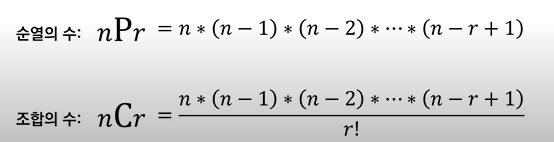

### 자료형

> 모든 프로그래밍은 결국 데이터를 다루는 행위
>
> 자료형에 대한 이해는 프로그래밍의 길에 있어서 첫 걸음이다

#### 파이썬의 자료형

- **정수형, 실수형, 복소수형, 문자열, 리스트, 튜플, 사전 등이 있다**(필수적으로 알아두어야 할 요소)

  - **정수형( Integer)** : 정수를 다루는 자료형

    - 양의 정수, 음의 정수, 0 이 포함
    - 코딩테스트에서 출제되는 많은 문제들은 정수형을 주로 다루게 된다.

    ```python
    # 양의 정수
    a = 1000
    print(a)				# 출력결과 : 1000
    
    # 음의 정수
    b = -7
    print(b)				# 출력결과 : -7
    
    c = 0
    print(C)				# 출력결과 : 0
    ```

  - **실수형(Real Number)** : 소수점 아래의 데이터를 포함하는  수 자료형

    - 파이썬에서는 변수에 소수점을 붙인 수를 대입하면 실수형 변수로 처리된다.
    - 소수부가 0이거나, 정수부가 0인 소수는 0을 생략하고 작성할 수 있다.

    ```python
    # 양의 실수
    a = 157.93
    print(a)				# 출력결과 : 157.93
    
    # 음의 실수
    b = -1837.2
    print(b)				# 출력결과 : -1837.2
    
    # 소수부가 0일때 0생략
    c = 5.
    print(C)				# 출력결과 : 5.0
    
    # 정수부가 0일때 0생략
    c = -.7
    print(C)				# 출력결과 : -0.7
    ```

    - 파이썬에서는 e나 E를 이용한 **지수표현 방식을 이용**할 수 있다.
      - e나 E 다음에 오는 수는 10의 지수부를 의미한다.
      - 예를 들어 **1e9**라고 입력하면, **10의 9제곱**(1,000,000,000)이 된다.
      - 지수 표현 방식은 임의의 큰 수를 표현하기 위해 자주 사용된다.
      - 최단 경로 알고리즘에서는 도달할 수 없는 노드에 대하여 최단 거리를 **무한(INF)**로 설정하곤 한다.
      - 이 떄 가능한 최댓값이 10억 미만이라면 무한(INF)의 값으로 1e9를 이용할 수 있다

    ```python
    # 1,000,000,000의 지수표현 방식
    a = 1e9
    print(a)				# 출력결과 : 1,000,000,000.0
    
    # 정수형으로 출력하고 싶으면
    a = int(1e9)
    print(a)				# 출력결과 : 1,000,000,000
    
    b = 75.25e1
    print(b)				# 출력결과 : 752.5
    
    c = 3594e-3
    print(c)				# 출력결과 : 3.594
    ```

    - 컴퓨터 시스템은 실수정보를 표현하는 정확도에 한계를 가진다.

    - EX> 10진수에서는 0.3 + 0.6 은 0.9로 정확하게 떨어지지만 2진수에서는 0.9를 정확히 표현할 수 있는 방법이 없다.

      컴퓨터는 0.9와 최대한 가깝게 표시하지만 미세한 오차가 발생한다.

    ```python
    a = 0.3 + 0.6
    print(a)				# 출력결과 : 0.89999999999999999
    
    if a == 0.9 :
          print(True)
    else :
          print(False)		# 출력결과 : False
    ```

    - 개발 과정에서 실수 값을 제대로 비교하지 못해서 원하는 결과를 얻지 못할 수 있다. 이럴 때 round()함수를 이용할 수 있다
    - EX> 123.456을 소수 셋째자리에서 반올림 하려면 round(123.456, 2)라고 작성한다 => 결과 : 123.46(소수 둘째자리까지 표현하라는 의미)

    ```python
    a = 0.3 + 0.6
    print(round(a, 4))				# 출력결과 : 0.9
    
    if round(a, 4) == 0.9 :
          print(True)
    else :
          print(False)				# 출력결과 : True
    ```

#### 수 자료형의 연산

- 수 자료형에 대하여 사칙연산과 나미저 연산자가 많이 사용된다.

- 나누기 연산자(/)를 주의해서 사용해야 한다.

  - 파이썬에서는 나누기연산자(/)는 나눠진 결과를 실수형으로 반환한다.

- 다양한 로직을 설계할 때 나머지연산(%)를 이용해야 할 때가 많다.

  - EX> a가 홀수인지 체크해야 하는 경우

- 파이썬에서는 몫을 얻기 위해 몫연산자(//)를 사용한다.

- 이외에도 거듭 제곱 연산자(**)를 비롯해 다양한 연산자들이 존재한다.

  ```python
  a = 7
  b = 3
  
  # 나누기
  print(a / b)				# 출력결과 : 2.3333333333335
  
  # 나머지
  print(a % b)				# 출력결과 : 1
  
  #몫 연산자
  print(a // b)				# 출력결과 : 2
  
  # 거듭제곱
  print(a ** b)				# 출력결과 : 343
  
  # 제곱근
  print(a ** 0.5)				# 출력결과 : 2.6457513110645907
  ```

#### 리스트 자료형

- 여러 개의 데이터를 연속적으로 담아 처리하기 위해 사용하는 자료형이다.

  - 사용자의 입장에서 C나 자바에서의 배열(Array)의 기능 및 연결 리스트와 유사한 기능을 지원한다.
  - 리스트 대신에 배열 혹은 테이블이라고 부르기도 함

- 리스트 초기화

  - 리스트는 대괄호([])안에 원소를 넣어 초기화하며, 쉼표(,)로 원소를 구분한다.

  - 비어 있는 리스트를 선언하고자 할 때는 list() 혹은 간단히 []를 이용할 수 있다.

  - 리스트의 원소에 접근할 때는 인덱스(index) 값을 괄호에 넣는다.

    - **인덱스는 0부터 시작**

    ```python
    # 직접 데이터를 넣어서 초기화
    a = [1, 2, 3, 4, 5, 6, 7, 8, 9]
    print(a)					# 출력결과 : [1, 2, 3, 4, 5, 6, 7, 8, 9]
    
    # 네 번째 원소만 출력
    print(a[3])					# 출력결과 : 4
    
    # 크기가 N이고, 모든 값이 0인 1차원 리스트 초기화
    N = 10
    a = [0] * N
    print(a)					# 출력결과 : [0, 0, 0, 0, 0, 0, 0, 0, 0, 0]
    ```

- 리스트 인덱싱과 슬라이싱

  - 인덱스 값을 입력하여 리스트의 특정한 원소에 접근하는 것을 인덱싱(indexing)이라고 한다.

    - 파이썬의 인덱스 값은 양의 정수와 음의 정수 모두 사용할 수 있다.
    - 음의 정수를 넣으면 원소를 거꾸로 탐색하게 된다.

    ```python
    a = [1, 2, 3, 4, 5, 6, 7, 8, 9]
    # 여덟 번째 원소만 출력
    print(a[7])					# 출력결과 : 8
    
    # 뒤에서 첫 번째 원소 출력
    print(a[-1])				# 출력결과 : 9
    
    # 뒤에서 세 번째 원소 출력
    print(a[-3])				# 출력결과 : 7
    
    # 네 번째 원소값 변경
    a[3] = 7
    print(a)					# 출력결과 : [1, 2, 3, 7, 5, 6, 7, 8, 9]
    ```

  - 리스트에서 연속적인 위치를 갖는 원소들을 가져와야 할 때는 슬라이싱(Slicing)을 이용한다.

    - 대괄호 안에 **콜론(:)**을 넣어서 **시작 인덱스와 끝 인덱스**를 설정할 수 있다.
    - **끝 인덱스는 실제 인덱스보다 1을 더 크게 설정한다.**

    ```python
    a = [1, 2, 3, 4, 5, 6, 7, 8, 9]
    # 네 번째 원소만 출력
    print(a[3])					# 출력결과 : 4
    
    # 두 번째 원소부터 네 번째 원소까지
    print(a[1 : 4])				# 출력결과 : [2, 3, 4]
    ```

- 리스트 컴프리헨션

  - 리스트를 초기화 하는 방법 중 하나이다.

    - 대괄호 안에 조건문과 반복문을 적용하여 리스트를 초기화할 수 있다.

    ```py
    # 0 ~ 9의 수를 포함하는 리스트
    array = [i for i in range(10)]
    print(array)				# 출력결과 : [0, 1, 2, 3, 4, 5, 6, 7, 8, 9]
    
    # 0 ~ 19 까지 수 중에서 홀수만 포함하는 리스트
    array = [i for i in range(20) if i % 2 == 1]
    print(array)				# 출력결과 : [1, 3, 5, 7, 9, 11, 13, 15, 17, 19]
    
    # 일반적인 코드
    array = []
    for i in range(20) : 
          if i % 2 == 1 :
                  array.append(i)
    print(array)
                    
    # 1 ~ 9 까지 수 중에서 제곱값을 포함하는 리스트
    array = [i * i for i in range(1, 10)]
    print(array)				# 출력결과 : [1, 4, 9, 16, 25, 36, 49, 64, 81]
    ```

  - 리스트 컴프리헨션은 2차원 리스트를 초기화할 떄 효과적으로 사용될 수 있다.

  - 특히 N X M 크기의 2차원리스트를 한 번에 초기화 해야 할 때 매우 유용하다.

    - 좋은 예 > array = [[0] * m for _ in range(n)]

    ```py
    # N X M 리스트 초기화
    N = 4
    M = 3
    array = [[0] * M for _ in range(N)]
    print(array)					# 출력결과 : [[0, 0, 0], [0, 0, 0], [0, 0, 0], [0, 0, 0]]
    ```

  - 만약에 2차원리스트를 초기화 할 때 다음과 같이 작성하면 예기치 못한 결과가 나올 수 있다.

    - 나쁜 예 >array = [[0] * m] * n
    - 위 코드는 전체 리스트 안에 포함된 각 리스트가 모두 같은 객체로 인식된다. 

    ```python
    # N X M 리스트 초기화(잘 못된 방법)
    N = 4
    M = 3
    array = [[0] * M] * N
    print(array)					# 출력결과 : [[0, 0, 0], [0, 0, 0], [0, 0, 0], [0, 0, 0]]
    								# 얼핏 잘나온 것 같다 but...
    array[1][1] = 5
    print(array)					# 출력결과 : [[0, 5, 0], [0, 5, 0], [0, 5, 0], [0, 5, 0]]
    								# 하나의 객체로 인식해서 다른 위치에 있는 원소들 까지 바꿔버린다
    ```

  - 언더바를 사용하는 경우

    - 파이썬에서는 반복을 수행하되 반복을 위한 변수의 값을 무시하고자 할 때 언더바(_)를 자주 사용한다.

    ```python
    # 1 부터 9까지의 자연수 더하기(변수 사용)
    sum = 0
    for i in range(1, 10) :
          sum += i
    print(sum)
    
    # "Hello World" 5번 출력하기(변수사용 하지 않음)
    for _ in range(5) :
          print("Hello World")
    ```

  - 리스트 관련 자주 사용되는 메서드

    - |  함수명   |                    사용법                    |                             설명                             | 시간 복잡도 |
      | :-------: | :------------------------------------------: | :----------------------------------------------------------: | :---------: |
      | append()  |               변수명.append()                |              리스트에 원소 하나 삽입할 때 사용               |    O(1)     |
      |  sort()   | 변수명.sort()<br>변수명.sort(reverse = True) |    기본 정렬 기능으로 오름차순 정렬<br>내림차순으로 정렬     |  O(NlogN)   |
      | reverse() |               변수명.reverse()               |            리스트의 원소의 순서를 모두 뒤집는다.             |    O(N)     |
      | insert()  |    insert(삽입할 위치 인덱스, 삽입할 값)     |          특정한 인덱스 위치에 원소를 삽입할 때 사용          |    O(N)     |
      |  count()  |            변수명.count(특정 값)             |   리스트에서 특정한 값을 가지는 데이터의 개수를셀 때 사용    |    O(N)     |
      | remove()  |            변수명.remove(특정 값)            | 특정한 값을 갖는 원소를 제거하는데, 값을 가진 원소가 여러개면 하나만 제거 |    O(N)     |

    ```python
    a = [1, 4, 3]
    print("기본리스트 :", a)					# 기본리스트 : [1, 4, 3]
    
    # 리스트에 원소 삽입
    a.append(2)
    print("삽입 :", a)					  # 삽입 : [1, 4, 3, 2]
    
    # 오름차순 정렬
    a.sort()
    print(a)								# 오름차순 정렬 : [1, 2, 3, 4]
    
    # 내림차순 정렬
    a.sort(reverse = True)
    print("내림차순 정렬 :", a)				# 내림차순 정렬 : [4, 3, 2, 1]
    
    # 리스트 원소 뒤집기
    a.reverse()
    print("원소 뒤집기 : ", a)				# 원소 뒤집기 : [1, 2, 3, 4]
    
    # 특정 인덱스에 데이터 추가
    a.insert(2, 3)
    print("인덱스 2에 3 추가 : ", a)			# 인덱스 2에 3 추가 : [1, 2, 3 ,3 ,4]
    
    # 특정 값인 데이터 갯수 세기
    print("값이 3인 데이터 갯수 : ", a.count(3))			# 값이 3인 데이터 갯수 : 2
    
    # 특정 값 데이터 삭제
    a.remove(1)
    print("값이 1인 데이터 삭제 : ", a)			# 값이 1인 데이터 삭제 : [2. 3. 3. 4]
    
    # 리스트에서 특정 값을 가지는 원소 모두 제거하기
    a = [1, 2, 3, 4, 5, 5, 5]
    remove_set = {3, 5}	# 집합 자료형
    
    # remove_set에 포함되지 않는 값만을 저장
    result = [i for i in a if i not in remove_set]
    print(result)							# 결과 : [1, 2, 4]
    ```

#### 문자열 자료형

- 문자열 변수를 초기화할 때는 큰 따옴표(")나 작은 따옴표(')를 사용한다.

- 문자열 안에 큰 따옴표나 작은 따옴표가 포함되어야 하는 경우가 있다.

  - 전체 문자열을 큰 따옴표롤 구성하는 경우, 내부적으로 작은 따옴표를 포함할 수 있다.

  - 전체 문자열을 작은 따옴표로 구성하는 경우, 내부적으로 큰 따옴표를 포함할 수 있다.

  - 혹은 백슬래시(\)를 사용하면, 킅 따옴표나 작은 따옴표를 원하는 만큼 포함시킬 수 있다.

    ```python
    data = 'Hello World'
    print(data)					# 출력 : Hello World
    
    data = "Don't you know \"Python\"?
    print(data)					# 출력 : Don't you know "Python"?
    ```

- 문자열 연산

  - 문자열 변수에 덧셈(+)을 이용하면 문자열이 더해져서 연결(Concatenate)이 된다.

  - 문자열 변수를 특정한 양의 정수와 곱하는 경우, 문자열이 그 값만큼 여러번 더해진다.

  - 문자열에 대해서도 마찬가지로 인덱싱과 슬라이싱을 이용할 수 있다.

  - 문자열 자료형에서는 특정 원소값을 다른 값으로 변경할 수 없다.

    - 다만 문자열은 특정 인덱스의 값을 변경할 수는 없다.(Immutable)

    ```python
    a = "Hello"
    b = "World"
    print(a + " " + b)			# 출력 : Hello World
    
    a = "String"
    print(a * 3)				# 출력 : StringStringString
    
    a = "ABCDEF"
    print(a[2 : 4])				# 출력 : CD
    ```


#### 튜플 자료형

- 튜플 자료형은 리스트와 유사하지만 몇 가지 차이점이 있다.
  - 튜플은 **한 번 선언된 값을 변경할 수 없다.**
  - 리스트는 대괄호([])를 이용하지만, 튜플은 소괄호(())를 이용한다.
  
- 튜플은 리스트에 비해 상대적으로 **공간 효율적**이다.

  ```python
  a = (1, 2, 3, 4, 5, 6, 7, 8, 9)
  
  # 네 번째 원소만 출력
  print(a[3])						# 출력 : 4
  
  # 두 번째 원소부터 네 번째 원서까지 출력
  print(a[1 : 4])					# 출력 : (2, 3, 4)
  
  # 특정한 인덱스의 값을 바꾸고자 하면 에러가 발생
  a = (1, 2, 3, 4)
  print(a)
  
  a[2] = 7						# 출력 : Traceback(most recent call last) :
  								#		  File "main.py", line 4, in <module> a[2] = 7
      							# 		TypeError : 'tuple' object does not support itmes assignment
  ```

- 튜플을 사용하면 좋은 경우
  - **서로 다른 성질**의 데이터를 묶어서 관리해야 할때
    - 최단 경로 알고리즘에서는 (비용, 노드 번호)의 형태로 튜플 자료형을 자주 사용한다.
  - 데이터 나열을 **해싱(Hashing)의 키 값**으로 사용해야 할 때
    - 튜플은 변경이 불가능하므로 리스트와 다르게 키 값으로 사용될 수 있다.
  - **리스트보다 메모리를 효율적으로 사용**해야 할 때

#### 사전 자료형

- 사전 자료형은 **키(Key)와 값(Value)의 쌍을 데이터로 가지는 자료형**이다.

  - 앞서 다루었던 리스트와 튜플이 값을 순차적으로 저장하는 것과는 대비된다.

- 사전 자료형은 키와 값의 쌍을 데이터로 가지며, 원하는 **'변경 불가능한(Immutable) 자료형'을 키로 사용**할 수 있다.

- 파이썬의 사전 자료형은 해시 테이블(Hash Table)을 이용하므로 <u>데이터의 조회 및 수정에 있어서 O(1)의 시간에 처리할 수 있다.</u>

  ```python
  data = dict()
  data['사과'] = 'Apple'
  data['바나나'] = 'Banana'
  data['코코넛'] = 'Coconut'
  
  print(data)											# 출력 : {'사과' : 'Apple', '바나나' : 'Banana', '코코넛' : 'Coconut'}
  
  if '사과' in data :
        print("'사과'를 키로 가지는 데이터가 존재합니다.")	  # 출력 : '사과'를 키로 가지는 데이터가 존재합니다.
  ```

- 사전 자료형 관련 메소드

  - 사전 자료형에서는 키와 값을 별도로 뽑아내기 위한 메소드를 지원한다.

    - 키 데이터만 뽑아서 리스트로 이용할 때는 **keys()** 함수를 이용한다.
    - 값 데이터만 뽑아서 리스트로 이용할 때는 **values()** 함수를 이용한다.

    ```python
    data = dict()
    data['사과'] = 'Apple'
    data['바나나'] = 'Banana'
    data['코코넛'] = 'Coconut'
    
    # 키 데이터만 담은 리스트
    key_list = data.keys()
    # 값 데이터만 담은 리스트
    value_list = data.values()
    print(key_list)									# 출력 : dict_keys(['사과', '바나나', '코코넛'])
    print(value_list)								# 출력 : dict_values(['Apple', 'Banana', 'Coconut'])
    
    # 각 키에 따른 값을 하나씩 출력
    for key in key_list :
          print(data[key])							# 출력 : Apple
    												#		Banana
    												#		Coconut
    # 사전자료형을 초기화 할 때 중괄호 이용 쌉가능
    b = {
        '사과' : 'Apple',
        '바나나': 'Banana',
        '코코넛' : 'Coconut'
    }
    print(b)
    key_list = b.keys()
    print(key_list)									# 출력 : dict_keys(['사과', '바나나', '코코넛']) 이렇게 출력이 된다
    
    # 순수하게 리스트 형태로 값을 가지고 오고 싶다면 이렇게 사용하면 된다
    key_list = list(b.keys())
    print(key_list)									# 출력 : ['사과', '바나나', '코코넛']
    ```

#### 집합 자료형

- 집합은 다음과 같은 특징이 있다.

  - 중복을 허용하지 않는다.
  - 순서가 없다.

- 집합은 **리스트 혹은 문자열을 이용해서 초기화**할 수 있다.

  - 이때 set()함수를 이용한다.

- 혹은 중괄호({}) 안에 각 원소를 콤마(,)를 기준으로 구분하여 삽입함으로써 초기화 할 수 있다.

- <u>데이터의 조회 및 수정에 있어서 O(1)의 시간에 처리</u>할 수 있다.

  ```python
  # 집합 자료형 초기화 방법1
  data = set([1, 1, 2, 3, 4, 4, 5])
  print(data)											# 출력 : {1, 2, 3, 4, 5}
  
  # 집합 자료형 초기화 방법2
  data = {1, 1, 2, 3, 4, 4, 5}
  print(data)											# 출력 : {1, 2, 3, 4, 5}
  ```

- 집합 자료형의 연산

  - 기본적인 집합 연산으로는 합집합, 교집합, 차집합 연산 등이 있다.

    - **합집합** :  집합 A에 속하거나 B에 속하는 원소로 이루어진 집합**(A ∪ B)**
    - **교집합** :  집합 A에도 속하고 B에도 속하는 원소로 이루어진 집합**(A ∩ B)**
    - **차집합** :  집합 A의 원소 중에서 B에 속하지 않는 원소들로 이루어진 집합**(A - B)**

    ```python
    a = set([1, 2, 3, 4, 5])
    b = set([3, 4, 5, 6, 7])
    
    # 합집합
    print(a | b)								# 출력 : {1, 2, 3, 4, 5, 6, 7}
    
    # 교집합
    print(a & b)								# 출력 : {3, 4, 5}
    
    # 차집합
    print(a - b)								# 출력 : {1, 2}
    ```

    - 집합 자료형 관련 함수

    ```python
    data = set([1, 2, 3])
    print(data)									# 출력 : {1, 2, 3}
    
    # 새로운 원소 추가
    data.add(4)
    print(data)									# 출력 : {1, 2, 3, 4}						
    
    # 새로운 원소 여러 개 추가
    data.update([5, 6])
    print(data)									# 출력 : {1, 2, 3, 4, 5, 6}
    
    # 특정한 값을 갖는 원소 삭제
    data.remove(3)
    print(data)									# 출력 : {1, 2, 4, 5, 6}
    ```

- 사전 자료형과 집합 자료형의 특징
  - 리스트나 튜플은 순서가 있기 때문에 인덱싱을 통해 자료형의 값을 얻을 수 있다.
  - 사전 자료형과 집합 자료형은 **순서가 없기 때문에** 인덱싱으로 값을 얻을 수 없다.
    - **사전의 키(key) 혹은 집합의 원소(Element)를 이용해 O(1)의 시간 복잡도로 조회한다.**

#### 기본 입출력

- 모든 프로그램은 적절한 약속된 입출력 양식을 가지고 있다

- 프로그램 동작의 첫 번째 단계는 데이터를 입력 받거나 생성하는 것이다.

- EX> 학생의 성적 데이터가 주어지고, 이를 내림차순으로 정렬한 결과를 출력하는 프로그램

  ```python
  student = int(input())							# 학생수 입력 : 5
  
  score = list(map(int, input().split()))			# 성적 입력 : 65 90 75 34 99
  score.sort(reverse = True)
  print(score)									# 출력 : [99, 90, 75, 65, 34]
  ```

  - input() 함수는 한 줄의 문자열을 입력 받는 함수이다.

  - map() 함수는 리스트의 모든 원소에 각각 특정한 함수를 적용할 때 사용한다.

    - EX> list(map(int, input().split())) => split()은 공백기준으로 데이터를 구분지을때 쓰인다.

    - EX> 공백을 기준으로 구분된 데이터 개수가 많이 있다면

      ​		a, b, c = map(int, input().split()) 이렇게 사용

- 빠르게 입력 받기

  - 사용자로부터 입력을 최대한 빠르게 받아야 하는 경우가 있다.

  - 파이썬의 경우 sys 라이브러리에 정의되어 있는 sys.stdin.readline() 메소드를 함께 사용한다.

    - 단, 입력 후 엔터(Enter)가 줄 바꿈 기호로 입력되므로 rstrip() 메소드를 함께 사용한다.

    ```python
    import sys
    
    # 문자열 입력받기
    data = sys.stdin.readlin().rstrip()
    print(data)
    ```

- 자주 사용되는 표준 출력 방법

  - 파이썬에서 기본 출력은 print() 함수를 이용한다.

    - 각 변수를 콤마(,)를 이용하여 띄어쓰기로 구분하여 출력할 수 있다.

  - print()는 기본적으로 출력 이후에 줄바꿈을 수행한다.

    - 줄 바꿈을 원하지 않는 경우 'end' 속성을 이용할 수 있다.

    ```python
    # 출력할 변수들							# 실행결과 : 1 2
    										#		   7 8 정답은 7입니다
    a = 1
    b = 2
    print(a, b)								# 출력 : 1 2
    print(7, end=" ")
    print(8, end=" ")						# 출력 : 위에 출력값의 end 때문에 줄바꿈이 사라져서 7 8
    
    # 출력할 변수
    answer = 7
    print("정답은 " + str(answer) + "입니다.")	# 출력 : 7 8 정답은7입니다. => 위 출력값에 end로 인해 줄바꿈이 없어져서 이렇게 출력
    ```

  - f-string

    - 파이썬 3.6부터 사용 가능하며, 문자열 앞에 접두사 'f'를 붙여서 사용한다.

    - 중괄호 안에 변수명을 기입하여 간단히 문자열과 정수를 함께 넣을 수 있다.

      - **answer = 7**

        **print(f"정답은 {answer}입니다")**

#### 조건문

- 조건문은 **프로그램의 흐름을 제어**하는 문법이다.

- 조건문을 이용해 조건에 따라서 프로그램의 로직을 설정할 수 있다

  ```python
  x = 15
  
  if x >= 10 :
      print("x >= 10")						# 총 실행결과 : x >= 10
      										#			  x >= 0
  if x >= 0 :
      print("x >= 0")
  if x >= 30 :
      print("x >= 30")
  ```

- 들여쓰기
  - **파이썬은 코드의 블록(Block)을 들여쓰기(Indent)로 지정한다.**
  - **파이썬 스타일 가이드라인에서는 4개의 공백 문자를 사용하는 것을 표준으로 설정하고 있다.(스페이스 4개)**

- 조건문의 기본적인 형태는 if ~ elif ~ else 이다.

  - 조건문을 이용할 때 elif 혹은 else 부분은 경우에 따라 사용하지 않아도 된다.

  ```python
  if 조건문 1 :
        # 조건문 1이 True일 떄 실행되는 코드
  elif 조건문2 : 
        # 조건문 1에 해당하지 않고 조건문2가 True일 때 실행되는 코드
  else :
        # 위의 모든 조건문이 True 값이 아닐 때 실행되는 코드
  ```

- 비교 연산자

  - 비교 연산자는 특정한 두 값을 비교할 때 이용할 수 있다.

    - 대입 욘선저(=)와 같음 연산자(==)의 차이점에 유의해야 함

      | 비교 연산자 | 설명                              |
      | ----------- | --------------------------------- |
      | x == y      | x와 y가 서로 같을 때 참(True)     |
      | x != y      | x와 y가 서로 다를 때 참(True)     |
      | x > y       | x가 y보다 클 때 참(True)          |
      | x < y       | x가 y보다 작을 때 참(True)        |
      | x >= y      | x가 y보다 크거나 같을 때 참(True) |
      | x <= y      | x가 y보다 작거나 같을 때 참(True) |

- 논리 연산자는 논리값(True / False) 사이의 연산을 수행할 때 사용한다.

  | 논리 연산자 | 설명                                      |
  | ----------- | ----------------------------------------- |
  | x and y     | x와 y가 모두 참(True)일 때 참(True)       |
  | x or y      | x와 y중에 하나만 참(True) 이어도 참(True) |
  | not x       | x가 거짓(False)일때 참(True)              |

- 기타연산자

  - 다수의 데이터를 담는 자료형을 위해 in 연산자와 not in 연산자가 제공된다.

    - 리스트, 튜플, 문자열, 딕셔너리 모두에서 사용 가능

    | in 연산자와 not in 연산자 | 설명                                         |
    | ------------------------- | -------------------------------------------- |
    | x in 리스트               | 리스트 안에 x가 들어 있을 때 참(True)        |
    | x not in 문자열           | 문자열 안에 x가 들어가 있지 않을 때 참(True) |

- pass 키워드

  - 아무것도 처리하고 싶지 않을 떄 pass 키워드를 사용한다.

- 조건부 표현식(Conditional Expression)은 if ~ else문을 한 줄에 작성할 수 있도록 해준다

  ```python
  score = 85
  result = "Success" if score >= 80 else "Fail"
  print(result)									# 출력 : Success
  ```


#### 반복문

- 특정한 소스코드를 반복적으로 실행하고자 할 때 사용하는 문법이다.

- 파이썬에서는 while문과 for문이 있는데, 어떤 것을 사용해도 상관없다.

  - 코딩테스트에서는 for문이 더 간결한 경우가 많다.

  ```python
  i = 1
  result = 0
  
  while i <= 9 :
      result += i
      i += 1
  print(result)						# 출력 : 45
  ```

- **무한루프**란 끊임없이 반복되는 반복 구문을 의미한다.

  - 반복문을 작성한 후에는 항상 반복문을 탈출할 수 있는지 확인해야 한다.

  ```python
  x = 10
  while x > 5 :
        print(x)						# 출력 : 10 10 10 .....(중략)
  ```

- for문은 특정한 변수를 이용하여 'in' 뒤에 오는 **데이터(리스트, 튜플 등)에 포함되어있는 원소를 첫 번째 인덱스부터 차례대로 하나씩 방문**한다.

  ```python
  for 변수 in 리스트 :
        실행할 소스코드
  ```

- for문에서 연속적인 값을 차례대로 순회할 때는 range()를 사용한다.

  - 이때 range(시작값, 끝값 + 1)형태로 사용한다.
  - 인자를 하나만 넣으면 자동으로 시작값은 0이 된다.

  ```python
  result = 0
  # i 는 1부터 9까지의 모든값을 순회
  for i in range(1, 10) :
        result += i
  print(result)						# 출력 : 45
  ```

  - continue 키워드

    - 반복문에서 남은 코드의 실행을 건너뛰고, 다음 반복을 진행하고자 할 때 continue를 사용한다.
    - 1에서 9까지의 홀수 합을 구할때 다음과 같이 작성할 수 있다.

    ```python
    result = 0
    for i in range(1, 10) :
          if i % 2 == 0 :
                  continue
          result += i
    print(result)						# 출력 : 25
    ```

  - break 키워드

    - 반복문을 즉시 탈출하고자 할 때 break를 사용한다.
    - 1 ~ 5까지의 정수를 차례대로 출력하고자 할 때 다음과 같이 작성할 수 있다.

    ```python
    i = 1
    
    while True :
          print(f"{'현재의 값 : '} {i}")
          if i == 5 :
              break
          i += 1							# 출력 : 현재의 값 :  1
                                            #		현재의 값 :  2
                                            #		현재의 값 :  3
                                            #		현재의 값 :  4
                                            #		현재의 값 :  5
    ```

#### 함수

- 함수(Function)이란 특정한 작업을 하나의 단위로 묶어놓은 것을 의미한다.

- 함수를 사용하면 불필요한 소스코드의 반복을 줄일 수 있다

- 내장함수 : 파이썬이 기본적으로 제공하는 함수

- 사용자 정의 함수 : 개발자가 직접 정의하여 사용할 수 있는 함수

- 함수 정의하기

  - 프로그램에는 똑같은 코드가 반복적으로 사용되어야 할 때가 많다.

  - 함수를 사용하면 소스코드의 길이를 줄일 수 있다.

    - 매개변수 : 함수 내부에서 사용할 변수
    - 반환 값 : 함수에서 처리된 결과를 반환

    ```python
    def 함수명(매개변수) :
          # 실행할 소스코드
          return 반환 값
    
    # 더하기 함수 예1
    def add(a, b) :
          return a + b
    print(add(1, 3))				# 출력 : 4
    
    
    # 더하기 함수 예2
    def add(a, b) :
          print(f"{'함수의 결과 : '} {a + b}")
    add(3, 7)						# 출력 : 함수의 결과 :  10
    ```

- global 키워드

  - global키워드로 변수를 지정하면 해당 함수에서는 지역 변수를 만들지 않고, 함수 밖에 선언된 변수를 바로 참조하게 된다.

    ```python
    a = 0
    def func() :
          global a
          a += 1
    for i in range(10) :
          func()
    print(a)
    ```

  - 여러개의 반환값

    - 파이썬에서 함수는 여러개의 반환 값을 가질 수 있다.

    ```python
    def operator(a, b) :
          add_var = a + b
          substract_var = a - b
          multiply_var = a * b
          divide_var = a / b
          return add_var, substract_var, multiply_var, divide_var
    a, b, c, d = operator(7, 3)
    print(a, b, c, d)							# 출력 : 10 4 21 2.3333333333333335
    ```

#### 람다 표현식

- 람다 표현식을 이용하면 함수를 간단하게 작성할 수 있다.

  - 특정한 기능을 수행하는 함수를 한 줄에 작성할 수 있다는 점이 특징이다.

  ```python
  def add(a, b) :
        return a + b
  
  # 일반적인 add() 메소드 사용
  print(add(3, 7))					# 출력 : 10
  
  # 람다 표현식으로 구현한 add() 메소드
  print((lambda a, b : a + b)(3, 7))	# 출력 : 10
  ```

  - 람다 표현식 예시 : 내장 함수에서 자주 사용되는 람다 함수

  ```python
  array = [('홍길동', 50), ('이순신', 32), ('아무개', 74)]
  
  def my_key(x) :
        return x[1]
  print(sorted(array, key = my_key))
  print(sorted(array, ley = lambda x : x[1]))			# 출력 : 	[('이순신', 32), ('홍길동', 50), ('아무개', 74)] 로 동일
  ```

  - 예시 2

  ```python
  list1 = [1, 2, 3, 4, 5]
  list2 = [6, 7, 8, 9, 10]
  
  result = map(lambda a, b : a + b, list1, list2)
  print(list(result))						# 출력 : [7, 9, 11, 13, 15]
  ```

#### 실전에서 유용한 표준 라이브러리

- **내장함수** : 기본 입출력 함수부터 정렬 함수까지 기본적인 함수들을 제공한다

  - 파이썬 프로그램을 작성할 때 없어서는 안 되는 필수적인 기능들을 포함하고 있다.

- **itertools** : 파이썬에서 반복되는 형태의 데이터를 처리하기 위한 유용한 기능들을 제공한다.

  - 특히 순열과 조합 라이브러리는 코딩 테스트에서 자주 사용된다.

- **heapq** : 힙(Heap) 자료구조를 제공한다.

  - 일반적으로 우선순위 큐 기능을 구현하기 위해 사용된다.

- **bisect** : 이진탐색(Binary Search) 기능을 제공한다.\

- **collection** : 덱(deque), 카운터(Counter) 등의 유용한 자료구조를 포함한다.

- **math** : 필수적인 수학정 기능을 제공한다.

  - 팩토리얼, 제곱근, 최대공약수(GCL), 삼각함수 관련 함수부터 파이(pi)와 같은 상수를 포함한다.

  ```python
  # sum()
  result = sum([1, 2, 3, 4, 5])
  print(result)						# 출력 : 15
  
  # min(), max()
  min_result = min(7, 3, 5, 2)
  max_result = max(7, 3, 5, 2)
  print(min_result, max_result)		# 출력 : 2 7
  
  # eval()
  result = eval("(3+5)*7")
  print(result)						# 출력 : 56
  
  # sorted()
  result = sorted([9, 1, 8, 5, 4])
  reverse_result = sorted([9, 1, 8, 5, 4], reverse = True)
  print(result)						# 출력 : [1, 4, 5, 8, 9]
  print(reverse_result)				# 츨력 : [9, 8, 5, 4, 1]
  
  # sorted() with key
  array = [('홍길동', 35), ('이순신', 75), ('아무개', 50)]
  result = sorted(array, key = lambda x : x[1], reverse = True)
  print(result)						# 출력 : [('이순신', 75), ('아무개', 50), ('홍길동', 35)]
  ```

#### 순열과 조합

- 모든 경우의 수를 고려해야 할 때 어떤 라이브러리를 효과적으로 사용할수 있을까?

- **순열** : 서로 다른 n개에서 서로다른 r개를 선택하여 일렬로 나열하는것

  - {'A', 'B', 'C'}에서 세 개를 선택하여 나열하는 경우 : 'ABC', 'ACB', 'BAC', 'BCA', 'CAB', 'CBA'

- **조합** : 서로 다른 n개에서 순서에 상관 없이 서로 다른 r개를 선택하는 것

  - {'A', 'B', 'C'}에서 순서를 고려하지 않고 두 개를 뽑는 경우 : 'AB', 'AC', 'BC'

  

  ```python
  # 순열
  from itertools import permutations
  
  data = ['A', 'B', 'C']	# 데이터 준비
  result = list(permutations(data, 3))	# 모든 순열 구하기
  print(result)					# 출력 : [('A', 'B', 'C'), ('A', 'C', 'B'), ('B', 'A', 'C'), ('B', 'C', 'A'), ('C', 'A', 'B'), ('C', 'B', 'A')]
  ```

  ```py
  # 조합
  from itertools import combinations
  
  data = ['A', 'B', 'C']	# 데이터 준비
  result = list(combinations(data, 2))	# 2개를 뽑는 모든 조합 구하기
  print(result)					# 출력 : [('A', 'B'), ('A', 'C'), ('B', 'C')]
  ```

- **중복 순열과 중복 조합(product, combinations_with_relpacement)**

  ```python
  from itertools import product
  
  data = ['A', 'B', 'C']	# 데이터 준비
  result = list(product(data, repeat = 2))	# 2개를 뽑는 모든 순열 구하기(중복허용)
  print(result)			# 출력 : [('A', 'A'), ('A', 'B'), ('A', 'C'), ('B', 'A'), ('B', 'B'), ('B', 'C'), ('C', 'A'), ('C', 'B'), ('C', 'C')]
  
  from itertools import combinations_with_replacement
  data = ['A', 'B', 'C']	# 데이터 준비
  result = list(combinations_with_replacement(data, 2))	# 2개를 뽑는 모든 조합 구하기(중복허용)
  print(result)			# 출력 : [('A', 'A'), ('A', 'B'), ('A', 'C'), ('B', 'B'), ('B', 'C'), ('C', 'C')]
  ```

#### Counter

- 파이썬 collections 라이브러리의 Counter는 등장 횟수를 세는 기능을 제공한다.

- 리스트와 같은 반복 가능한(iterable) 객체가 주어졌을 때 내부의 원소가 몇 번씩 등장하는지를 알려준다.

  ```python
  from collections import Counter
  
  counter = Counter(['red', 'blue', 'red', 'green', 'blue', 'blue'])
  
  print(counter['blue'])	# 블루가 등장한 횟수 출력
  print(counter['green'])	# 그린이 등장한 횟수 출력
  print(dict(counter))	# 사전 자료형으로 반환
  
  # 출력값 : 3
  #		  1
  #		  {'red': 2, 'blue': 3, 'green': 1}
  ```

#### 최대 공약수와 최소 공배수

- 최대 공약수를 구해야 할 떄는 math 라이브러리의 gcd() 함수를 이용할 수 있다

  ```python
  import math
  
  # 최소 공배수(LCM)을 구하는 함수
  def lcm(a, b) :
        return a * b // math.gcd(a, b)
  
  a, b = 21, 14
  print(math.gcd(a, b))
  print(lcm(a, b))
  
  # 출력 : 7
  #		42
  ```

  
