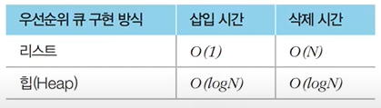
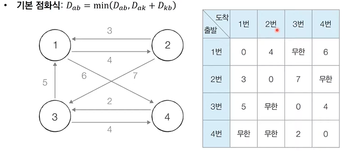

### 다익스트라 최단경로 

#### 1. 최단경로

- 최단경로 알고리즘은 가장 짧은 경로를 찾는 알고리즘이다.

- **문제상황**

  - 한 지점에서 다른 한 지점까지의 최단경로
  - 한 지점에서 다른 모든 지점까지의 최단경로
  - 모든 지점에서 다른 모든 지점까지의 최단경로

- 각 지점은 그래프에서 **노드**로 표현

- 지점 간 연결된 도로는 그래프에서 **간선**으로 표현

  

#### 2. 다익스트라 최단경로 알고리즘

- **특정한 노드**에서 출발하여 **다른 모든 노드**로 가는 최단 경로를 계산한다.

- 다익스트라 최단경로 알고리즘은 음의 간선이 없을 떄 정상적으로 동작한다.

  - 현실 세계의 도로(간선)은 음의 간선으로 표현되지 않는다.

- 다익스트라 최단경로 알고리즘은 그리디 알고리즘으로 분류된다.

  - **매 상황에서 가장 비용이 적은 노드를 선택**해 임의의 과정을 반복한다.

- 동작과정

  1. 출발 노드 설정
  2. 최단 거리 테이블을 초기화
  3. 방문하지 않은 노드 중에서 최단 거리가 가장 짧은 노드를 선택
  4. 해당 노드를 거쳐 다른 노드로 가는 비용을 계산하여 최단 거리 테이블을 갱신
  5. 위 과정에서 3, 4번 반복

- 알고리즘 동작과정에서 최단거리 테이블은 각 노드에 대한 현재까지의 최단거리 정보를 가지고 있다.

- 처리 과정에서 더 짧은 경로를 찾으면 '이제부터는 이 경로가 제일 짧은 경로야' 라고 갱신한다.

  

- 특징

  - 그리디 알고리즘 : 매 상황에서 방문하지 않은 가장 비용이 적은 노드를 선택해 임의의 과정을 반복한다.
  - 단계를 거치며 **한 번 처리된 노드의 최단거리는 고정되어 더 이상 바뀌지 않는다**.
    - 한 단계당 하나의 노드에 대한 최단거리를 확실히 찾는 것으로 이해할 수 있다.
  - 다익스트라 알고리즘을 수행한 뒤에 <u>테이블에 각 노드까지 최단거리 정보가 저장</u>된다.
    - 완벽한 형태의 최단경로를 구하려면 소스코드에 추가적인 기능을 더 넣어야 한다.

- 구현 방법

  - 단계마다 방문하지 않은 노드중에서 최단거리가 가장 짧은 노드를 선택하기 위해 **매 단계마다 1차원 테이블의 모든 원소를 확인(순차탐색)한다.**

    ```python
    import sys
    input = sys.stdin.readline
    INF = int(1e9)	# 무한을 의미하는 값으로 10억 지정
    
    # 노드의 개수, 간선의 개수 입력
    n, m = map(int, input().split())
    # 시작 노드 번호를 입력받기
    start = int(input())
    # 각 노드에 연결되어 있는 노드에 대한 정보를 담는 리스트를 만들기
    graph = [[] for i in range(n + 1)]
    # 방문한 적이 있는지 체크하는 목적의 리스트 만들기
    visited = [False] * (n + 1)
    # 최단거리 테이블을 모두 무한으로 초기화
    distance = [INF] * (n + 1)
    
    # 모든 정보 입력받기
    for _ in range(m):
        a, b, c = ,ap(int, input().split())
        # a번 노드에서 b노드로 가는 비용이 c라는 의미
        graph[a].append((b, c))
        
    # 방문하지 앟는 노드중에서 가장 최단거리가 짧은 노드의 번호 반환
    def get_smallest node():
        min_value = INF
        index = 0	# 가장 최단 거리가 짧은 노드(인덱스)
        for i in range(1, n + 1):
            if distance[i] < min_value and not visited[i]:
                min_value = distance[i]
                index = i
        return index
    
    def dijkstra(start):
        # 시작 노드에 대해 초기화
        distance[start] = 0
        visited[start] = True
        for j in graph[start]:
            distance[j[0]] = j[1]
        # 시작 노드를 제외한 전체 n - 1개의 노드에 대해 반복
        for i in range(n - 1):
            # 현재 최단거리가 가장 짧은 노드를 꺼내서 방문처리
            now = get_smallest_node()
            visited[now] = True
            # 현재 노드와 연결된 다른 노드들 확인
            for j in graph[now]:
                cost = distance[now] + j[1]
                # 현재 노드를 거쳐서 다른 노드로 이동하는 거리가 더 짧은 경우
                if cost < distance[j[0]]:
                    distance[j[0]] = cost
    
    dijkstra(start)	# 다익스트라 알고리즘 수행
    
    # 모든 노드로 가기 위한 최단 거리를 출력
    for i in range(1, n + 1):
        # 도달할 수 없는 경우 무한이라고 출력
        if distance[i] == INF:
            print('INFINITY')
        # 도달할 수 있는 경우 거리 출력
        else:
            print(distance[i])    
    ```

#### 3. 우선순위 큐

- 우선순위가 가장 높은 데이터를 가장 먼저 삭제하는 자료구조이다.

- 예를 들어 여러 개의 물건 데이터를 자료구조에 넣었다가 가치가 높은 물건 데이터부터 꺼내서 확인해야 하는경우 우선순위 큐를 이용할 수 있다.

  

- **우선순위 큐 구현 방법**

  - **힙(Heap)**

    - **우선수위 큐를 구현하기 위해서 사용하는 자료구조 중 하나**이다.

    - 최소 힙(Min Heap)과 최대 힙(Max Heap)이 있다.

    - 다익스트라 최단경로 알고리즘을 포함해 다양한 알고리즘에서 사용된다.

      

      ```python
      import heapq	# 최소 힙 예제
      
      # 오름차순 힙 정렬
      def heapsort(iterable):
          h = []
          result = []
          # 모든 원소를 차례대로 힙에 삽입
          for value in iterable:
              heapq.heappush(h, value)
          # 힙에 삽입된 모든 원소를 차례대로 꺼내서 담기
          for i in range(len(h)):
              result.append(heapq.heappop(h))
          return result
      
      result = heapsort([1,3,5,7,9,2,4,6,8,0])
      print(result)		# 결과 : [0,1,2,3,4,5,6,7,8,9]
      ```

      ```python
      import heapq	# 최대 힙 예제
      
      # 내림차순 힙 정렬
      def heapsort(iterable):
          h = []
          result = []
          # 모든 원소를 차례대로 힙에 삽입
          for value in iterable:
              heapq.heappush(h, -value)
          # 힙에 삽입된 모든 원소를 차례대로 꺼내서 담기
          for i in range(len(h)):
              result.append(-heapq.heappop(h))
          return result
      
      result = heapsort([1,3,5,7,9,2,4,6,8,0])
      print(result)		# 결과 : [9,8,7,6,5,4,3,2,1,0]
      ```

    - 개선된 구현방법은 단계마다 방문하지 않은 노드중 최단 거리가 가장 짧은 노드를 선택하기 위해 힙(heap) 자료구조를 이용한다.

    - 기본 원리는 동일

      - 현재 가장 가까운 노드를 저장해 두기 위해 힙 자료구조를 추가적으로 이용한다는 점만 다르다.
      - 현재 최단거리가 가장 짧은 노드를 선택해야 하므로 최소 힙을 사용한다.

      ```python
      # 힙 이용한 다익스트라
      import heapq
      input = sys.stdin.readline
      INF = int(1e9)	# 무한을 의미하는 값으로 10억 지정
      
      # 노드의 개수, 간선의 개수 입력
      n, m = map(int, input().split())
      # 시작 노드 번호를 입력받기
      start = int(input())
      # 각 노드에 연결되어 있는 노드에 대한 정보를 담는 리스트를 만들기
      graph = [[] for i in range(n + 1)]
      # 방문한 적이 있는지 체크하는 목적의 리스트 만들기
      visited = [False] * (n + 1)
      # 최단거리 테이블을 모두 무한으로 초기화
      distance = [INF] * (n + 1)
      
      # 모든 정보 입력받기
      for _ in range(m):
          a, b, c = ,ap(int, input().split())
          # a번 노드에서 b노드로 가는 비용이 c라는 의미
          graph[a].append((b, c))
          
      def dijkstra(start):
          q = []
          # 시작 노드로 가기 위한 최단 경로는 0으로 설정하여 큐에 삽입
          heapq.heappush(q, (0, start))
          distance[start] = 0
          while q:	# 큐가 비어있지 않다면
              # 가장 짧은 거리가 짧은 노드에 대한 정보 꺼내기
              dist, now = heapq.heappop(q)
              # 현재 노드가 이미 처리된 적 있는 노드라면 무시
              if distance[now] < dist:
                  continue
              # 현재 노드와 연결된 다른 인접한 노드들을 확인
              for i in graph[now]:
                  cost = dist + i[1]
                  # 현재 노드를 거쳐서 다른 노드로 이동하는 거리가 더 짧은 경우
                  if cost < distance[i[0]]:
                      distance[i[0]] = cost
                      heapq.heappush(q, (cost, i[0]))
                      
      # 다익스트라 알고리즘 수행
      dijkstra(start)
      
      # 모든 노드로 가기 위한 최단 거리를 출력
      for i in range(1, n + 1):
          # 도달할 수 없는 경우 무한이라고 출력
          if distance[i] == INF:
              print('INFINITY')
          # 도달할 수 있는 경우 거리 출력
          else:
              print(distance[i])
      ```

#### 4. 플로이드 워셜 알고리즘

- <u>모든 노드에서 다른 모든 노드까지의 최단 경로를 모두 계산</u>한다.

- 플로이드 워셜은 다익스트라랑 마찬가지로 **단계별로 거쳐 가는 노드를 기준으로 알고리즘을 수행**한다.

  - 다만 매 단계마다 방문하지 않은 노드 중에 최단거리를 갖는 노드를 찾는 과정이 필요하지 않다.

- 플로이드 워셜은 2차원 테이블에 최단 거리 정보를 저장한다.

- 플로이드 워셜은 다이나믹 프로그래밍 유형에 속한다.

- 플로이드 워셜

  - 각 단계마다 특정한 노드 k를 저쳐가는 경우를 확인한다.

    - a에서 b로 가는 최단 거리보다 a에서 k를 거쳐 b로 가는 거리가 더 짧은지 검사한다.

  - 점화식

    - D<sub>ab</sub> = min(D<sub>ab</sub>, D<sub>ak</sub> + D<sub>kb</sub>)

    

    ```python
    INF = int(1e9)	# 무한 의미로 10억 설정
    
    # 노드의 개수 및 간선개수 입력
    n = int(input())
    m = int(input())
    # 2차원 리스트를 만들고 무한으로 초기화
    graph = [[INF] * (n + 1) for _ in range(n + 1)]
    
    # 자기자신에서 자기자신으로 가는 비용은 0으로 처리
    for a in range(1, n + 1):
        for b in range(1, n + 1):
            if a == b:
                graph[a][b] = 0
     
    # 각 간선에 대한 정보를 입력받아 그 값으로 초기화
    for _ in range(m):
        # A에서 B로 가는 비용은 C
        a, b, c = map(int, input().split())
        graph[a][b] = c
        
    # 점화식에 따라 플로이드 워셜 알고리즘 수행
    for k in range(1, n + 1):
        for a in range(1, n + 1):
            for b in range(1, n + 1):
                graph[a][b] = min(graph[a][b, graph[a][k] + graph[k][b]])
                
    # 수행된 결과 출력
    for a in range(1, n + 1):
        for b in range(1, n + 1):
            if graph[a][b] == INF:
                print('INFINITY')
            else:
                print(graph[a][b], end = ' ')
         print()
    ```

    

     

