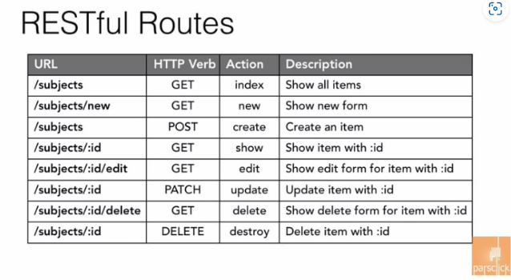

# React_Router

- 리액트만으로는 멀티페이지를 만들어 줄 수 없다.

- 멀티페이지를 만들어 주는 역할을 하는 라이브러리이다.

- 설치 및 실행

  - `npm install react-router-dom@6`를 터미널에 입력하여 설치를 해준다.

  - index.js

    ```react
    import React from 'react';
    import ReactDOM from 'react-dom/client';
    import './index.css';
    import App from './App';
    // index.js에 설치한 react-router-dom으로 부터 router를 사용하기 위해 import를 해준다
    import {BrowserRouter} from "react-router-dom";
    
    const root = ReactDOM.createRoot(document.getElementById('root'));
    root.render(
      <BrowserRouter>	// 기존의 <React.StrictMode>로 되어있던 것을 <BrowserRouter>로 바꿔준다.
        <App />
      </BrowserRouter>
    );
            
    reportWebVitals();
    ```

  - App.js

    ```react
    import "./App.css";
    import Homepage from "./page/Homepage";
    import Aboutpage from "./page/Aboutpage";
    // 사용할 Route들을 import 해준다.
    import { Route, Routes } from "react-router-dom";
    
    function App() {
    
      return (
        <Routes>	// <div>로 감싸져 있던 것을 <Routes>로 감싸준다.
          <Route path="/" element={<Homepage />} />		 // 각각의 페이지는 <Route>로 정의한다
          <Route path="/about" element={<Aboutpage />} />
        </Routes>
      );
    }
    
    export default App;
    ```

    - `Route`는 속성값이 2개이다(**path : 각페이지의 주소, element : 이 주소일 때 보여주고 싶은 페이지**)

- Route끼리의 switch 방법

  - Homepage.js

    ```react
    import React from 'react';
    // 라우터간에 이동할 수 있게 도와주는 Link태그를 import 한다.(a태그와 같은 역할)
    import { Link } from 'react-router-dom';
    
    const Homepage = () => {
      return (
        <div>
          <h1>Home page!</h1>
          <Link to={"/about"}>Go to about page!</Link>
        </div>
      );
    };
    
    export default Homepage;
    ```

  - Aboutpage.js

    ```react
    import React from "react";
    // 라우터간에 이동할 수 있는 다른 방법인 useNavigate를 import 한다.
    import { useNavigate } from "react-router-dom";
    
    const Aboutpage = () => {
      const navigate = useNavigate();
      const goToHomepage = () => {
        navigate("/")
      };
      return (
        <div>
          <h1>About page!</h1>
          <button onClick={goToHomepage}>Home</button>
        </div>
      );
    };
    
    export default Aboutpage;
    
    ```

#### Restful Route

- REST 규칙을 이용해서 만든 api 디자인 패턴

- Http 명령어와 URL을 매칭시켜 url디자인을 좀더 단순하고 통일성 있게 만듬

  

- HTTP 명령어
  - Get : 데이터를 가져올 때 쓰임 (fetch하면 기본 명령어 속성이 Get임)
  - Post : 데이터를 생성할 때 쓰임.
  - Put : 데이터를 수정할 때 쓰임(Patch 라고도 불림)
  - Delete: 데이터를 삭제할때 쓰임 

#### Restful Route 필요성

- 우리가 쇼핑몰 아이템을 보여주는 페이지가 있다고 가정하자
  어떤이는

  ```
  /showitem
  ```

  이라고 만들고 어떤이는

  ```
  /getItem
  ```

  이라고 만들 수 있다.

  어떤 아이템을 삭제하는 페이지의 경우에는
  어떤이는

  ```
  /removeItems
  ```

  어떤이는

  ```
  /deleteItems
  ```

  라고 이름지을 수 있다. 이런식으로 하면 이름에 통일성이 없어지고 어떤 아이템에대해서 모든 생성,읽기,수정,삭제 행위에 대해서 총 4개의 url이 필요하다

  ```
  /getItem /createItem /updateItem /deleteItem
  ```

  이렇게 하면 url은 길고 복잡해진다. 이를 해결하기 위해 나온게 restful 디자인이다
  url에서 동사는 빼고 이를 Http 명령어로 대체한다
  따라서

  ```
  /items + get 명령어 = 아이템읽어오기
  /items + post 명령어 = 아이템 생성하기 
  /items + put 명령어 = 아이템 수정하기 
  /items + delete명령어 = 아이템 삭제하기
  ```

  이런 규칙으로 바뀐다
  즉 /items라는 url 하나로 4가지의 액션을 할 수 있게 되었다.

  내가 하나의 아이템만 가져오고싶다면 뒤에 아이템의 id를 붙이는것도 restful route의 규칙이다

  ```
  /items/:id +get 명령어 = id를 가진 아이템읽어오기 
  /items/:id +put 명령어 = id를 가진 아이템 수정하기 
  /items/:id +delete 명령어 = id를 가진 아이템 삭제하기
  ```