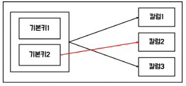
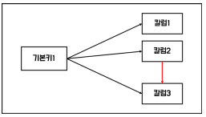

### 2. 데이터 모델과 성능

#### 1. 성능 데이터 모델링의 개요

- 성능 데이터 모델링 : DB 성능향상을 위한 사항이 데이터 모델링에 반영되도록 하는 것
- 수행 시점 : 분석/설계 단계, 성능 데이터 모델링 시점이 늦어질수록 재업무 비용이 증가함
- 고려 사항 : 정규화 수행, DB용량 산정과 트랜잭션 유형 파악을 통한 반정규화 수행, 정규화는 무조건 해야 함.

#### 2. 정규화 성능

- 정규화(Normalization) : 데이터 분해과정, 이상현상(anomaly) 제거

  - 정규형(NF ; Normal Form) : 정규화로 도출된 뎅이터 모델이 갖춰야 할 특성

- 함수적 종속성(FD ; Functional Dependency) : 결정자와 종속자의 관계, 결정자의 값으로 종속자의 값을 알 수 있음

  - 다치 종속(MVD ; Multivalued Dependency) : 여러 칼럼이 동일한 결정자의 종속자일 때

- 정규화 이론 : 1) 1차 2차 3차 보이스코드 정규화는 함수적 종속성에 근거 2) 4차 정규화는 다치 종속을 제거 3) 5차 정규화는 조인에 의한 이상현상을 제거하여 정규화를 수행함

  - 1차 정규화 : 속성의 원자성 확보, 다중값 속성을 분리함

  - 2차 정규화 : 부분 함수 종속성 제거, 일부 기본키에만 종속된 속성을 분리함, 기본키가 하나의 칼럼일 때 생략 가능

    - 부분 함수 종속성

      

  - 3차 정규화 : 이행 함수 종속성 제거, 서로 종속관계가 있는 일반 속성을 분리함, 주식별자와 관련성이 가장 낮음

    - 이행 함수 종속성

      

  - 보이스코드 정규화(BCNF ; Boyce-Codd Normal Form) : 후보키가 기본키 속성 중 일부에 함수적 종속일 때 다수의 주식별자를 분리함

  - 4차 정규화, 5차 정규화 : 다치 종속 분리, 결합 종속 분리

- 정규화와 성능 : 정규화는 입출력 데이터의 양을 줄여 성능을 향상시킴

  - 정규화로 인한 성능 향상 : 입력/수정/삭제 시 성능은 항상 향상됨
    - 유연성 증가 : High Cohension & Loose Coupling 원칙에 충실해짐
    - 재활용 가능성 증가 : 개념이 세분화됨
    - 데이터 중복 최소화
  - 정규화로 인한 성능 저하 : 조회 시 처리 조건에 따라 성능 저하가 발생할 수도 있음
    - 데이터 조회 시 조인을 유발하여 CPU와 메모리를 많이 사용하게 됨
      - 반정규화로 해결 가능
      - 조인이 발생해도 인덱스를 사용하여 조인 연산을 수행하면 성능상 단점이 거의 없고, 정규화를 통해 피룡한 인덱스의 수를 줄일 수 있음
      - 정규화를 통해 소량의 테이블이 생성된다면 성능상 유리할 수 있음

#### 3. 반정규화와 성능

- 반정규화(Denormalization) : 데이터 중복을 허용하여 조인을 줄이는 DB성능 향상 방법, 데이터의 무결성을 희생하고 조회 성능 향상
- 절차
  1. 반정규화 대상 조사 : 데이터 처리 범위 및 통계성 등 조사
  2. 다른 방법 검토 : 1) 뷰 2) 클러스터링 3) 인덱스 4) 애플리케이션
  3. 반정규화 적용 : 정규화 수행 후 반정규화 수행
- 기법
  - 테이블 반정규화
    - 테이블 병합
      - 1:1 관계 테이블 병합
      - 1:N 관계 테이블 병합 : 많은 데이터 중복 발생
      - 슈퍼타입 / 서브타입 테이블 병합
    - 테이블 분할 : 1) 수직 분할 2) 수평 분할
    - 테이블 추가
      - 중복 테이블 : 업무나 서바가 다르 때 중복 테이블 생성(원격 조인 제거)
      - 통계 테이블
      - 이력 테이블
      - 부분 테이블 : 자주 이용하는 칼럼으로 구성된 테이블 생성
  - 칼럼 반정규화
    - 중복 칼럼 추가
    - 파생 칼럼 추가 : 필요한 값 미리 계산한 칼럼 추가
    - 이력 테이블 칼럼 추가
    - PK에 의한 칼럼 추가 : PK의 종속자를 일반속성으로 생성
    - 응용 시스템의 오작동을 위한 칼럼 추가
  - 관계 반정규화 : 데이터 무결성 보장 가능
    - 중복 관계 추가

#### 4. 대용량 데이터에 따른 성능 : 테이블 반정규화 중 테이블 분할 관련

- 블록 : 테이블의 데이터 저장 단위
- 대량 데이터 발생으로 인한 현상 : 블록 I/O 횟수 증가 -> 디스크 I/O 가능성 상승(디스크 I/O시 성능 저하)
  - 로우 체이닝(Row Chaining) : 행 길이가 너무 길어 여러 블록에 걸쳐 저장되는 현상
  - 로우 마이그레이션(Row Migration) : 수정된 데이터가 해당 블록이 아닌 다른 블록의 빈 공간에 저장되는 현상
- 테이블 분할 : 반정규화 기법
  - 수직 분할 : 칼럼 단위로 테이블을 분할ㅇ하여 I/O 를 감소시킴, 너무 많은 수의 칼럼이 있는 경우 사용
  - 수평 분할 : 행 단위로 테이블을 분할하여 I/O 감소시킴
- 파티셔닝(Partitioning) : 테이블 수평분할 기법, 논리적으로는 하느의 테이블이지만 물리적으로 여러 데이터 파일에 분산 저장, 데이터 조회 범위를 줄여 성능 향상