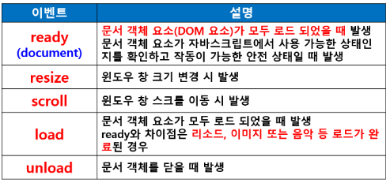
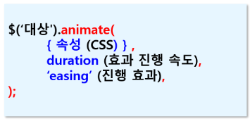
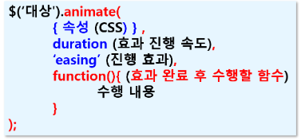
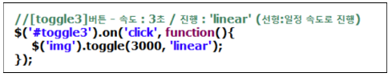

### jQuery

> John Resig이 만든 디자인 자바스크립트 라이브러리
>
> 무료 사용 가능한 오픈소스 라이브러리
>
> 모든 웹 브라우저에서 동작

- **jQuery 특징**
  - 용량이 약 100KB로 가벼움
  - 동적으로 HTML이나 CSS컨트롤 능력 탁월
  - 짧고 간결하게 코딩가능
  - 웹 표준과 타 브라우저 호완성 뛰어남(크로스-브라우저 지원)
  - 편리한 Ajax 호출 방법
  - 메소드 체인 방식 (여러 메소드를 연결하여 사용)으로 효율적인 코딩 가능, 간결하고 효과적인 코드 수정 가능
  - 다양한 플러그인 제공

- **jQuery 사용 목적**

  - 쉬운 DOM 처리
  - 쉽고 일관된 이번트 연결 구현
  - 쉬운 시각적 효과 구현
  - Ajax 기능 쉽게 구현

- **jQuery 시작 / 기본**

  - < script src="ooo.js">파일 경로 지정
  - External 방식 : 별도의 자바스크립트 파일(.js) 사용
    - start.js 생성
    - < script src = "start.js">< /script>

- **jQuery 코드 형태**

  - 객체 구조로 **객체.메소드** 형태
  - 객체 선택
    - $("선택자").메소드
  - 사용자가 생성한 객체 사용
    - var obj = $("선택자").메소드;
  - 메소드 체이닝
    - 여러 개의 메소드를 연결해서 사용하는 것
    - 객체.메소드1.메소드2. ...

- **jQuery 치환**

  - jQuery의 모든 함수 및 객체는 jQuery에서 제공되는 것이라는 점을 나타내기 위해 코드 앞에 jQuery 키워드 사용
    - jQuery(document).ready(function(){ … });
  - 쉽게 하기 위해 $ 문자로 치환해서 사용
    - $(document).ready(function(){ … });
  - **$(document).ready(함수) 명령어**
    - 화면에 페이지가 로딩되어 실행
    - HTML 문서가 화면에 보여진 후에 자동으로 포함된 함수 실행
    - 자바스크립트의 window.onload = function() { };에 해당
  - **$(document).ready()와 window.onload = function() **
    - 같은 점
      - 콜백 함수가 호출되는 시점에서 DOM 요소에 접근 가능
    - 차이점
      - $(document).ready()
        - DOM 요소가 로드 되었을 때 이벤트 발생하면서 호출 (외부 리소스, 이미지 또는 사운드 등이 로드 되기 전)
      - window.onload = function() 
        - DOM 요소 뿐 아니라 외부 리소스, 이미지, 사운드 등 모든 콘텐츠의 로드가 끝나는 시점에서 이벤트가 발생하면서 호출

- **jQuery 선택자 (selector)**

  - jQuery 코드는 선택자와 메소드의 조합으로 구성되는 경우가 많음

  - HTML 태그를 쉽게 선택하기 위해 선택자 사용

  - **선택자 구조**

    - $(“선택자”).메소드(매개변수, 함수 등);
    - $(“span”).hide();
      - 큰 따옴표, 작은 따옴표 다 사용 가능

  - **선택자 종류**

    

  - **인접 관계 선택자 : 부모, 조상, 자식, 자손, 형제**

    

    

  - **필터 선택자**

    - 태그의 상태나 순서 등으로 선택

    - **$(“태그명:순서필터”)**

      - **$(“tr:odd”) : 홀수 행인경우**

    - **$(“태그명:상태필터”)**

      - **$(“input:checked”) : 체크 상태인 경우**

        

  - **속성 선택자**

    - 문서에 삽입된 HTML 태그(요소)의 지정된 속성 값에 따라 선택자로 정의

      

- **jQuery 변수**
  - **변수명 앞에 $ 붙임**
  - var $box1 = $(‘#box1’);
  - $box1의 타입은 Object로 jQuery 메소드 사용 가능
  - $box1.css(‘color’, ‘red’);
  - var $divLen = $(‘div’).length; // < div> 태그 개수 저장
  - $divLen의 타입은 Number 
  - 이 경우 일반적으로 $ 붙이지 않음 (자바스크립트 변수)
  - var divLen = $(‘div’).length;

- **jQuery 이벤트**

  - 기존의 자바스크립트에서 사용했던 이벤트 대부분 사용

  - jQuery를 이용하여 이벤트를 처리하면 훨씬 간단하고 쉽게 이벤트 처리 가능

  - **이벤트 사용 기본 구조**

    - **$(‘#btn’).click(function() { ....** });
    - (1) 이벤트 대상 : $(‘#btn’)
    - (2) 이벤트 등록 메소드 (이벤트 유형) : click()
    - (3) 이벤트 핸들러 (이벤트 처리 함수) : function() {..}

  - **이벤트 등록 메소드 유형**

    - **(1) 단독 이벤트 등록 메소드**
      - $(‘#btn’).click(function() { .... });
      - 주의! - 동적 연결 지원 안됨
      - 동적으로 생성된 객체에 이벤트 적용 안됨
    - **그룹 이벤트 등록 메소드 (여러 이벤트 적용)**
      - $(‘#btn’).on(‘mouseover focus’, function() { .. } );
      - **동적으로 생성된 요소에 적용 가능**

  - **이벤트 연결 방식**

    - **정적연결**
      - 현재 HTML 화면에 있는 태그에만 이벤트 연결
      - jQuery를 통해 새로 삽입되는 태그에는 이벤트 연결 안됨
    - **동적연결**
      - **현재 HTML 화면에 표시된 요소와 앞으로 생성될 요소에 전부 이벤트 연결 가능**

  - **이벤트 종류**

    - 윈도우 이벤트

      

  - **마우스 이벤트 종류**

    

    - 동적 연결 이벤트
      - 동적으로 생성된 버튼에 이벤트 연결

  - **키보드 이벤트 종류**

    

  - **입력 양식 이벤트 종류**

    

  - **input 입력란에서 엔터키 쳤을 때 문제**
    - < input> 태그의 입력란에서 엔터키를 치면무조건 submit 이벤트가 발생하면서 submit() 호출하고 서버로 전송되는 문제 발생
    - 엔터키 쳤을 때 submit 되지 않도록 문서 전체에 이벤트 처리 : [Enter] 키의 아스키 코드 값 : 13
    - if(e.keyCode == 13) return false;
    - 문서 전체에 이벤트 처리

- **jQuery DOM 요소 조작**

  - 동적으로 DOM 요소 조작

  - jQuery를 이용하면 쉽고 간단하게 조작 가능

  - DOM 요소 삽입 / 삭제 / 속성 추가 및 삭제

    

  - **text()와 html()메소드**
    - 자바스크립트의 innerHTML 속성과 유사
    - 선택한 DOM 요소에 글자(텍스트)를 설정하거나 반환
    - html()
      - HTML 태그 인식 (태그 효과 적용)
    - text()
      - HTML 태그 인식하지 못하고 글자로 인식

  - **DOM** **요소의 속성 추가 및 삭제**

    - attr(속성명,값) : 속성 추가 (prop())
    - removeAttr(속성명) : 속성 제거
    - attr() : 속성 설정, 조회
    - prop() : 활성화, 체크, 선택여부 등 동적 적용

- **DOM요소에 CSS효과 동적 적용**

  - CSS 클래스 선택자에 적용된 여러 효과를 동적으로 추가하거나 삭제

  - < style>

    .h1Css{,,,,,,,,}

    < /style>

  - addClass('클래스명') : CSS효과 적용
  - removeClass('클래스명') : 적용된 CSS 효과 해제
  - toggleClass('클래스명')
    - addClass()와 removeClass() 번갈아가며 실행하는 결과

- **jQuery 시각적 효과**

  - **Basic 효과**

    - hide() : 요소 숨기기
    - show() : 요소 표시
    - toggle() : show() / hide() 번갈아가면서 표시

  - **sliding 효과**

    - slideDown() : 요소를 슬라이딩 효과로 나타나게 함
    - slideUp() : 요소를 슬라이딩 효과로 숨김
    - slideToggle() : slideDown()과 slideUp 효과를 교대로 실행
    - 주의!!!!
      - 슬라이딩 효과는 < div>박스에 적용
      - 이미지 슬라이딩 효과를 주면 전체적으로 축소/확대 되면서 사라졌다가 보여짐

  - **Fading 효과**

    - fadeIn() : 요소를 선명하게 만들면서 나타남
    - fadeOut() : 요소를 흐리게 하면서 숨김
    - fadeToggle()
    - fadeTo() : 요소의 불투명도 조정 / 투명도 0으로 안보여도 영역은 그대로 남아있음

  - **Animate 효과**

    - animate(속성)

      - 사용자 CSS 효과를 지정하여 애니메이션 수행

    - animate() 형식1

      

    - animate형식2

      

    - 애니메이션 정지

      - $('선택자').stop(); =>false입력한 것으로 간주
      - $('선택자').stop(true); =>clearQueue 수행
      - $('선택자').stop(true, true) =>clearQueue, goToEnd 수행
      - **clearQueue****
        - 대기열에 있는 함수 모두 제거
        - 예약된 애니메이션 초기화
        -  clearQueue() 메소드 실행 효과
      - **goToEnd**
        - 제자리에서 멈추는 것이 아니라 지정한 최종 형태에서 멈춤 (애니메이션 진행 중간에 멈추는 것이 아니라 마지막까지 수행되고 멈춤)

  - **공통인수**

    - duaration : 효과 진행 속도(slow / normal / fast)

    - callback(function()) : 효과 완료 후 수행할 함수

    - easing

      - 전체 애니메이션의 적용 시간 비율을 원하는 진행 비율로 매핑

      - swing : 사인 곡성(느리게 시작해서 빠르게 진행하다가 나중에 다시 느려지는 효과)

      - linear : 선형(일정한 속도로 진행)

        